# Introduction

.png)

## Outlines for Chapter ONE

* 本课程原理的部分就是三个 Management

## 什么是操作系统

* 操作系统就是一个运行在电脑用户以及电脑硬件之间的程序，这个程序我们也称为==kernal==
* 操作系统的目标：
  * 运行用户程序，并且让解决用户问题更简单
  * 让计算机系统更简单的去使用
* 硬件插电后，第一个运行的程序我们可以认为是操作系统
* OS是一个==resource allocator==
* OS也是一个==control program==

## Computer Startup

* 在开机后的一小段时间内，我们还需要将操作系统从硬盘加载到内存中，实现这个功能的程序我们称为 **bootstrap program**

## Interrupt

```mermaid
flowchart TD
A[中断:interrupt] --> B[硬件中断]
A --> C[软件中断<br>陷阱:trap]
C --> D[错误<br>如：除以零、非法内存访问:error]
C --> E[系统调用<br>程序主动请求操作系统服务:ecall]
```

* ==interrupt vector==：存储了各种设备的终端处理程序的地址。
* System call是软件通过调用系统中断来实现一些操作，比如`printf("%d",1)`也就是使用硬件输出一个数。

### 两种I/O的方法

* Synchronous：同步。当中断发生的时候，程序会一起停止，直到中断程序的结束。
* Asynchronous：异步。当中断发生的时候，程序不会一起停止，而是会在转移到中断后迅速转移回来，继续执行当前的程序。I/O 操作最后会返回一个结果。

#### Divice-Status Table

然而，异步的时候有一个问题：在一个 I/O 操作执行完之后，要把结果发送给请求者，但是由于程序没有等 I/O，因此选择维护一个 Device-Status Table，储存各种信息，例如请求的文件、操作、请求者的地址、数据偏移量等

### Direct Memory Access Structure

在面对大量 I/O 操作的时候，会带来大量的开销。为了解决这个问题，我们选择使用 DMA，让 I/O 设备和 memory 可以直接进行数据的传输，没有 CPU 的干扰。

然而，实际上还是要中断一次的。在刚开始的时候，==需要中断一次==，在 memory 中划分一段内存空间，并将这段内存空间和 I/O 设备直接连接在一起。

## OS Operations(mode)

对于一个程序，它在system call之后，就可以调用操作系统提供的服务。于是我们可以将用户的程序分为两种状态：正常执行自己的代码、执行system call。我们称前者为==user mode==，后者为==Kernel mode==。

mode的切换由==mode bit==负责，mode bit由硬件实现。

* user mode下，不能使用 Interrupt，因为如果可以，那么我们就默认 user mode 和 kernel mode 权限是一样的，破坏了隔离性。
* `Privilege instruction`：例如，`ecall`就是。所有的`privilege instruction`都可在 kernel mode 下运行，但不是所有在 kernel mode 中的 instruction 都是`privilege instruction`，例如，`mv`操作就不是`privilege instruction`。

## Process Management

进程（process）是一个运行中的程序。可以说是一个“活着的”程序。

进程为了完成任务，需要一定的资源，包括 CPU 时间、内存、文件、I/O 设备等。这些资源可以在进程创建的时候赋予，也可以在执行进程的时候分配。

进程有一个非常重要的资源，叫做program counter，是用来指定下一个所要执行的指令。在任何时候，每个进程最多只能执行一次指令。

## Multicore Systems

* 多核指的是集成多个==计算核==到单个芯片。
* 多核往往比多个单核更加高效。
* 同时，多核也比单核芯片消耗低。

## Operating System Structure

### Multiprogramming

* 中文称为“多道程序运行”

* ==如图，只要我们能将几个程序一起加载进内存，我们就一起运行，这就是 Multiprogramming。==
* 我们并不关心谁先运行。
* 关心资源，尽可能运用我们的计算资源。

### Multitasking(Timesharing)

* 关注用户，实际上是在各个进程之间快速切换，可以支持多个用户

## Process Management

### 线程和进程

​	对于进程和线程，我们可以做以下理解：

* 一个进程可以包含**一个或多个线程**。
* 所有线程共享进程的资源，比如内存、文件句柄等。
* 多线程让进程可以**并发执行多个任务**，提高效率和响应速度。
* 线程之间的关系就像是一个家庭里的成员，住在同一个房子（进程），但各自做事

> 举个例子
>
> 

### 单线程进程和多线程进程

### 操作系统的任务

​	操作系统有以下任务：

* Creating and deleting both user and system processes
  * 包括用户进程（比如你打开的应用）和系统进程（比如后台服务）。
  * 当你启动一个程序，操作系统就会创建一个进程；当程序关闭，它会删除这个进程。
* Suspending and resuming processes
  * 有时进程需要暂停（比如等待某个资源），操作系统可以“挂起”它。
  * 当条件满足后，可以“恢复”进程继续运行。
* Providing mechanisms for process synchronization
  * 当多个进程或线程需要协调工作时（比如同时访问一个文件），操作系统提供同步工具（如锁、信号量）来避免冲突。
* Providing mechanisms for process communication
  * 不同进程之间需要交流数据时，操作系统提供通信方式，比如管道、消息队列、共享内存等。
* Providing mechanisms for deadlock handling
  * 如果多个进程互相等待对方释放资源，可能会陷入“死锁”状态。
  * 操作系统负责检测、预防或解决这种情况，确保系统不会卡住。

## Memory Management

* All data must be in memory before and after processing
* All instructions must be in memory in order to execute
* Memory management determines what is in memory when
  * Optimizing CPU utilization and computer response to users
* Memory management activities
  * Keeping track of which parts of memory are currently being used and by whom
  * Deciding which processes (or parts thereof) and data to move into and out of memory
  * Allocating and deallocating memory space as needed

中文翻译如下：

## Storage Management

* OS provides uniform, logical view of information storage
  * Abstracts physical properties to logical storage unit  - file
  * Each medium is controlled by device (i.e., disk drive, tape drive)
    * Varying properties include access speed, capacity, data-transfer rate, access method (sequential or random)
* File-System management
  * Files usually organized into directories
  * Access control on most systems to determine who can access what
  * OS activities include
    * Creating and deleting files and directories
    * Primitives to manipulate files and dirs
    * Mapping files onto secondary storage
    * Backup files onto stable (non-volatile) storage media

​	中文翻译如下：

### Mass-Storage Management

* Usually disks used to store data that does not fit in main memory or data that must be kept for a “long” period of time.
* Proper management is of central importance
* Entire speed of computer operation hinges on disk subsystem and its algorithms
* OS activities
  * Free-space management
  * Storage allocation
  * Disk scheduling
* Some storage needs not be fast
  * Tertiary storage includes optical storage, magnetic tape
  * Still must be managed
  * Varies between WORM (write-once, read-many-times) and RW (read-write)

​	中文翻译：

### I/O Subsystem

* One purpose of OS is to hide peculiarities of hardware devices from the user – ease of usage & programming
* I/O subsystem responsible for
  * Memory management of I/O including buffering (storing data temporarily while it is being transferred), caching (storing parts of data in faster storage for performance), spooling (the overlapping of output of one job with input of other jobs)
  * General device-driver interface
  * Drivers for specific hardware devices

​	中文翻译：

## OS purposes

* Basic requirements for OS
  * Sharing/multiplexing
    * 操作系统要能让多个程序共享系统资源（比如 CPU、内存、磁盘等）。
    * 多路复用指的是把一个资源（比如 CPU）分配给多个任务轮流使用，实现并发运行。
  * Isolation
    * 每个进程或用户的操作要彼此隔离，防止互相干扰或访问不该访问的数据。
    * 比如你打开的微信不能随便读取支付宝的内存数据。
  * Interaction
    * 操作系统要支持用户与程序之间的交互，比如通过键盘、鼠标、触摸屏等。
    * 也包括程序之间的交互，比如进程通信。
* Abstraction
  * 操作系统把复杂的硬件功能封装成简单的接口，比如文件系统、虚拟内存等。
  * 让程序员不需要直接操作硬件，而是通过操作系统提供的“抽象层”来使用资源。
* Security
  * 防止恶意程序或用户破坏系统，保护数据隐私和系统稳定。
  * 包括权限控制、防病毒机制、加密等。
* Performance
  * 操作系统要高效地管理资源，保证程序运行流畅。
  * 包括调度算法、内存管理、磁盘访问优化等。
* Range of uses
  * 操作系统要能适应不同的设备和场景，比如手机、电脑、服务器、嵌入式系统等。
  * 所以它必须具备灵活性和可扩展性。

## 拓展

### Library call

* 就是通过函数的方法调用资源，跳过了 mode 的转换。这样做的话，可以避免上下文的转换，从而提升性能。

