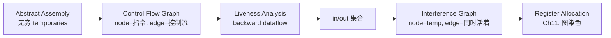

## What does Chapter 10 focus on?

Chapter 9 把 canonical IR 翻成了 abstract assembly——指令选好了,但用的还是**无穷多个 temporary**(`t1, t2, t3, ...`)。真实机器只有几十个寄存器,根本装不下。Chapter 10 接着问:

> **怎么知道哪些 temporary "正在使用",从而把它们挤进有限的寄存器里?**

答案是 **liveness analysis**——一个典型的 **dataflow analysis**:



Chapter 10 的三个主题:

1. **Liveness Analysis**:用 dataflow equations 算出每个程序点上哪些变量"活着"
2. **Theoretical Results**:为什么必须用保守近似(halting problem)、为什么迭代算法收敛到 least fixed point
3. **Interference Graph**:把 liveness 结果转成图,供下一章 register allocation 使用

---

## 我们在哪里?

```
┌──────────────────────┐
│ Abstract Syntax Tree │
└──────────┬───────────┘
           ↓ Chapter 5–7
┌──────────────────────┐
│ IR Tree              │
└──────────┬───────────┘
           ↓ Chapter 8: Canonical IR
┌──────────────────────┐
│ Canonical IR list    │
└──────────┬───────────┘
           ↓ Chapter 9: Instruction Selection
┌──────────────────────┐
│ Abstract Assembly    │   ← 用无穷 temporary
└──────────┬───────────┘
           ↓ Chapter 10: Liveness Analysis  ← 你在这里
┌──────────────────────┐
│ Interference Graph   │
└──────────┬───────────┘
           ↓ Chapter 11: Register Allocation
┌──────────────────────┐
│ Real Assembly        │   ← 用真实寄存器
└──────────────────────┘
```

---

# Part 1: Why —— 为什么要做 Liveness Analysis?

## 矛盾

| | |
|---|---|
| **IR / abstract assembly** | 可以用**无穷多个** temporary |
| **真实机器** | 只有**有限多个** register |

要把多个 temporary 塞进同一个 register,必须先回答一个问题:

> **哪些 temporary 是"同时活着的"?**

## 关键观察

```
a := b + 1;
return a;
```

这里 `b` 在 `a := b + 1` 之后就再也不用了,而 `a` 是这之后才需要的——**a 和 b 不会同时被需要**,完全可以塞同一个 register。

只要能把所有这种"不重叠"的 temporary 配对挤压,就能用少量 register 装下大量 temporary。装不下的那些,溢出到内存(spill)。

## Liveness 的非正式定义

> 一个变量在某个程序点 **live**,当且仅当它**当前持有的值在未来可能被用到**。

注意是"持有的值"——如果以后会再赋值再读,那只是同名变量的不同生命周期。

---

# Part 2: How —— Liveness 是 Backward Analysis

## 直觉

要回答"变量 x 在 statement n 之后还会被用到吗?",得问两件事:

1. **n 之后哪些 statement 可能执行?** → 看 **control flow graph**
2. **那些 statement 用到 x 吗?** → 分析每条 statement 的 use/def

由于"未来要不要用"这种问题天然是从后往前推:

> Liveness 是 **backward analysis**——信息从程序的尾部沿 control flow 反向流动。

这跟 reaching definitions、available expressions 等"forward"问题正好相反。

## Control Flow Graph(CFG)

CFG 是 dataflow analysis 的舞台:

- **node**: 一条 statement / 指令(或 basic block)
- **edge**: 控制流。`m → n` 表示 m 之后可能执行 n

### 例子

```
        a ← 0
   L1:  b ← a + 1        →     1: a := 0
        c ← c + b              2: b := a+1   ←┐
        a ← b * 2              3: c := c+b    │
        if a < N goto L1       4: a := b*2    │
        return c               5: a < N  ─────┘ (true → 2)
                               6: return c   (false from 5)
```

### Flow Graph 术语

| 术语 | 含义 |
|---|---|
| **out-edges** of n | 离开 n 的边 |
| **in-edges** of n | 进入 n 的边 |
| **succ[n]** | n 的后继节点集合 |
| **pred[n]** | n 的前驱节点集合 |

> 上面例子中 `succ[5] = {2, 6}`、`pred[2] = {1, 5}`。

---

# Part 3: What —— 形式化定义

## Use 和 Def

| | |
|---|---|
| **def**(节点) | 这条指令**赋值**给的变量集合(LHS) |
| **use**(节点) | 这条指令**读取**的变量集合(RHS / 表达式中) |

也可反过来定义:

- **def** of variable v = 所有定义 v 的节点集合
- **use** of variable v = 所有使用 v 的节点集合

### 例子

```
3: c := c + b      →   def(3) = {c},  use(3) = {b, c}
4: a := b * 2      →   def(4) = {a},  use(4) = {b}
```

> 注意 statement 3 既 use 又 def 了 c——RHS 里的 c 是旧值的 use,赋值是新值的 def。

## Liveness 的精确定义

> **A variable is live on an edge** if there is a directed path **from that edge to a use** of the variable that **does not go through any def**.

通俗讲:沿控制流往下走,**先撞到 use 而不是 def**——它才活着。如果先被重新赋值,旧值就死了。

### Live-in 和 Live-out

| | 含义 |
|---|---|
| **in[n]** | 在 n 的**入口边**上活着的变量(进入 n 之前就需要) |
| **out[n]** | 在 n 的**出口边**上活着的变量(n 执行完之后还需要) |

## "活着"的两个条件

变量 a 在某条边上活着 ⟺

1. **未来会被用** —— 控制流上能找到一个 use(a)
2. **被用之前不被覆盖** —— 这条路径上没有 def(a)

```
       ●  v
       │      no def(v)
       ▼
       ●  use(v)         ← v live on the edge above
```

---

# Part 4: Dataflow Equations

## 三条规则推出方程

从直觉一步步推到方程:

### Rule 1:`out[n]` 来自后继的 `in[m]`

```
       n: ...
       /     \
     m1       m2
   in[m1]    in[m2]
```

如果 a 在某个 successor m 的入口活着,那它在 n 的出口当然也活着——因为执行完 n 就要进 m。所以:

$$\text{out}[n] = \bigcup_{m \in \text{succ}[n]} \text{in}[m]$$

### Rule 2:n 自己用了的变量,必须在入口活着

如果 n use 了 a,那 a 进入 n 时就得有值——不然 n 没法运行。所以:

$$a \in \text{use}[n] \Rightarrow a \in \text{in}[n]$$

### Rule 3:出口活着、自己又没重新定义的,在入口也活着

如果 a 在 n 的出口活着(后面要用),而 n 没有 def(a),那 a 是从 n 入口"穿过"来的——n 入口必须也有 a:

$$a \in \text{out}[n] \land a \notin \text{def}[n] \Rightarrow a \in \text{in}[n]$$

反过来,如果 n 重新 def 了 a,那入口的 a 是死的(被 n 覆盖了)。

## 合并:Liveness Dataflow Equations

把 Rule 2 + Rule 3 合并:

$$\boxed{\text{in}[n] = \text{use}[n] \cup (\text{out}[n] - \text{def}[n])}$$

$$\boxed{\text{out}[n] = \bigcup_{s \in \text{succ}[n]} \text{in}[s]}$$

> 这两条方程是 Chapter 10 的灵魂。所有后续算法、定理都围绕它们展开。

### 直观理解

```
in[n]  =  use[n]                     ← 自己要用的
       ∪  (out[n] - def[n])          ← 出口活着且自己没杀掉的
```

n 入口活着的变量 = "我自己 n 要用的" + "出来后还活着、且 n 没 def 掉的"。

---

# Part 5: Solving the Equations —— 迭代算法

## 为什么不能一次算出来?

方程是**循环**的——`in[n]` 依赖 `out[n]`,`out[n]` 依赖 `in[succ[n]]`,而 succ 可能绕回 n(循环)。所以得**迭代到不动点**(fixed point)。

## 算法

```
for each n:
    in[n] ← {};  out[n] ← {}
repeat
    for each n:
        in'[n] ← in[n];  out'[n] ← out[n]
        in[n]  ← use[n] ∪ (out[n] - def[n])
        out[n] ← ⋃_{s∈succ[n]} in[s]
until in'[n] = in[n] AND out'[n] = out[n] for all n
```

## 为什么会终止?

- `use[n]` 和 `def[n]` 是程序静态属性,**已知且固定**。
- 每次迭代,`in[n]` / `out[n]` 只会**增加**(单调),因为 `use[n]` 始终包含、`out` 来自 `in[s]` 的并集。
- 集合元素来自一个**有限**的全集(程序里所有变量),不可能无限增长。
- 单调 + 有上界 ⇒ **有限步必到不动点**。

## 计算顺序很关键

`out[n]` 依赖 `in[s]`(s 是后继),而 `in[n]` 依赖 `out[n]`。所以:

> Liveness flows **backward** along control-flow edges, and from **out** to **in**, so the computation should follow the same direction.

也就是按节点编号**从大到小**(从尾到头)、每个节点先算 `out` 再算 `in`,信息一次传播一长段。反过来按 1→6 算的话,要好多轮才传得回去。

### 收敛速度对比

| 迭代顺序 | 例子收敛轮数 |
|---|---|
| forward (1→6, in→out) | 约 7 轮 |
| backward (6→1, out→in) | **3 轮** |

> 这是一个通用经验:**backward problem ⇒ backward iteration**;**forward problem ⇒ forward iteration**。顺着信息流,效率最高。

---

# Part 6: 实现层面的考虑

## Variant 1:Basic Blocks 当节点

只有一个前驱、一个后继的节点没意思——把这种节点跟邻居**合并**成 basic block,CFG 节点数大幅缩小,迭代轮数也变少。

> 块内 use/def 可以提前算好(只关心"块整体的 use/def"),块间再做 dataflow。

## Variant 2:一次只算一个变量

不是每次都需要全套 in/out。某些场景下只需要追踪某个变量是否活着——按需计算。许多 temporary 的 live range 很短,这种"按需"很省。

## Set 的实现:Bit Array vs Sorted List

| | 适用 | 集合操作复杂度 |
|---|---|---|
| **Bit Array** | dense set(变量很多、活的也多) | union = N/K(K = word size) |
| **Sorted List** | sparse set(每点只活几个变量) | union = 合并两个有序表 |

> 平均每个集合元素数 < N/K 时,sorted list 更快。实际编译器多用 bit array,因为常量因子小、SIMD 友好。

## Time Complexity

设程序大小 N(节点数 ≤ N,变量数 ≤ N):

- 每次 set-union: **O(N)**(bit array 是 O(N/K),为简化记 O(N))
- 内层 for loop:每节点常数次 set 操作 ⇒ **O(N²)** per iteration
- 外层 repeat:in/out 集合大小总和 ≤ 2N²,每轮至少加一个元素,所以最多 **O(N²)** 轮

**最坏:O(N⁴)。实际:O(N) ~ O(N²)**(选合适的迭代顺序)。

---

# Part 7: 理论结果 —— 不动点与保守近似

## Least Fixed Point

方程**可能有多个解**。考虑下面的表(教材 Table 10.7):

| | 解 X | 解 Y | "解" Z |
|---|---|---|---|
| 1 in/out | c / ac | cd / acd | c / ac |
| 2 in/out | ac / bc | acd / bcd | ac / b |
| 3 in/out | bc / bc | bcd / bcd | b / b |
| 4 in/out | bc / ac | bcd / acd | b / ac |
| 5 in/out | ac / ac | acd / acd | ac / ac |
| 6 in/out | c / | c / | c / |

- **X 和 Y 都满足方程**(Y 是把变量 d "假装也活着")。两个都是 valid 解。
- **Z 不满足方程**——基于 Z 会推出"b 和 c 不冲突",可能把它们分到同一寄存器,**程序就错了**。

> 满足方程的解称为 **fixed point**。其中**最小的**(变量最少的)那个叫 **least fixed point**。

**Theorem.** 迭代算法从空集出发,每次只增不减,最后收敛到的就是 **least fixed point**。

## Conservative Approximation —— 保守近似

任意 fixed point 都是 liveness 的**保守上估**:

| | 含义 |
|---|---|
| ✅ **真活的一定在算出的 live 集里** | dynamic live ⇒ static live |
| ❌ **算出在 live 集里的不一定真活** | static live ⇏ dynamic live |

也就是说,我们可能**多说**几个变量活着(寄存器多用一些),但**绝不会漏说**。

> **保守 = 安全**:误判活着 ⇒ 多用 register,代码不优但**正确**;误判死了 ⇒ 寄存器复用导致**值被覆盖,程序错**。

## Static vs Dynamic Liveness

```
1: a := b * b              ← a >= 0
2: c := a + b              ← c >= b
3: if c >= b               ← always true!
4:     return a            ← dead branch
5:     return c
```

- **Dynamic liveness**:某个**实际执行**会从 n 走到 use(a),且不经过 def(a)。
- **Static liveness**:CFG 上**存在一条路径**从 n 到 use(a),不经过 def(a)。

例子里 node 4 在动态执行中**永远到不了**,但 static analysis 看到 CFG 边就认为它能到——所以认为 a 在 node 1 之后是 live 的。

> Static 总是 ⊇ Dynamic,所以 static liveness 是 dynamic liveness 的保守近似。

## 为什么必须保守? —— Halting Problem

**Theorem(Halting Problem).** 不存在程序 H,对任意程序 P 和输入 X,(在不无限循环的前提下)能判定 P(X) 是否停机。

**Corollary.** 不存在程序 H'(P, L),能判定程序 P 中的标号 L 在某次执行中**是否会被到达**。

> **证明草图**:若 H' 存在,把程序结尾加一个 `halt → goto L`,就能用 H' 判定 P 是否停机——矛盾。

**推论**:编译器**根本不可能**精确知道一个变量是否真活,只能用静态、保守的近似。

> **设计原则**:dataflow equation 应当设计成"任何解都是保守的"。这样优化结果**至多 suboptimal,但绝不 incorrect**。

---

# Part 8: Interference Graph

## Interference 是什么?

> **Interference**: 阻止两个 temporary 共享同一个 register 的条件。

两类:

1. **Overlapping live ranges**:在某个程序点 a 和 b 同时活着 ⇒ 它们必须在不同寄存器。
2. **机器约束**:某条指令的结果只能放进特定寄存器,其他变量碰不得。比如 x86 的乘法结果固定到 RAX。

## 表示方式

### Matrix(对称矩阵,X 标记 interference)

```
   a  b  c
a        x
b        x
c  x  x
```

### Undirected Graph

```
   b
   │
   ●
   │
   a ─── c
```

- **node** = 每个 temporary
- **edge** = "这两个不能同寄存器"

> 这就是 **interference graph**——下一章 register allocation 把它当成图染色问题:用 K 种颜色(寄存器)染图,相邻节点不同色。

## 怎么从 liveness 构造 interference graph?

### 基本规则

> 在 def 一个变量 a 的指令 n 处,a 跟 `out[n]` 里所有其他变量都 interfere。

直觉:n 执行完后,a 占了一个 register,而 `out[n]` 里的变量也都占着 register,显然不能撞车。

**算法**:

```
for each n that defines variable a:
    for each b in out[n], b ≠ a:
        add edge (a, b) to interference graph
```

## MOVE 指令的特殊处理

考虑 `t := s`(纯 copy,不是 `t := s + 1`):

```
t := s        ← 此后 t 和 s 值相同
...
x := ... s ... ← use s
...
y := ... t ... ← use t
```

执行完 `t := s` 后,`out[n]` 里既有 t 又有 s——按基本规则会加 (s, t) 边。

但其实**没必要**!s 和 t 此时**值相等**,完全可以共用一个寄存器(把 MOVE 退化掉,直接复用)。

### 修正后的规则

> **At a MOVE instruction `a := c`,where `out[n] = {b1, ..., bk}`,add edges (a, bi) only for `bi ≠ c`.**

也就是:MOVE 的 src 和 dst 之间**不加** interference 边。

> 如果以后真的有不同时活的需要,会被其他指令的 def 加上边(比如后面 `t := ...` 用到 t 时,t 跟当时活着的 s 自然产生冲突)。

## Zero-length live ranges

如果某指令 def 了 a,但 a 之后再也没用——a 的 live range 长度为 0。

会不会造成问题?

- 如果是纯计算指令(`a := b + c`),不用 a 干脆别生成。
- 但如果指令有**副作用**(比如调用),**还是得执行**——它会占用某个 register。
- 那个 register **不能跟其他活着的变量重合**。

> **结论**:zero-length live range **仍然 interfere** 它所重叠的活变量。这是 interference graph 构造时容易遗漏的边界。

---

# Part 9: Tiger Compiler 中的实现框架

(本节理论性较弱,只列接口,不展开)

```
1. Assem program  →  Control-flow graph     (FlowGraph 模块)
2. Control-flow graph  →  Liveness 分析     (Liveness 模块)
3. 副产物:Interference graph + MOVE pairs
```

`FG_def(n)` / `FG_use(n)` / `FG_isMove(n)` 提供节点的 use/def 信息;
`Live_liveness(flow)` 返回 interference graph + 应当合并的 MOVE 对。

---

# Summary:Chapter 10 的核心思路

### 1. 为什么要 liveness?
寄存器有限,IR 用无穷 temporary。要把多个 temporary 塞同一寄存器,就得知道**哪些不会同时活着**。

### 2. Liveness 是 backward dataflow
"未来会用到"天然反向流动。CFG 是舞台,sweet equations 描述如何在节点之间传播。

### 3. 三条规则 ⇒ 两个方程
$$\text{in}[n] = \text{use}[n] \cup (\text{out}[n] - \text{def}[n])$$
$$\text{out}[n] = \bigcup_{s \in \text{succ}[n]} \text{in}[s]$$

### 4. 迭代到不动点
单调 + 有上界 ⇒ 必收敛。从空集出发,得到 **least fixed point**。

### 5. 顺着 flow 算最快
backward problem 用 backward iteration,从尾节点起、out 先于 in,信息一波到位。

### 6. 保守近似是必然
Halting problem 决定了没有"完美"liveness 算法。任何静态分析都是 dynamic 行为的**上估**——宁多勿少,保证正确。

### 7. Static ⊇ Dynamic
静态认为活着 ≠ 实际执行真用到。多估一个变量 ⇒ 寄存器分配不优;漏估一个变量 ⇒ **程序错**。所以方程要"任何解都保守"。

### 8. Interference Graph
把 liveness 落到图上:**def 节点的变量 ↔ out[n] 中其他变量** 连边。MOVE 的 src/dst 不连(可以共享寄存器)。Zero-length live range 仍要算 interference。

---

## 一个总的理解框架

| Chapter | 问 | 答 |
|---|---|---|
| 7 | typed AST → IR? | IR Tree + Translate |
| 8 | IR 怎么整理? | Canonical → Basic Blocks → Traces |
| 9 | IR → 机器指令? | Instruction selection (maximal munch) |
| **10** | **temp 谁跟谁能共享寄存器?** | **Liveness analysis + Interference graph** |
| 11 | 怎么把 temp 真的塞进寄存器? | Graph coloring / 寄存器分配 |

到这里整个编译器已经能算出"哪些 temporary 互相冲突"。下一章 Chapter 11 用 **图染色** 把 interference graph 涂成 ≤K 色(K = 寄存器数),涂不开就 **spill** 到内存。

```
abstract assembly + flow graph
→ liveness (in/out)
→ interference graph     ← 你在这里
→ graph coloring → real assembly
```

---

# 学习路线建议

按以下顺序推进,效率最高:

### Step 1:把"为什么"想清楚(0.5h)
- 复习 Lec9 的 abstract assembly:无穷 temporary 是怎么生出来的
- 理解 register 是有限资源,liveness 是为了"压缩"temporary 到寄存器
- liveness ≠ "变量是否定义过",而是"未来还会不会用"

### Step 2:Use / Def / Live-in / Live-out(1h)⭐ **基础**
- 对每条指令准确写出 def 和 use(尤其 `c := c + b` 这种自更新)
- 严格区分 **edge 上的 liveness** 和 **节点的 in/out**
- 默写 liveness 的精确定义:"directed path from edge to use, no def in between"

### Step 3:Dataflow Equations(1h)⭐ **核心**
- **默写两条方程**:
  - `in[n] = use[n] ∪ (out[n] - def[n])`
  - `out[n] = ⋃ in[s]`
- 自己推一遍三条 rule 怎么合成方程
- 在课件 6 节点例子上手算 in/out 表(forward + backward 两种顺序)

### Step 4:迭代算法 + 收敛性(1h)
- 算法的伪代码要会写
- 理解为什么 in/out **单调递增**、为什么必终止
- 用 backward iteration 算同一个例子,对比为什么收敛更快

### Step 5:理论 —— 保守近似(1.5h)⭐ **重点**
- **least fixed point**:多个解、迭代算法收敛到最小那个
- **conservative approximation**:为什么 X、Y 都对,但 Z 错
- **halting problem 的 corollary**:不存在算法精确判定 label 可达性
- **static vs dynamic liveness**:static ⊇ dynamic
- 保守原则:"宁可误判 live,不可误判 dead"

### Step 6:Interference Graph(1h)
- 基本规则:def 节点 ↔ out[n] 其他变量
- MOVE 特殊处理:src 和 dst 之间不连边
- Zero-length live range 仍 interfere
- 自己手画课件例子的 interference graph

### Step 7:复杂度与实现(0.5h)
- 时间复杂度:最坏 O(N⁴),实际 O(N) ~ O(N²)
- bit array(dense)vs sorted list(sparse)
- basic block 当节点 / 一次只算一个变量

### 常见陷阱

- **`c := c + b`**:c 既 use 又 def,顺序是先 use 再 def(`use[n] = {b, c}`、`def[n] = {c}`)
- **节点 in/out 不是边的 liveness**:`in[n]` 是 n 入口边集合的 union,`out[n]` 是出口边集合的 union
- **方程是循环依赖**:必须迭代,不能一遍算出
- **iteration 顺序错就慢**:liveness 是 backward,应该**反向**迭代(从尾到头)
- **least fixed point ≠ 唯一解**:多个解都满足方程,迭代算法只是收敛到最小的那个
- **MOVE 的 src/dst 不加 edge ≠ 永远不冲突**:之后 dst 被重新 def 时还是会跟 src 加边
- **Zero-length live range 还是要 interfere**:别忘了 def 但马上死掉的变量也要占 register

### 和后续章节的衔接

- **Ch11 Graph Coloring**:把 interference graph 涂 K 色,K = 机器寄存器数。涂不开 ⇒ spill
- **Ch11 Coalescing**:合并 MOVE 的 src/dst,正是利用了我们没在 MOVE 上加 interference 边
- **Ch11 Spill**:spill 的变量挪到内存,新生成的 load/store 又要重新跑 liveness 分析(迭代)

> **Liveness 是连接 IR 和真实机器寄存器的桥梁**:没有它,寄存器分配就是空中楼阁。
