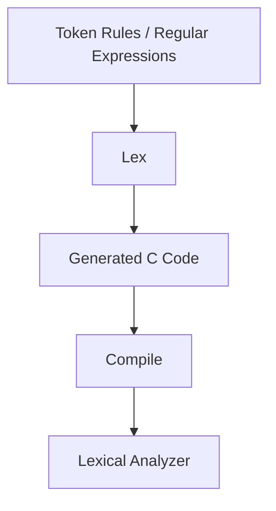

## Compiling Process

​	编译器分为前端和后端：

* 前端（Analysis）
  - Lexical Analysis: breaking the input into individual words or =="tokens"==;
  - Syntax Analysis: parsing the ==phrase structure== of the program; 
  - Semantic Analysis: calculating the program's meaning.
* 后端（Synthesis）

| 阶段 |             内容 |
| ---- | ---------------: |
| 前端 |      源代码 → IR |
| 后端 | IR → 汇编/机器码 |

## Task of lexical analyzer


* 输入：字符流（stream of characters）
* 输出：token 流（stream of tokens）

​	例如：

```C
float match0(char *s)
```

​	会被转换为：

```C
FLOAT ID(match0) LPAREN CHAR STAR ID(s) RPAREN ...
```

## Lexical Token

* token: 
  * 是字符的一个序列
  * 是语法中的一个基本单位
  * 有有限种 token 类型

​	常见 token 类型：

| 类型   |     示例     |
| :----- | :----------: |
| ID     |   foo, n14   |
| NUM    |   73, 082    |
| REAL   | 1.2, 5.5e-10 |
| IF     |      if      |
| COMMA  |      ,       |
| NOTEQ  |      !=      |
| LPAREN |      (       |

* Reserved words: 不会用于 identifiers。例如：IF, VOID, RETURN

​	非 token 例子：

| 类型                        |        示例        |
| :-------------------------- | :----------------: |
| comment                     |  /* try again */   |
| preprocessor directive      | \#include<stdio.h> |
| preprocessor directive      | \#define NUMS 5, 6 |
| macro                       |        NUMS        |
| blanks, tabs, and new-lines |                    |

* The preprocessor deletes the non-tokens
  * Operates on the source character stream
  * Producing another character stream to the lexical analyzer
* 预处理器先处理字符流，再交给词法分析器。

## How to implement a lexical analyzer

### 词法规则（英文描述示例）


### Implementation

* 四种方法：
  * An ad hoc lexer: 手写 lexer
  * Regular expressions: 描述 lexer
  * Deterministic finite automata: 实现 lexer
  * Mathematics: 结合 RE 和 DFA

$$
\text{Lexical Token Description}
\xrightarrow{\text{Manually}}
\text{RE}
\xrightarrow{\text{?}}
\text{DFA}
\xrightarrow{\text{Table-Driven Implementation}}
\text{Lexer}
$$

## Regular Expression

* A ==language== is a set of strings
* A ==string== is a finite sequence of symbols
* A ==symbol== is taken from a finite alphabet

### 基础元素

| 形式 | 含义   |
| ---- | ------ |
| a    | 字符 a |
| ε    | 空串   |

### 运算

* $M \mid N:L(M \mid N) = \{ s \mid s \in L(M) \; or \; s \in L(N) \}$
* $M \cdot N:L(M \cdot N) = \{\, st \mid s \in L(M),\; t \in L(N) \,\}$
* $M*$，Kleene closure

​	常见符号：

| 表达式 | 含义         |
| ------ | ------------ |
| M+     | M 至少一次   |
| M?     | 0或1次       |
| [abc]  | a \| b \| c  |
| [a-z]  | 字符范围     |
| .      | 任意字符     |
| "abc"  | 字符串字面量 |

### Regular Expressions for Tokens


### Disambiguation rules

​	有时规则匹配会有歧义冲突，有两种方式解决：

* Longest Match（最长匹配）：
  * 匹配最长可能字符串。
  * `if8` 匹配为 ID 而不是 IF + NUM
* Rule Priority（规则优先级）：
  * 若长度相同，优先匹配先写的规则
  * `if` 匹配为 IF 而不是 ID

## Finite Automata

* DFA 包含：
  * 有限状态集合
  * 唯一开始状态
  * 若干终止状态
  * 每个状态对每个字符只有一个转移
* 接受规则
  - 从开始状态出发
  - 逐字符转移
  - 最终落在终止状态 → 接受


### 多个 DFA 合并

* 多个 token 自动机合并为一个大自动机：
  * 所有表达式的起点合并
  * 每个终态标记 token 类型

​	例如：


* 冲突时：
  * 采用最长匹配
  * 再按规则优先级

​	例如在遇到 `if` 时：


### Transition matrix

​	可以对 DFA 进行编码：

```C
int edges[state][character];
int final[state];
```

​	`final[state]` 将 state numbers 映射至 actions，而 `edges[state][character]` 表示 DFA 的转移，如下：


### Recognizing the longest match

* 使用两个变量：
  * LastFinal
  * InputPositionAtLastFinal
* 当进入死状态时：
  * 回退到 last final
  * 输出 token

​	使用以下标志符：

* |：input position
* ⊥: automaton position
* T: Input position at last final

​	展示一个示例：

```C
if --not-a-com
```

​	过程如下：


## NFA

​	DFA 的构造有些困难，可以考虑使用 NFA：
$$
\text{Description of lexical tokens (in natural language or in mind)}
\xrightarrow{\text{Manually}}
\text{RE}
\xrightarrow{\text{Thompson's Construction}}
\text{NFA}
\xrightarrow{\text{Subset Construction, DFA Minimization}}
\text{Deterministic Finite Automata}
\xrightarrow{\text{e.g., Table-Driven Implementation}}
\text{Lexer}
$$

### NFA 定义

* 同一字符可能有多条边
* 可以有 ε 边（不消耗输入）
* 接受规则：只要有一条路径能到终态就接受

## From RE to Lexer

​	词法分析器的完整构造流程：

$$
\text{Lexical Token Description}
\xrightarrow{\text{RE}}
\text{NFA}
\xrightarrow{\text{Subset Construction}}
\text{DFA}
\xrightarrow{\text{Table Implementation}}
\text{Lexer}
$$

​	步骤说明：

| 阶段    | 作用                     |
| ----- | ---------------------- |
| RE    | 描述 token 的模式           |
| NFA   | 使用 Thompson 构造         |
| DFA   | 使用 subset construction |
| Lexer | 表驱动实现                  |

## Regular Expression → NFA

​	使用 **Thompson Construction** 将正则表达式转换为 NFA。

​	特点：

* 每个 RE 结构都有一个固定的 NFA 模板
* 所有 NFA 只有一个入口和一个出口

### 基本构造

1. 单字符

​	

2. ε


### 运算构造

1. Union（M | N）


2. Concatenation（MN）


3. Kleene Star（M*）


## NFA Simulation

​	直接运行 NFA 的基本思想：同时追踪多个可能状态。

​	假设：

```C++
start state = s1
input = c1, c2, ... ck
```

​	算法：

```C++
d ← closure({s1})
for i = 1 to k
    d ← DFAedge(d, ci)
```

​	其中：

```C++
d = 当前可能状态集合
```

### ε-closure

```C
closure(S)
```

​	定义：

* 从集合 S 中所有状态出发，通过 ε-transitions 能到达的所有状态

​	例：

```C
1 --ε--> 2
1 --ε--> 3
```

​	则：

```C
closure({1}) = {1,2,3}
```

### move(S, c)

```C
move(S, c)
```

​	表示：从 S 中的状态，通过字符 c 能到达的所有状态

​	例如：

```C
2 --a--> 4
3 --a--> 5
```

```C
move({2,3}, a) = {4,5}
```

### DFAedge(S, c)

​	定义：

```C
DFAedge(S, c) = closure(move(S, c))
```

​	步骤：

1. 计算 move
2. 再计算 ε-closure

### NFA Simulation Example

​	NFA：

```
1 --ε--> 2
1 --ε--> 3
2 --a--> 2
2 --b--> 4
3 --a--> 4
4 --b--> 5
```

​	输入：

```
aab
```

1. Step1：`d0 = closure({1})`、`closure({1}) = {1,2,3}`
2. Step2：`move({1,2,3}, a)`、`2 → 2,
   3 → 4`、`d1 = {2,4}`
3. Step3：`move({2,4}, a)`、`2 → 2`、`d2 = {2}`
4. Step4：`move({2}, b)`、`2 → 4`、`d3 = {4}`
5. 判断：final state 为 5，但最终状态为 `{4}`，所以字符串不能被接受。

## Problem of NFA Simulation

​	通过上面的例子可以发现：

> Manipulating sets of states is expensive

> 也就是读取一个字符都需要经历 `move`、`closure`、`set union` 这三个步骤。

## Solution: Subset Construction

​	其中一种解决方法是：预先计算所有状态集合。即：

$$
NFA \rightarrow DFA
$$
​	这样扫描输入时，有：

```C
state = transition[state][char]
```

### Subset Construction Algorithm

​	核心思想为：DFA 的每个状态 = 一个 NFA 状态集合

1. Step1：初始状态时，`D1 = closure({start})`
2. Step2：对于每个状态集合 Di，对于每个输入符号 a ∈ Σ，计算 `Dj = DFAedge(Di, a)`，若 Dj 为新集合，则加入 DFA 状态集合。
3. Step3：重复：直到没有新集合产生

### Example: NFA → DFA

​	NFA：

```C
1 --ε--> 2
1 --ε--> 3
2 --a--> 2
2 --b--> 4
3 --b--> 3
3 --a--> 4
```

* alphabet：$\Sigma = \{a,b\}$	
* 初始状态：$closure(\{1\}) = \{1,2,3\}$，记为：D1

​	则 DFA 转移如下：

| State   | a     | b     |
| ------- | ----- | ----- |
| {1,2,3} | {2,4} | {3,4} |
| {2,4}   | {2}   | {4}   |
| {3,4}   | {4}   | {3}   |
| {2}     | {2}   | {4}   |
| {4}     | ∅     | ∅     |
| {3}     | {4}   | {3}   |

* DFA Final States 只要集合包含：NFA final state，则为 DFA final state。例如：`{2,4}`、`{3,4}`、`{4}`

## DFA Minimization

​	DFA 最小化是将 DFA 化为==最小形式（Minimized DFA）==的过程，使得状态数最少且语言不变。

### 等价状态

* 两个状态 p 和 q ==等价==，当且仅当：
  * 对于所有输入字符串 w，从 p 出发和从 q 出发，得到的输出结果相同
  * 即：$\delta(p, w)$ 和 $\delta(q, w)$ 要么都是接受状态，要么都是非接受状态

* 两个状态 p 和 q ==可区分==，如果存在某个字符串 w 使得 $\delta(p, w)$ 是接受状态而 $\delta(q, w)$ 不是接受状态（反之亦然）

### 划分算法（Partitioning Algorithm）

* 步骤：
  1. **初始划分**：将状态分为接受状态组和非接受状态组
  2. **迭代细分**：对每个组进行细分：
     * 如果组内两个状态对某个输入字符转移到不同组，则将它们分开
  3. **重复直到收敛**：重复步骤 2 直到没有组可以再细分
  4. **合并**：每个组压缩为一个状态

### 示例：DFA Minimization 详细过程

​	给定以下 DFA（识别以 ab 结尾的字符串）：

```
初始状态：0
接受状态：3

转移表：
状态  'a'  'b'
 0     1    2
 1     1    3
 2     1    2
 3     1    2
```

#### Step 1: 初始划分

* 接受状态：$\{3\}$
* 非接受状态：$\{0, 1, 2\}$

划分 $P_0 = \{\{0,1,2\}, \{3\}\}$

#### Step 1 迭代 1：检查组 $\{0,1,2\}$

* 对状态 0：
  * $\delta(0, 'a') = 1 \in$ 组 $\{0,1,2\}$
  * $\delta(0, 'b') = 2 \in$ 组 $\{0,1,2\}$
* 对状态 1：
  * $\delta(1, 'a') = 1 \in$ 组 $\{0,1,2\}$
  * $\delta(1, 'b') = 3 \in$ 组 $\{3\}$  ← 转移到不同组！
* 对状态 2：
  * $\delta(2, 'a') = 1 \in$ 组 $\{0,1,2\}$
  * $\delta(2, 'b') = 2 \in$ 组 $\{0,1,2\}$

**结论**：状态 1 和 $\{0,2\}$ 可区分，需要拆分！

划分 $P_1 = \{\{0,2\}, \{1\}, \{3\}\}$

#### Step 1 迭代 2：检查组 $\{0,2\}$

* 对状态 0：
  * $\delta(0, 'a') = 1 \in$ 组 $\{1\}$
  * $\delta(0, 'b') = 2 \in$ 组 $\{0,2\}$
* 对状态 2：
  * $\delta(2, 'a') = 1 \in$ 组 $\{1\}$
  * $\delta(2, 'b') = 2 \in$ 组 $\{0,2\}$

**结论**：状态 0 和 2 行为完全相同，不需要拆分！

划分 $P_2 = \{\{0,2\}, \{1\}, \{3\}\}$

#### Step 2: 构建最小化 DFA

* 组 $\{0,2\}$ → 新状态 A
* 组 $\{1\}$ → 新状态 B
* 组 $\{3\}$ → 新状态 C（接受状态）

**转移计算**：

* 从 A（代表 $\{0,2\}$）出发：
  * 读 'a'：$\delta(0,'a')=1 \in B$，所以 $\delta(A,'a') = B$
  * 读 'b'：$\delta(0,'b')=2 \in A$，所以 $\delta(A,'b') = A$

* 从 B 出发：
  * 读 'a'：$\delta(1,'a')=1 \in B$，所以 $\delta(B,'a') = B$
  * 读 'b'：$\delta(1,'b')=3 \in C$，所以 $\delta(B,'b') = C$

* 从 C 出发：
  * 读 'a'：$\delta(3,'a')=1 \in B$，所以 $\delta(C,'a') = B$
  * 读 'b'：$\delta(3,'b')=2 \in A$，所以 $\delta(C,'b') = A$

#### 最小化结果


| 最小化前状态数 | 最小化后状态数 |
| ------------- | ------------- |
| 4 | 3 |

### Different tokens 类型的情况


* state2 与 state4 是等价的，但是 A 和 B 是两种 token 类型，此时不应该放在一个等价类里面。
* 考虑将他们分到不同的等价组里面，即可
  * $\Pi=\{S-F,F_1,\dots,F_k\}$

## Lex: A Lexical Analyzer Generator

Lex 是一个 **词法分析器生成器（lexer generator）**，用于根据 **token 的正则表达式描述自动生成 lexer 程序**。

它是 Unix 系统中经典的编译器工具，通常与 **Yacc / Bison（语法分析器生成器）**一起使用。

### Motivation

手写词法分析器虽然可行，但存在以下问题：

- 实现复杂
- 代码容易出错
- 维护困难
- token 规则修改成本高

因此，可以使用 **lexer generator** 自动生成词法分析器。

### Lex 工作流程

Lex 的基本流程如下：



也可以表示为：

$$
\text{Regular Expressions}
\xrightarrow{\text{Lex}}
\text{Lexer (C program)}
$$

### Lex Specification File

Lex 使用一个 **.l 文件**作为输入。

其结构分为 **三部分**：

```C
definitions
%%
rules
%%
user code
```

1. Definitions：用于定义：
   1. 宏（macros）
   2. 头文件
   3. 全局变量
   4. token 名称

例如：

```C
%{
#include <stdio.h>
%}

DIGIT   [0-9]
ID      [a-zA-Z][a-zA-Z0-9]*
```

解释：

| 定义    | 含义             |
| ------- | ---------------- |
| `%{ %}` | 插入 C 代码      |
| DIGIT   | 宏定义           |
| ID      | identifier 的 RE |

2. Rules：规则部分格式：

```
pattern    action
```

pattern 是 **正则表达式**
action 是 **C 代码**

例如：

```C
%%
"if"        return IF;
"while"     return WHILE;
{ID}        return ID;
{DIGIT}+    return NUM;
[ \t\n]+    ;
%%
```

解释：

| 规则       | 含义      |
| ---------- | --------- |
| `"if"`     | 关键字 if |
| `{ID}`     | 标识符    |
| `{DIGIT}+` | 数字      |
| `[ \t\n]+` | 忽略空白  |

3. User Code

用户自定义代码部分，例如：

```C
int main() {
    yylex();
    return 0;
}
```

其中：

```
yylex()
```

是 Lex 自动生成的词法分析函数。

### Example: Simple Lex Program

```C
%{
#include <stdio.h>
%}

DIGIT   [0-9]

%%
{DIGIT}+   printf("NUMBER\n");
"+"        printf("PLUS\n");
"-"        printf("MINUS\n");
[ \t\n]    ;
%%

int main() {
    yylex();
}
```

输入：

```
12+3
```

输出：

```
NUMBER
PLUS
NUMBER
```

### Lex 内部实现原理

Lex 内部实际上使用：

```
Regular Expressions
      ↓
     NFA
      ↓
     DFA
      ↓
Table-driven Scanner
```

这和前面讲的 **RE → NFA → DFA → Lexer** 完全一致。

### Longest Match Rule

Lex 默认使用 Longest Match 匹配 **最长可能字符串**

例如：

```
== 
=
```

输入：

```
==
```

Lex 会选择：

```
==
```

而不是两个 `=`。

### Rule Priority

如果多个规则匹配 **相同长度字符串**，使用 **先写的规则**

例如：

```C
if      return IF;
[a-z]+  return ID;
```

输入：

```
if
```

结果：

```
IF
```

而不是 ID。

### Reserved Words Handling

关键字通常写在 **identifier 规则之前**：

```C
if      return IF;
else    return ELSE;
[a-z]+  return ID;
```

原因：

- 同长度匹配
- 使用 rule priority

### Ignoring Tokens

有些 token 不需要返回，例如：

- whitespace
- comments

例如：

```C
[ \t\n]+    ;
```

表示：

```
匹配但不执行任何动作
```

### Interaction with Parser

Lex 通常和 **Yacc/Bison** 一起使用。

流程：

```
Source Program
      ↓
    Lexer
      ↓
    Tokens
      ↓
    Parser
      ↓
  Syntax Tree
```

- Lex 负责 **词法分析**
- Yacc 负责 **语法分析**
