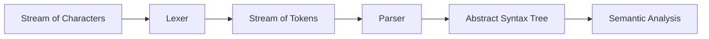

## What is syntax analysis?

* 语法分析（Syntax Analysis）就是 **parsing the phrase structure of the program**。
* 它位于前端（front-end）中，位于 **词法分析之后、语义分析之前**。



* Parser 通常是根据 **grammar（文法）** 手写或自动生成的。

## Why do we need syntax analysis?

1. 检查语法错误
   * 有些程序 **没有词法错误**（指的是字符不合法），但会有多个 **syntax errors**（语法错误，指的是 token 顺序错误）。
   * 语义分析通常假设输入程序已经满足语法要求，因此语法错误应尽早在 parser 阶段发现。
2. 构造 parse tree，服务后续阶段

例如表达式：

```text
1 + 2 * 3
```

经过 Lexer：

```text
num(1) plus num(2) times num(3)
```

经过 Parser：

* 得到 parse tree，从而正确体现优先级和结合性。
* 后续阶段（语义分析、IR 生成）都依赖这种结构信息。


## Outline: How to build a parser?

* 用 **Context-Free Grammar (CFG)** 描述语言语法
* 基于 CFG 构造 parser：
  * Top-Down Parsing
  * Predictive Parsing (LL(k))
  * Bottom-Up Parsing
  * LR Parsing
* More about parsing:
  * Automatic parser generation
  * Error recovery

## Context-Free Grammar (CFG)

### Why CFG?

* 并不是所有 token 串都构成合法程序。
* 我们需要：
  * 形式化地描述合法 token 串
  * 能区分 valid / invalid strings

### Regular language 不够强

* 正则语言是常用形式语言中较弱的一类。
* 但编程语言里存在大量 **recursive structure**，例如：

```text
(), (()), ((()))
((1+2)+3)
```

* 这类结构不是 regular language，更自然的工具是 **CFG**。

### CFG 定义

一个 CFG 由以下部分组成：

| 组成        | 含义                      |
| ----------- | ------------------------- |
| T           | terminals（终结符）       |
| N           | non-terminals（非终结符） |
| S           | start symbol（开始符号）  |
| Productions | 产生式 / 规则             |

产生式一般写作：
$$
X \rightarrow Y_1Y_2 \dots Y_k
$$


其中：

* $X \in N, \quad Y_i \in N \cup T \cup \{\varepsilon\}$

### 例子：匹配括号的 CFG

```text
S -> (S)
S -> ε
```

它描述的语言是：

```text
{ ε, (), (() ), ((())), ... }
```

## Derivation（推导）

### 定义

从开始符号 `S` 出发：

1. 初始串只包含开始符号 `S`
2. 每次把某个非终结符替换为某条产生式右侧
3. 重复直到串中只剩终结符

例如：

```text
S -> (S) -> ((S)) -> (())
```

### 语言定义

若文法 `G` 的开始符号是 `S`，则：

$$
L(G) = \{\, w \mid S \Rightarrow^{*} w,\; \text{且 } w \text{ 只含终结符} \,\}
$$
其中 $\Rightarrow^{*}$ 表示经过零步或多步推导。

## Parse Tree

* 推导过程可以画成一棵树：
  * 根节点是开始符号
  * 内部节点是非终结符
  * 叶子节点是终结符
* 叶子从左到右读出的顺序，就是原始输入串。

### Parse Tree 的作用

* 不只是判断 $S \in L(G)$
* 更重要的是体现 **phrase structure（短语结构）**
* 也体现运算符的 **association of operations**

### Left-most / Right-most Derivation

* Left-most derivation：每一步都替换最左侧非终结符
* Right-most derivation：每一步都替换最右侧非终结符
* 对于 **unambiguous CFG**，它们虽然推导顺序不同，但会得到同一棵 parse tree。

## Ambiguous Grammar（歧义文法）

### 定义

如果一个文法能够对某个字符串生成 **两棵不同的 parse tree**，则它是 ambiguous grammar。

等价地说：

* 对某个字符串存在多个 left-most derivation
* 或存在多个 right-most derivation

### 经典例子

```text
E -> E * E
E -> E / E
E -> E + E
E -> E - E
E -> id
E -> num
E -> (E)
```

字符串：

```text
id * id + id
```

可以解释为：

* `(id * id) + id`
* `id * (id + id)`

所以文法是歧义的。

### 为什么歧义有问题？

* 编译器依赖 parse tree 来定义程序含义
* 例如：

```text
2 * 3 + 4
```

不同 parse tree 会给出不同结果：

* `(2*3)+4 = 10`
* `2*(3+4) = 14`

所以 ambiguous grammar 会让程序含义不明确。

## Removing Ambiguity

### 目标

我们通常希望：

* `*` / `/` 的优先级高于 `+` / `-`
* 运算符满足左结合（left associativity）

### 经典改写

把歧义文法改写为：

```text
E -> E + T
E -> E - T
E -> T
T -> T * F
T -> T / F
T -> F
F -> id
F -> num
F -> (E)
```

其中：

* `E` = expression
* `T` = term
* `F` = factor

### 为什么它能消歧义？

* **Precedence**：高优先级运算符在更深层（`T`,`F`）推导
* **Left associativity**：使用左递归（如 `E -> E + T`）

##  EOF Marker

为了明确“完整句子已经结束”，通常引入：

```text
$: end of file (EOF)
```

做法：

* 添加新的开始符号 `S'`
* 添加新规则：

```text
S' -> S $
```

这样 parser 就能判断：

* 既成功识别了一个完整的 `S`
* 也到达了输入末尾

## Predictive Parsing

### Parser 的类型

三类常见 parser：

| 类型      | 特点                       |
| --------- | -------------------------- |
| Universal | 能处理任意 grammar，但太慢 |
| Top-Down  | 从根到叶构造 parse tree    |
| Bottom-Up | 从叶到根构造 parse tree    |

* Top-Down 和 Bottom-Up 都是从左到右扫描输入。
* 最高效的方法通常只适用于某些 grammar 子类。

### Top-Down Parsing

* 从 parse tree 的根开始，自顶向下构造
* 可以看作寻找输入串的 **left-most derivation**

例如，对于字符输入 `begin print num = num end` 来说，可以画出语法分析树：


## Recursive-Descent Parsing

### 思想

* 每个 non-terminal 对应一个递归函数
* 每条产生式对应函数中的一个分支

例如文法：

```text
S -> if E then S else S
S -> begin S L
S -> print E
L -> end
L -> ; S L
E -> num = num
```

可以写出：

```c
void S(void) {
    switch(tok) {
        case IF:    eat(IF); E(); eat(THEN); S(); eat(ELSE); S(); break;
        case BEGIN: eat(BEGIN); S(); L(); break;
        case PRINT: eat(PRINT); E(); break;
        default: error();
    }
}
```

### 基础设施

```c
enum token {IF, THEN, ELSE, BEGIN, END, PRINT, SEMI, NUM, EQ};
extern enum token getToken(void);
enum token tok;

void advance() { tok = getToken(); }
void eat(enum token t) {
    if (tok == t) advance();
    else error();
}

void S(void) {
  switch(tok) { 
    case IF: eat(IF); E(); eat(THEN); S(); eat(ELSE); S(); break; 
    case BEGIN: eat(BEGIN); S(); L(); break; 
    case PRINT: eat(PRINT); E(); break; 
    default: error(); }}
void L(void) {
  switch(tok) {
    case END: eat(END); break;
    case SEMI: eat(SEMI); S(); L(); break;
    default: error(); }}
void E(void) { eat(NUM); eat(EQ); eat(NUM); }		
```

### 优点

* 简单
* 容易手写

### 缺点

* 一般形式可能需要 **backtracking**
* 某些 grammar 会导致分支选择困难，开销高

## Why Predictive Parsing?

对于如下文法：

```text
E -> E + T
E -> E - T
E -> T
```

当 lookahead 是 `num` 时，无法仅凭当前 token 决定选择哪条产生式。

如果采用普通 recursive descent：

* 可能要 backtracking
* 代价很高，甚至指数爆炸

于是引出：

## Predictive Parsing

### 定义

* Predictive parsing 是 recursive descent 的一个特例
* **不需要 backtracking**
* 通过查看前方 `k` 个 token 决定使用哪条产生式
* 能处理 **LL(k)** 文法

其中：

```text
LL(k) = Left-to-right parse, Leftmost derivation, k-token lookahead
```

## Nullable / FIRST / FOLLOW

为了构造 predictive parsing table，需要先计算：

* Nullable
* FIRST
* FOLLOW

### Nullable

如果某个符号能推出 `ε`，则它是 nullable。

$$
\text{Nullable}(X) = \text{true} \iff X \Rightarrow^{*} \varepsilon
$$

#### 迭代算法

1. 初始化所有符号为 `false`
2. ==若有产生式== $X \rightarrow Y_1Y_2 \dots Y_k$，且所有 `Yi` 都 nullable，则 `X` nullable
3. 迭代直到不再变化
4. 有点类似于 closure

```C
for each symbol X:
	Nullable(x) = False
repeat
	for each production X -> Y1 Y2 … Yk:
		if Nullable(Yi) = True for 1 <= i <= k:
			Nullable(X) = True
until Nullable did not change in this iteration 
```

### FIRST

`FIRST(γ)` 表示：

> 从字符串 `γ` 推导出的串中，**可能出现在最前面的终结符集合**

若 $\gamma \Rightarrow^* t \beta $，则：

$$
t \in \text{FIRST}(\gamma)
$$

#### 规则

* 若 `X` 是终结符，则 `FIRST(X) = {X}`
* 若 `X -> Y1 Y2 ... Yk`
  * 加入 `FIRST(Y1)`
  * 如果 `Y1` nullable，再加入 `FIRST(Y2)`
  * 依此类推

### FOLLOW

`FOLLOW(X)` 表示在某个句型中，**紧接在 X 后面的终结符集合**。也就是：
$$
\text{若 } S \Rightarrow^{*} \beta X t \delta \\
\text{则 }t \in FOLLOW(X)
$$

#### 规则

若：
$$
Y \rightarrow \alpha X \beta
$$
则：

* 把 `FIRST(β)` 加入 `FOLLOW(X)`
* 若 `β =>* ε`，则把 `FOLLOW(Y)` 加入 `FOLLOW(X)`

### The algorithm to calculate First, Follow and Nullable Sets


## Predictive Parsing Table

对产生式：

```text
X -> γ
```

建表规则：（实际上，思路就是根据第一个终止符，判断当前产生式有无作用）

1. 若 `t ∈ FIRST(γ)`，则在 `M[X,t]` 中填入 `X -> γ`
2. 若 `γ` nullable，且 `t ∈ FOLLOW(X)`，则在 `M[X,t]` 中填入 `X -> γ`


### LL(1) Grammar

若按上述方法构造出的 parsing table **没有重复表项**，则文法是 **LL(1)**。

若某一格中出现多条产生式：

* predictive parsing 无法工作
* 文法不是 LL(1)

### Non-Recursive Predictive Parser

除了递归版本，也可以使用显式栈实现非递归预测分析：

* 栈顶为终结符：尝试 match
* 栈顶为非终结符：查表展开产生式
* 栈和输入都到 `$` 时 accept

## Eliminating Left Recursion

​	在使用 Predictive Parsing Table 的时候，不可以使用左递归，要将其消除。

### 为什么要消左递归？

例如：

```text
E -> E + T
E -> T
```

会导致：

* `FIRST(E+T) = FIRST(E)`
* 与 `E -> T` 冲突
* predictive parsing table 中出现重复表项

因此：

> Top-down parsing 不能处理 left-recursive grammar

### 经典消除方法

把：

```text
A -> Aα
A -> β
```

改写为：

```text
A  -> β A'
A' -> α A'
A' -> ε
```

例如：

```text
E -> E + T | T
```

改写为：

```text
E  -> T E'
E' -> + T E'
E' -> ε
```

### 表达式文法改写后

```text
S -> E $
E -> T E'
E' -> + T E'
E' -> - T E'
E' -> ε
T -> F T'
T' -> * F T'
T' -> / F T'
T' -> ε
F -> id
F -> num
F -> (E)
```

## Left Factoring

### 为什么需要？

若同一 non-terminal 的两条产生式有公共前缀：

```text
S -> if E then S else S
S -> if E then S
```

在 LL(1) 中，当看到 `if` 时无法马上决定选哪条。

### 解决：提取公共前缀

```text
S -> if E then S X
X -> else S
X -> ε
```

### 一般形式

```text
A -> αβ
A -> αγ
A -> α
```

改写为：

```text
A  -> α A'
A' -> β | γ | ε
```

本质：

* 延迟决策
* 直到读到更多输入后再选分支

## Error Recovery in Predictive Parsing

### 两种策略

* 直接报错并退出
* 报错后尽量恢复，继续分析

### 常见恢复思路

#### 插入 token

* 假装缺失 token 已存在
* 风险：可能导致 parser 不终止

#### 删除 token（更安全）

* 一直跳过输入 token
* 直到遇到一个“同步 token”

常用做法：

```text
skip until a token in FOLLOW(X)
```

例如：

```c
int Tprime_follow[] = {PLUS, RPAREN, EOF};
```

当 `T'` 出错时，跳过输入直到遇到 `+`, `)` 或 EOF。

## Bottom-Up Parsing

### 基本思想

* 自底向上构造 parse tree
* 从 leaves 一直归约到 root

### Shift-Reduce Parsing

Bottom-Up parsing 的一般风格是 **shift-reduce parsing**。

* **shift**：读入下一个 token，压栈
* **reduce**：若栈顶匹配某个产生式右部，则用其左部替换

### Reduce vs Derive

* Derive：把 LHS 展开成 RHS
* Reduce：把 RHS 归约回 LHS

Bottom-up parsing 本质上是在 **逆转 right-most derivation**。


## LR Parsing

### LR(k)

* `L` = left-to-right scan
* `R` = construct the reverse of a rightmost derivation
* `k` = lookahead token 数

### 优点

* 比 LL(k) 更强
* 可以把决策推迟到看到完整 RHS 之后再做

### Parser 维护的信息

* 当前输入位置
* 一个状态栈（或状态+符号栈）

### 四类动作

| 动作   | 含义               |
| ------ | ------------------ |
| Shift  | 把下一个输入移入栈 |
| Reduce | 用某条产生式归约   |
| Goto   | 归约后跳转到新状态 |
| Accept | 成功分析结束       |

## LR(0) Parsing

### LR(0) Item

```text
A -> α . β
```

表示：

* `α` 已经处理过
* 接下来期望看到 `β`

### Closure(I)

若在集合 `I` 中有：

```text
A -> α . X β
```

且 `X` 是非终结符，则对每条产生式：

```text
X -> γ
```

加入：

```text
X -> . γ
```

重复直到不再变化。

### Goto(I, X)

若 `I` 中有：

```text
A -> α . X β
```

则把点右移：

```text
A -> α X . β
```

收集后再做 closure。

### LR(0) DFA

* 状态 = item 集合
* 边 = Goto
* 然后由 DFA 构造 action/goto 表

### LR(0) 表项填写

* 若有终结符边：填 `shift`
* 若有非终结符边：填 `goto`
* 若状态中含有 `A -> α .`：对所有终结符填 `reduce`
* 若状态中含有 `S' -> S . $`：在 `$` 列填 `accept`

### LR(0) 的问题

* 有时会出现 **shift/reduce conflict** 或 **reduce/reduce conflict**
* 说明文法不是 LR(0)

---

## SLR Parsing

### 思想

LR(0) 的 reduce 太激进：

* 只要看到 `A -> α .`，就对所有终结符都 reduce

SLR 改进为：

> 只在 `FOLLOW(A)` 中的 token 上放置 reduce 动作

### 规则

若状态 `I` 中含有：

```text
A -> α .
```

则仅对：

```text
t ∈ FOLLOW(A)
```

填写：

```text
reduce A -> α
```

### 优点

* 比 LR(0) 更精确
* 能解决一部分 LR(0) 冲突

### 仍然可能出问题

* SLR 仍可能保留一些冲突
* 因为 FOLLOW 集是全局信息，不够精细

---

## LR(1) Parsing

### 核心思想

在 item 中加入 **lookahead**。

### LR(1) Item

```text
(A -> α . β, x)
```

含义：

* 当前处于 `A -> αβ` 的某个分析状态
* 完成这个产生式后，合法的后继 lookahead 是 `x`

### Closure（LR(1)）

若有：

```text
(A -> α . X β, z)
```

则对每个产生式：

```text
X -> γ
```

以及每个：

```text
w ∈ FIRST(β z)
```

加入：

```text
(X -> . γ, w)
```

### Reduce（LR(1)）

若状态中有：

```text
(A -> α ., z)
```

则只在 lookahead `z` 上 reduce。

### 优势

* 比 SLR 更准确
* 能解决更多冲突

### 代价

* 状态数通常更多
* 表可能非常大

## LALR(1) Parsing

### 动机

LR(1) 表太大。

### 做法

把 **LR(1) 项目核相同、只有 lookahead 不同** 的状态合并。

### 特点

* 表比 LR(1) 小很多
* 比 SLR 强
* 现代 parser generator 常用
* **Yacc** 基于 LALR 思想构造 parser

### 关系

```text
LR(0) ⊂ SLR ⊂ LALR(1) ⊂ LR(1)
```

通常：

* 所有 SLR grammar 都是 LALR(1)
* 但反过来不成立

---

## LR Parsing of Ambiguous Grammars

经典例子：dangling else

```text
S -> if E then S else S
S -> if E then S
S -> other
```

输入：

```text
if a then if b then s1 else s2
```

存在两种解释：

1. `else` 匹配最近的 `then`
2. `else` 匹配外层 `then`

大多数语言选择：

> `else` 匹配最近可能的 `then`

### 两种解决办法

#### 1. 改写文法

引入：

* `M`：matched if
* `U`：unmatched if

#### 2. 保持原文法，但在冲突时优先 shift

这会自然得到“最近 then 匹配 else”的效果。

## Automatic Parser Generation

### Why?

* 手写 parser 复杂
* LL/LR 文法都可以自动构造 parsing table

因此可以使用 **parser generator**。

## Yacc

### 基本概念

* Yacc = **Yet Another Compiler-Compiler**
* 输入：`.y` 规格文件
* 输出：C 语言 parser 代码（常见为 `tab.c`）

### 基本结构

```text
definitions
%%
rules
%%
auxiliary routines
```

### Example

可用 Yacc 写表达式计算器：

```yacc
%token NUMBER
%%
command: exp { printf("%d\n", $1); };
exp: exp '+' term { $$ = $1 + $3; }
   | exp '-' term { $$ = $1 - $3; }
   | term { $$ = $1; }
;
term: term '*' factor { $$ = $1 * $3; }
    | factor { $$ = $1; }
;
factor: NUMBER { $$ = $1; }
      | '(' exp ')' { $$ = $2; }
;
```

## Yacc 中的重要符号

### `yyparse()`

* Yacc 生成的 parser 主函数
* 成功返回 0，失败返回 1

### `yylex()`

* 由 lexer 提供
* 返回 token 类型
* 返回 0 表示输入结束

### `yyerror()`

* 用来输出错误信息

### `yylval`

* 存储 token 的语义值
* 例如数字 token 对应的整数值

### `$$`, `$1`, `$2`, ...

* `$i`：产生式右部第 i 个符号的值
* `$$`：产生式左部的值

例如：

```yacc
exp: exp '+' term { $$ = $1 + $3; }
```

表示：

* `$$` = 当前 `exp` 的值
* `$1` = 左边 `exp` 的值
* `$3` = `term` 的值

## YYSTYPE / %union / %type

默认情况下：

```c
#define YYSTYPE int
```

若不同符号需要不同值类型，可用：

```yacc
%union {
    double val;
    char op;
}
%type <val> exp term NUMBER
%type <op> op
```

这样可以让：

* `exp` 存 double
* `op` 存 char

---

## Embedded Actions

有时需要在整条产生式识别完成前执行代码：

```yacc
decl: type { current_type = $1; } var_list
```

这类 action 常用于：

* 符号表构造
* 类型信息传递

---

## Yacc Conflicts

Yacc 会报告：

* shift-reduce conflict
* reduce-reduce conflict

默认处理方式：

* shift-reduce：**优先 shift**
* reduce-reduce：选择 **文法中较早出现的规则**

但一般来说：

> 大多数 shift-reduce 冲突，以及所有 reduce-reduce 冲突，都应通过改写 grammar 消除。

---

## Precedence Directives in Yacc

Yacc 支持用优先级/结合性规则消解歧义。

### 声明方式

```yacc
%nonassoc EQ NEQ
%left PLUS MINUS
%left TIMES DIV
%right EXP
```

表示：

* `PLUS` / `MINUS`：同优先级，左结合
* `TIMES` / `DIV`：更高优先级，左结合
* `EXP`：右结合
* `EQ` / `NEQ`：不结合

### 冲突解决规则

* shift 的优先级来自当前 token
* reduce 的优先级来自该规则 RHS 最后一个 token

若发生冲突：

1. 规则优先级高 → reduce
2. token 优先级高 → shift
3. 优先级相同：
   * `%left` → reduce
   * `%right` → shift
   * `%nonassoc` → error

### `%prec`

可给规则强行指定优先级，例如一元负号：

```yacc
%left PLUS MINUS
%left TIMES
%left UMINUS

exp: MINUS exp %prec UMINUS
```

---

## Syntax vs. Semantics

有些问题不应该在 parser 阶段解决，而应放到 **semantic analysis**。

例如：

```text
a + 5 & b
```

从语法上可以是合法表达式；
但从语义上可能类型不匹配。

原则：

* 语法分析负责 structure
* 语义分析负责 type / meaning

---

## Error Recovery

### 目标

开发者通常希望编译器报告 **尽可能多的错误**，而不是遇到第一个错误就停止。

### 两类技术

| 类型                 | 含义             |
| -------------------- | ---------------- |
| Local error recovery | 在出错点附近恢复 |
| Global error repair  | 尝试全局最小修改 |

### Yacc 的局部恢复

Yacc 提供特殊终结符：

```text
error
```

例如：

```text
exp  -> ( error )
exps -> error ; exp
```

作用：

* 当 parser 遇到错误时，回退栈
* 直到找到可以 shift `error` 的状态
* 跳过输入，直到同步 token（如 `)` 或 `;`）
* 然后继续分析

这些同步 token 叫做：

```text
synchronizing tokens
```

### Global Error Repair

* 试图通过插入 / 删除 / 替换 token 使输入变为合法
* 更强，但也更复杂、代价更高
* 例如 Burke-Fisher error repair

---

## Chapter 3 Summary

### 1. CFG

* CFG 比 regular language 更适合表达递归结构
* parser 的核心任务是构造 parse tree

### 2. Top-Down Parsing

* 对应 left-most derivation
* recursive descent 简单但可能 backtracking
* predictive parsing 要求 LL(k)

### 3. FIRST / FOLLOW / Nullable

* 是构造 predictive parser 的基础
* 用于判断在某个 lookahead 下该选哪条产生式

### 4. Bottom-Up / LR

* 对应 right-most derivation 的逆过程
* shift-reduce 是核心思想
* LR(0) < SLR < LR(1)
* LALR(1) 是工业界常用方案

### 5. Yacc

* 自动生成 parser
* 支持语义动作、类型值、优先级声明、错误恢复
* 常与 Lex/Flex 配合使用


$$
motion\_data \rightarrow Mimic(训练) \rightarrow 模型 \rightarrow Isaaclab\_trainCode\_HZJ(仿真) \rightarrow 部署
$$
