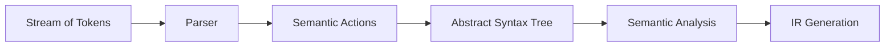

## What does Chapter 4 focus on?

Chapter 4 讨论的是：

1. **Semantic Actions（语义动作）**
   * parser 不只是判断输入串是否符合 grammar
   * 还可以在 parsing 的同时做“有用的事”
2. **Abstract Syntax（抽象语法）**
   * parser 最终更适合产出 **Abstract Syntax Tree (AST)**，而不是直接把所有后续工作都塞进 parser

可以把这一章看成是：

> 从“parser 只负责识别”走向“parser 负责构造后续阶段可用的数据结构”。



---

## Why is parsing alone not enough?

一个 parser 的最基本任务是：

* 识别一个 token 串是否属于某个 grammar 的语言
* 也就是回答：“这句话语法上是否合法？”

但是编译器真正需要的通常更多，例如：

* 构造 **abstract syntax tree**
* 做 **semantic analysis**
* 生成 **Intermediate Representation (IR)**

所以：

> parsing 只是第一步；semantic actions 让 parser 在识别结构的同时，把结构转换成更有用的结果。

---

## Semantic Actions（语义动作）

### 定义

**Semantic action** 就是附着在 parsing 过程中的计算或副作用。

它可以是：

* 计算表达式的值
* 构造抽象语法树节点
* 更新符号表
* 记录源代码位置
* 触发中间代码生成

对产生式

$$
A \rightarrow B\ C\ D
$$

可以理解为：当 parser 识别出右部 `B C D` 时，执行某段动作，构造出左部 `A` 对应的语义结果。

也就是说，除了“这个短语存在”，我们还关心：

$$
\text{val}(A)=f(\text{val}(B),\text{val}(C),\text{val}(D))
$$

---

## Semantic Actions in Recursive Descent

### 基本思想

在 **recursive-descent parser** 中：

* 每个 non-terminal 对应一个函数
* semantic action 往往就是：
  * 这个函数的 **返回值**
  * 或这个函数的 **side effect（副作用）**
  * 或两者兼有

因此，递归下降里最自然的问题就是：

> 这个 non-terminal 的 parsing function 应该返回什么？

### 语义值（semantic value）

对于每个 terminal / non-terminal，我们都可以关联一个“语义值类型”。

例如：

* `NUM` 可以携带 `int`
* `ID` 可以携带 `string`
* `E` 既可以返回：
  * 一个 `int`（如果我们想直接求值）
  * 也可以返回一个 `A_exp`（如果我们想构造 AST）

这个“类型”来自编译器的实现语言，例如 C 里的 `int`、指针、结构体等。

---

### 表达式 grammar 例子

这一章继续使用表达式 grammar：

```text
S  -> E $
E  -> T E'
E' -> + T E'
    | - T E'
    | ε
T  -> F T'
T' -> * F T'
    | / F T'
    | ε
F  -> id
    | num
    | (E)
```

这个 grammar 已经消除了左递归，因此适合 predictive / recursive-descent parsing。

---

### 例子：在 parsing 的同时求值

如果我们的目标是 **evaluate expression while parsing**，那么 `F()` 可以直接返回一个整数值：

```c
enum token {EOF, ID, NUM, PLUS, MINUS, TIMES, DIV, LPAREN, RPAREN};

union tokenval {
    string id;
    int num;
};

enum token tok;
union tokenval tokval;

// assume a lookup table mapping identifiers to integers
int lookup(string id);

int F(void) {
    switch (tok) {
        case ID: {
            int v = lookup(tokval.id);
            advance();
            return v;
        }
        case NUM: {
            int v = tokval.num;
            advance();
            return v;
        }
        case LPAREN: {
            eat(LPAREN);
            int v = E();
            eat(RPAREN);
            return v;
        }
        default:
            error("expected ID, NUM, or '('");
            return 0;
    }
}
```

这里的关键点是：

* `F` 不只是“识别一个 factor”
* 它还返回了这个 factor 的 **语义值**

例如：

* `id` -> 通过 `lookup` 取变量值
* `num` -> 直接返回数字
* `(E)` -> 返回括号内表达式的值

---

### Return value 和 side effect

在 recursive descent 中，semantic action 不一定非要靠返回值。

它还可以通过 **side effect** 完成任务。

例如：

```text
S -> id := num
```

对应的 semantic action 可以是：

* 把 `num` 的值写入变量 `id`
* 更新符号表或运行时环境

所以递归下降中常见的两种风格是：

1. **返回值风格**
   * 例如表达式求值、构造 AST 节点
2. **副作用风格**
   * 例如赋值、记录声明、填符号表

很多时候二者会同时出现。

---

### 消除左递归之后，如何保持左结合？

一个非常重要的问题是：

原始表达式 grammar 往往是左递归的，例如：

```text
T -> T * F | F
```

但为了写 recursive-descent parser，我们通常会把它改写成：

```text
T  -> F T'
T' -> * F T'
    | / F T'
    | ε
```

这样虽然 grammar 适合 top-down parsing 了，但语义动作不能简单照搬。

正确做法是：

> 把已经计算好的“左操作数”当参数传给 `T'`。

例如：

```c
int T(void) {
    switch (tok) {
        case ID:
        case NUM:
        case LPAREN:
            return Tprime(F());
        default:
            error("expected ID, NUM, or '('");
            return 0;
    }
}

int Tprime(int acc) {
    switch (tok) {
        case TIMES:
            eat(TIMES);
            return Tprime(acc * F());
        case DIV:
            eat(DIV);
            return Tprime(acc / F());
        case PLUS:
        case MINUS:
        case RPAREN:
        case EOF:
            return acc;
        default:
            error("bad token in T'");
            return acc;
    }
}
```

这里：

* `acc` 表示已经处理好的左侧结果
* 每次看到 `* F`，就把 `acc * F()` 继续传下去
* 最终得到的是 **左结合** 的结果

所以：

> 在改写 grammar 之后，semantic action 往往也要同步改写。

---

## Semantic Actions in Yacc-Generated Parsers

### 基本写法

在 Yacc / Bison 风格的 parser 中，semantic action 写在产生式后面的 `{ ... }` 里：

```yacc
%union { int num; string id; }
%token <num> INT
%token <id>  ID
%type  <num> exp

%left UMINUS

%%
exp : INT                    { $$ = $1; }
    | exp PLUS exp           { $$ = $1 + $3; }
    | exp MINUS exp          { $$ = $1 - $3; }
    | exp TIMES exp          { $$ = $1 * $3; }
    | MINUS exp %prec UMINUS { $$ = -$2; }
;
```

这里几个符号非常重要：

* `{ ... }`：semantic action
* `$i`：右部第 `i` 个符号的语义值
* `$$`：左部 non-terminal 的语义值
* `%union`：声明语义值可能的多种类型
* `<...>`：为某个 terminal / non-terminal 指定它使用 `%union` 中的哪个分量

---

### `$$`、`$1`、`$2`、`$3` 的含义

例如：

```yacc
exp : exp PLUS exp { $$ = $1 + $3; }
```

含义是：

* `$1`：左边那个 `exp` 的值
* `$2`：`PLUS` 的值（通常不需要）
* `$3`：右边那个 `exp` 的值
* `$$`：归约完成后，这个新的 `exp` 的值

也就是说：

> semantic action 明确地描述了“如何由子节点的语义值构造父节点的语义值”。

---

### Yacc 是如何实现这些语义动作的？

Yacc 生成的 LR parser 不只维护一个 **state stack**，还会维护一个与之平行的：

* **semantic value stack**

当 parser 做一次 reduction：

```text
A -> Y1 Y2 ... Yk
```

它会：

1. 从语义值栈顶取出这 `k` 个 RHS 符号的值
2. 把它们当作 `$1 ... $k`
3. 执行 `{ ... }` 中的 semantic action
4. 计算出 `$$`
5. 弹出 RHS 的 `k` 个值
6. 把 `$$` 压回栈中，作为新产生的 `A` 的语义值

所以 `$i` 的来源其实非常直接：

> 它们就是归约时栈顶那几个符号携带的语义值。

---

### 一个 reduction 的例子

考虑：

```yacc
exp : exp PLUS exp { $$ = $1 + $3; }
```

如果当前栈顶对应的是：

* 左侧 `exp` 的值为 `1`
* `+`
* 右侧 `exp` 的值为 `6`

那么 reduction 时会做：

```text
$$ = $1 + $3
val = 1 + 6
```

然后：

* pop `<exp2, 6>`
* pop `<+, NULL>`
* pop `<exp1, 1>`
* push `<exp, 7>`

这正是“把子表达式的值归约成父表达式的值”。

---

### LR parser 的语义动作顺序

在 bottom-up / LR parsing 中，reduction 的发生顺序是确定的。

因此，associated semantic actions 的执行顺序也是确定的：

* **bottom-up**
* **left-to-right**
* 等价于对“虚拟 parse tree”的 **postorder traversal（后序遍历）**

这点很重要，因为它说明：

> LR parser 中的 semantic action 执行顺序不是随意的，而是由 reduction 顺序严格决定的。

---

## Recursive Descent vs. Yacc：语义动作的区别

| 方式 | 语义动作通常写在哪里 | 典型数据流 |
| --- | --- | --- |
| Recursive Descent | 写在 parsing function 里面 | 返回值 / side effect |
| Yacc / LR | 写在 grammar rule 后面 | `$1, $2, ...` -> `$$` |

但它们本质上都在做同一件事：

> 当某个语法短语被识别出来时，计算它对应的语义结果。

---

## Why not put the whole compiler inside semantic actions?

理论上，完全可以把整个编译器都写进 Yacc 的 semantic action 里。

但是这样通常 **不利于工程实现**，主要原因有：

1. **难读、难维护**
   * grammar 本来是描述 syntax 的
   * 如果把 type checking、translation、符号表处理全塞进去，规则会变得很乱
2. **分析顺序被 parsing 顺序绑死**
   * parser 是按输入出现的顺序处理程序的
   * 但语义分析未必最适合严格按这个顺序进行
3. **模块化差**
   * parser 和后续阶段耦合过重

例如：

```c
void foo() { bar(); }
void bar() { ... }
```

如果所有事情都在 parsing 时立刻做掉，就会遇到：

* `foo` 里已经调用了 `bar`
* 但 `bar` 还没有被 parse 到

这说明：

> “parse 到哪里就必须立刻做完所有语义工作”并不是一个很好的架构。

更好的做法是：

* parser 先构造一棵 tree
* 后续 phase 再独立遍历这棵 tree

---

## Concrete Parse Tree vs. Abstract Syntax Tree

### Concrete Parse Tree（具体语法树）

从技术上说，一个 **parse tree**：

* 对输入中的每个 token 都有一个叶子
* 对 parsing 过程中每次使用的 grammar rule 都有一个内部节点

这种树忠实反映了 grammar 的具体形式，因此也叫：

* **concrete parse tree**
* 表示 **concrete syntax**

---

### Concrete Parse Tree 的问题

具体语法树通常不适合直接给后续 phase 使用，原因包括：

1. **冗余 token 太多**
   * 例如 `(`、`)`
   * 对后续 type checking / IR generation 往往没有直接价值
2. **内存开销大**
   * 每个 token、每次 reduction 都建节点，树会很大
3. **太依赖 grammar**
   * grammar 一改，parse tree 形状就可能大改
   * 这会把 parser 的改动传染给后续所有 phase

所以 concrete parse tree 虽然“忠实”，但并不“好用”。

---

### Abstract Syntax（抽象语法）

**Abstract syntax** 的目标是给 parser 和后续 phase 之间提供一个更干净的接口。

它的核心思想是：

* 保留真正重要的 **phrase structure**
* 丢掉那些只为 parsing 服务的细节

例如，具体语法可能写成：

```text
E -> E + T
   | T
T -> T * F
   | F
F -> n
   | (E)
```

而对应的抽象语法可以写得更直接：

```text
E -> n
   | E + E
   | E * E
```

注意：

* 抽象语法 **不是为了 parsing**
* parser 仍然使用 concrete syntax
* parser 的任务是把 concrete syntax 翻译成 abstract syntax tree

---

### AST conveys structure, not evaluation

对表达式：

```text
2 + 3 * 4
```

抽象语法树会表示为：

```text
    +
   / \
  2   *
     / \
    3   4
```

这棵树说明的是：

* `*` 比 `+` 优先级高
* `3 * 4` 是一个整体
* 最外层再和 `2` 做加法

但它 **没有做语义解释**，例如：

* 没有做类型检查
* 没有做常量折叠
* 也不等于“已经计算成 14”

所以：

> AST 表达的是“程序结构”，而不是“程序已经执行完的结果”。

---

## Why is AST a better interface?

AST 相比 concrete parse tree 的优势可以概括为：

1. **更简洁**
   * 去掉括号等冗余符号
2. **更稳定**
   * grammar 为了 parsing 做的小改动，不一定影响 AST 设计
3. **更适合后续阶段**
   * semantic analysis、IR generation 更关心程序结构，而不是 grammar 工程细节
4. **更利于模块化**
   * parser 只负责建树
   * 语义分析、优化、翻译再分别做自己的事

---

## Representing AST as Data Structures

### 典型做法：tagged union

如果编译器后续要操作 AST，就必须把 AST 表示成程序里的数据结构。

一种经典表示方法是：

* 对某类语法节点定义一个 `typedef`
* 用 `enum + union` 区分不同 kind 的节点

例如表达式 AST：

```c
typedef struct A_exp_ *A_exp;

struct A_exp_ {
    enum {A_numExp, A_plusExp, A_timesExp} kind;
    union {
        int num;
        struct { A_exp left; A_exp right; } plus;
        struct { A_exp left; A_exp right; } times;
    } u;
};

A_exp A_NumExp(int num);
A_exp A_PlusExp(A_exp left, A_exp right);
A_exp A_TimesExp(A_exp left, A_exp right);
```

这里：

* `kind` 告诉我们这个节点是什么类型
* `u` 里存放对应类型的具体数据
* `A_NumExp / A_PlusExp / A_TimesExp` 是构造函数

---

### 构造函数例子

例如构造加法节点：

```c
A_exp A_PlusExp(A_exp left, A_exp right) {
    A_exp e = checked_malloc(sizeof(*e));
    e->kind = A_plusExp;
    e->u.plus.left = left;
    e->u.plus.right = right;
    return e;
}
```

这个函数做的事就是：

1. 分配一个新节点
2. 记录节点 kind
3. 把左右孩子接上
4. 返回这个 AST 节点

这和“返回一个 `int` 值”完全不同：

* 这里我们不是在 **evaluate**
* 我们是在 **build structure**

---

### 例子：构造 `2 + 3 * 4` 的 AST


```c
A_exp e1 = A_NumExp(2);
A_exp e2 = A_NumExp(3);
A_exp e3 = A_NumExp(4);
A_exp e4 = A_TimesExp(e2, e3);
A_exp e5 = A_PlusExp(e1, e4);
```

要点是：

* 要先构造 `TimesExp`
* 再把它作为右子树挂到 `PlusExp` 上

也就是说：

> 我们先反映语法结构，再谈后续解释。

所以这里的结果不是数字 `14`，而是一棵树。

---

## Building AST during parsing

### parser 可以一边 parse，一边建 AST

无论是 recursive descent 还是 Yacc-generated parser，都可以在 parsing concrete syntax 的同时构造 AST。

例如在 Yacc 中：

```yacc
%left PLUS
%left TIMES
%%
exp : NUM            { $$ = A_NumExp($1); }
    | exp PLUS exp   { $$ = A_PlusExp($1, $3); }
    | exp TIMES exp  { $$ = A_TimesExp($1, $3); }
;
```

这里：

* 如果读到 `NUM`，就构造一个数字节点
* 如果归约出 `exp PLUS exp`，就构造一个加法节点
* 如果归约出 `exp TIMES exp`，就构造一个乘法节点

这说明 semantic action 不一定要“算值”，也可以“建树”。

---

### 求值和建树，其实只差一个返回类型

同样一套 parsing 框架，可以有两种不同目标：

1. **直接求值**
   * non-terminal 返回 `int`
2. **构造 AST**
   * non-terminal 返回 `A_exp`

例如：

* `exp PLUS exp { $$ = $1 + $3; }`
  * 这是求值
* `exp PLUS exp { $$ = A_PlusExp($1, $3); }`
  * 这是建树

所以 semantic action 的本质是：

> 为“同一个语法结构”选择一种你想要的语义表示。

---

## Positions（源代码位置）

### Why do positions matter?

在 one-pass compiler 里：

* lexer、parser、semantic analysis 几乎同时进行
* 如果出错，lexer 当前的位置常常就是一个还不错的错误位置近似

但如果编译器采用 AST 结构，情况就不同了：

* parser 先把整棵树建完
* 等到 semantic analysis 真正开始时，lexer 早就到 EOF 了

这时如果发现类型错误、未定义变量等问题，就不能再依赖“当前 token 位置”了。

所以需要：

> 在 AST 节点里保存它对应的 source-file position。

---

### 如何保存位置？

通常做法是：

* 在抽象语法数据结构中加入 `pos` 字段
* 记录该节点来自源文件的哪个位置

例如可以想象成：

```c
struct A_exp_ {
    position pos;
    enum {A_numExp, A_plusExp, A_timesExp} kind;
    union { ... } u;
};
```

这个 `pos` 可以是：

* 行号
* 行号 + 列号
* 或者一个更通用的 source location 结构

---

### position 是怎么传给 parser 的？

为了给 AST 节点设置位置，通常需要两步：

1. **lexer** 把每个 token 的位置信息传出来
2. **parser** 在 semantic action 中把这些位置信息塞进 AST 节点

理想情况下，parser 最好也维护一个与 semantic value stack 平行的：

* **position stack**

这样每个 grammar symbol 的位置都可以像 semantic value 一样被访问。

---

### Bison 与 Yacc 的区别

这一点上：

* **Bison** 可以比较自然地支持位置栈
* 传统 **Yacc** 没有那么方便

因此在 Yacc 里，一个常见 workaround 是：

> 额外定义一个 `pos` non-terminal，让它的 semantic value 就是当前位置。

例如：

```yacc
%{
extern A_OpExp(A_exp, A_binop, A_exp, position);
%}

%union {
    int num;
    string id;
    position pos;
    /* ... */
}

%type <pos> pos

%%
pos :                    { $$ = EM_tokpos; }
exp : exp PLUS pos exp   { $$ = A_OpExp($1, A_plus, $4, $3); }
;
```

这里的意思是：

* `pos` 这个“空产生式 non-terminal”专门用来捕获当前位置
* 然后把这个位置作为 `$3` 传给 AST 构造函数
* 从而把 source position 存进相应的语法节点里

这样做的目的就是：

> 即使后面很多 phase 才发现错误，也能准确报到源程序中的相关位置。

---

## Concrete Syntax vs. Abstract Syntax：一句话总结

可以把二者的区别记成下面这张表：

| 概念 | 关注点 | 是否保留所有 token | 是否适合后续 phase |
| --- | --- | --- | --- |
| Concrete Parse Tree | grammar 的具体推导过程 | 基本会 | 通常不太适合 |
| Abstract Syntax Tree | 程序真正的结构 | 不会 | 非常适合 |

---

## Chapter 4 Summary

### 1. Semantic actions 让 parser 不只是“认得句子”

* parser 不只是判断合法 / 非法
* 它还可以在 parsing 时：
  * 求值
  * 建树
  * 更新符号表
  * 记录位置
  * 生成中间结果

### 2. Recursive descent 和 Yacc 都能承载 semantic actions

* Recursive descent：
  * 语义值常通过函数返回值和副作用传递
* Yacc：
  * 语义值通过 `$1`, `$2`, ..., `$$` 以及语义值栈传递

### 3. LR parser 的 semantic action 顺序是确定的

* reduction 顺序决定 action 顺序
* 本质上是对虚拟 parse tree 的 **postorder traversal**

### 4. Concrete parse tree 太“忠实”，但不够“好用”

* 它保留了大量只为 parsing 服务的细节
* 冗余、耗内存、且强依赖 grammar

### 5. AST 是 parser 和后续 phase 之间更好的接口

* 更简洁
* 更稳定
* 更适合 semantic analysis 和 IR generation

### 6. AST 节点通常要保存 source position

* 因为后续 phase 发现错误时，lexer 可能早已到 EOF
* 所以需要在建 AST 时就把位置信息保存下来

---

## 一个总的理解框架

Chapter 3 主要回答的是：

> **How do we parse?**

而 Chapter 4 主要回答的是：

> **After we parse, what useful result do we want to get from parsing?**

答案就是两层：

1. 用 **semantic actions** 把“识别”变成“有意义的计算”
2. 用 **abstract syntax tree** 把 parser 的输出变成后续阶段真正可操作的数据结构
