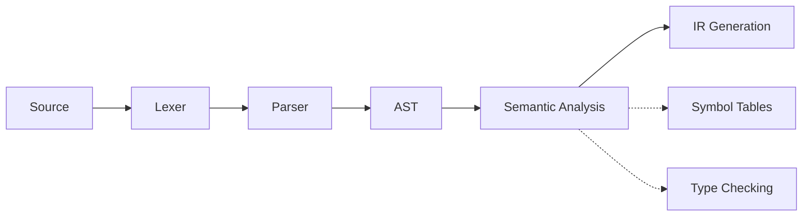

## What does Chapter 5 focus on?

Chapter 4 解决了“parser 之后该产出什么”——答案是 AST。Chapter 5 紧接着回答:

> **拿到 AST 之后,编译器接下来做什么?**

答案是 **Semantic Analysis(语义分析)**。它负责判断程序是不是“语义上合法”,也就是那些 grammar / CFG 本身表达不了的约束。



Chapter 5 的三大主题:

1. **Symbol Tables(符号表)**——用来跟踪"哪些名字在作用域里、绑定到什么"
2. **Symbols in the Tiger Compiler**——Tiger 编译器里符号和符号表的具体实现
3. **Type Checking(类型检查)**——利用符号表,判断每个表达式/声明/函数是否类型正确

---

## Why isn't CFG enough?

Context-free grammar 只能描述 **语法结构**,无法表达依赖于"值"或"上下文"的约束。考虑:

### 例子 1:变量未声明

```c
int x = 5;
y = x + 1;   // 错误：y 未声明
```

CFG 的产生式 `stmt → id = expr` 对 `y = x + 1` **完全接受**——结构合法。

但 CFG 只看 token 的**类别**（`id`, `int`, `+`, `=`, `;`），不看 token 的**值**（`y` 这个字符串是否被声明过）：

```
输入:   y   =   x   +   1   ;
CFG看到: id  =  id  +  int  ;
           ↑
    只知道这是个 id，不知道叫什么名字
```

### 例子 2:类型不匹配

```tiger
var x : string := "hello"
var y : int    := x + 1    (* 语义错误：string 不能做加法 *)
```

CFG 产生式 `exp → exp + exp` 对两个 `exp` 的**类型**没有任何约束，语法接受，但语义错误。

### 总结

| CFG 能描述的 | CFG 无法描述的 |
|---|---|
| "这里应该有一个 expression，然后 `+`，然后再一个 expression" | "这个 `id` 必须在当前作用域已经声明过" |
| 语法形状 | "这两个 expression 的类型必须兼容" |

这些约束依赖**上下文信息**（symbol table），需要语义分析阶段来处理。

---

### 原始例子（保留）

Context-free grammar 只能描述 **语法结构**,无法表达依赖于"值"或"上下文"的约束。考虑:

```text
string x;
int z;
x = "hello world";
z = x + 1
```

parser 会 **接受** 这段程序(它完全符合语法),但它显然是错的:

- `z = x + 1`:一个 string 和一个 int 相加
- 而且赋值给一个 int 类型的 `z`

这种问题 CFG 根本捕捉不到,因为它需要:

- 知道 `x` 被声明成了 `string`
- 知道 `z` 被声明成了 `int`
- 知道 `+` 不能作用于 `string` 和 `int`

CFG 解决不了的典型问题:

- **类型是否匹配?**(声明类型 vs 值类型)
- **变量使用前是否声明?**
- **数组访问是否越界?**(运行时问题)
- **函数调用是否符合签名?**
- **变量存在哪里?**(heap / stack / register)

> 这些问题都依赖 **值** 和 **上下文**,而不是单纯的语法形状。

---

## The Semantic Analysis Phase

语义分析阶段的两大任务:

### 1. 确定程序的静态属性

- **Scope and visibility**(作用域与可见性):每个变量使用前是否已声明?
- **Types**(类型):
  - 每个表达式有没有正确的类型
  - 函数调用是否符合定义

### 2. 把 AST 翻译成 IR

把 AST 转成更简单、更接近机器代码的 **中间表示(Intermediate Representation, IR)**,为后续代码生成做准备(Tiger 书第 7 章)。

> Chapter 5 聚焦第一部分(静态属性),IR 生成留到后面讲。

---

# Part 1: Symbol Tables

## 核心概念

语义分析阶段最核心的数据结构就是 **symbol table(符号表)**,也叫 **environment(环境)**。

### Binding(绑定)

给一个符号赋予一个"含义",记作 `↦`。

| Name/Symbol | Meaning/Attribute |
|---|---|
| type identifier | type(e.g., int, string) |
| variable identifier | type, value, access info, ... |
| function identifier | args & result types, ... |

### Environment(环境)

一组 bindings,例如:

$$
\sigma_0 = \{\, g \mapsto \text{string},\ a \mapsto \text{int}\,\}
$$

### Symbol Table(符号表)

就是 **environment 的具体实现**(数据结构)。

> **语义分析阶段 = 按某种顺序遍历 AST,同时维护 symbol tables**。

---

## Tiger 的 `let` 表达式语法

Tiger 中 `let` 表达式的结构：

```
let
  <declarations>    ← 声明区：声明变量、函数、类型
in
  <expression>      ← 使用区：使用上面声明的东西
end
```

`in` 是**语法分隔符**，分隔两个区域：
- `let` 到 `in` 之间：声明区
- `in` 到 `end` 之间：表达式区（这里所有 declarations 都在作用域内）

`let` 表达式本身有返回值，就是 `in` 和 `end` 之间那个 expression 的值。

> 注：这个语法直接借鉴自 ML/SML 语言（`let val x = 5 in x + 1 end`）。

---

## Motivating Example

考虑下面这段 Tiger 代码,假设进入第 1 行之前的环境是 $\sigma_0$:

```tiger
1 function f(a:int,b:int,c:int)=
2  (print_int (a+c);
3   let var j:= a+b
4       var a:= "hello"
5    in print(a); print_int(j)
6   end;
7   print_int(b)
8  )
```

环境是这样演化的:

| 行号 | 环境变化 |
|---|---|
| 1 | $\sigma_1 = \sigma_0 + \{a \mapsto \text{int},\ b \mapsto \text{int},\ c \mapsto \text{int}\}$ |
| 3 | $\sigma_2 = \sigma_1 + \{j \mapsto \text{int}\}$ |
| 4 | $\sigma_3 = \sigma_2 + \{a \mapsto \text{string}\}$ ← a 被 **覆盖** |
| 6 | `end` 到了,**discard $\sigma_2$ 和 $\sigma_3$**,恢复到 $\sigma_1$ |
| 7 | 在 $\sigma_1$ 里查找 `b` |
| 8 | `)` 函数结束,discard $\sigma_1$,回到 $\sigma_0$ |

### 关键观察

**(1)Declaration = 在 symbol table 里 bind**

每个 `var x := ...` 或 `function f(...) = ...` 都会往当前 table 里加一个 binding。

**(2)Use = 在 symbol table 里 lookup**

第 3 行的 `a+b`,需要到 $\sigma_1$ 里查 `a` 和 `b` 的类型/值。

**(3)Binding 可以被 override**

第 4 行 `var a := "hello"` 会 **覆盖** 第 1 行参数里的 `a: int`。新的 binding 出现在"右边的 table",它 **override** 左边那份。

注意:**table 的加法 `X + Y` 不是可交换的**(`X + Y ≠ Y + X`),因为后加的会覆盖先加的。

**(4)Scope = binding 的生命周期**

对于 `let D in E end`:
- 在 `D` 里声明的名字,**作用域从 D 的声明开始,到 end 为止**
- 到达 `end` 时,该作用域里新加的 binding 全部 **discard**
- table 恢复到进入 `let` 之前的状态

这就是为什么 **symbol table 的行为本质上是栈式的**。

---

## Symbol Table 的接口

一个符号表通常提供四个操作:

| 操作 | 作用 |
|---|---|
| `insert` | 往表里加一个 binding |
| `lookup` | 查一个名字,拿到对应的 binding |
| `beginScope` | 进入一个新作用域 |
| `endScope` | 退出当前作用域,恢复进入之前的状态 |

`beginScope` / `endScope` 是符号表区别于普通哈希表的关键——它们支持 **嵌套作用域**。

---

## Multiple Symbol Tables

有些语言里 **多个环境可以同时激活**,比如 Java/ML 中每个 class/module 各有自己的 symbol table。

### Java(允许前向引用)

```java
package M;
class D {
  static int d = E.a + N.a;  // ← D 引用了 E 和 N，但它们还没声明（前向引用）
}
class E { static int a = 5; }
class N {
  static int b = 10;
  static int a = E.a + b;
}
```

由于 Java **允许前向引用**,所以 E、N、D 都在 **同一个汇总环境 $\sigma_7$** 里被编译:

$$
\sigma_7 = \sigma_2 + \sigma_4 + \sigma_6
$$

其中 $\sigma_2 = \{E \mapsto \sigma_1\}$,$\sigma_4 = \{N \mapsto \sigma_3\}$,$\sigma_6 = \{D \mapsto \sigma_5\}$。

**`E ↦ σ₁` 的含义**：类名 `E` 绑定到它内部的环境 σ₁。这是**嵌套的 binding**——外层 binding 的"值"本身又是一个环境：

- $\sigma_1 = \{a \mapsto 5\}$（E 的内部环境）
- $\sigma_3 = \{b \mapsto 10,\ a \mapsto 15\}$（N 的内部环境）
- $\sigma_5 = \{d \mapsto 20\}$（D 的内部环境）

所以 $\sigma_7$ 展开就是：

$$
\sigma_7 = \{E \mapsto \{a \mapsto 5\},\ N \mapsto \{b \mapsto 10, a \mapsto 15\},\ D \mapsto \{d \mapsto 20\}\}
$$

当代码写 `E.a` 时，查找过程是：先在 $\sigma_7$ 里找到 $E \mapsto \sigma_1$，再在 $\sigma_1$ 里找到 $a \mapsto 5$。

**编译时两步过程：**
1. **第一遍**：扫描所有类名，构建 $\sigma_7 = \{E \mapsto \sigma_1,\ N \mapsto \sigma_3,\ D \mapsto \sigma_5\}$
2. **第二遍**：用 $\sigma_7$ 作为环境，逐个编译每个类的内部

```
编译 E 的内部  →  在 σ₇ 下检查
编译 N 的内部  →  在 σ₇ 下检查   （N 能看见 E）
编译 D 的内部  →  在 σ₇ 下检查   （D 能看见 E 和 N）
```

> **前向引用（Forward Reference）**：在代码里**先使用**一个名字，**后声明**它。Java 支持前向引用，C 不支持。允不允许前向引用，直接决定了 symbol table 是一次性构造还是增量构造。

### ML 语言简介

**ML（Meta Language）** 是一种函数式编程语言，1970 年代在爱丁堡大学开发。常见方言：Standard ML (SML)、OCaml、Haskell。

特点：静态类型 + 类型推断、函数是一等公民、`let...in...end` 语法。

Tiger 编译器就是用 **SML** 写的，Tiger 语言的语法（包括 `let...in...end`）也直接借鉴了 ML。

### ML(不允许前向引用)

```sml
structure M = struct
  structure E = struct val a = 5 end
  structure N = struct val b = 10 val a = E.a + b end
  structure D = struct val d = E.a + N.a end
end
```

ML **不允许前向引用**,所以编译是 **增量式** 的:
- `E` 用 $\sigma_0$ 编译
- `N` 用 $\sigma_0 + \sigma_2$ 编译(看得到 E)
- `D` 用 $\sigma_0 + \sigma_2 + \sigma_4$ 编译(看得到 E 和 N)

**最终结果都是 $\{M \mapsto \sigma_7\}$**,但"中间过程"不同。

> 这说明 **语义分析的顺序由语言规则决定**:前向引用与否,直接决定了 symbol table 是一次性构造还是增量构造。

---

## Implementing Symbol Tables

有两种实现风格:

### Imperative Style(命令式)

- **直接修改** $\sigma_1$ 让它变成 $\sigma_2$
- $\sigma_2$ 存在期间,**无法** 访问 $\sigma_1$
- 结束 $\sigma_2$ 的作用域时,用"undo"恢复 $\sigma_1$
- 实现:**单个全局 environment $\sigma$ + 一个 undo stack**

#### Undo Stack 演示（以 Java 前向引用为例）

```java
class D { static int d = E.a + N.a; }
class E { static int a = 5; }
class N { static int b = 10; static int a = E.a + b; }
```

**第一遍：收集所有类名和成员声明（只扫 header，不处理初始化表达式）**

```
操作                   哈希表状态            undo 栈
────────────────────────────────────────────────────
beginScope             (空)                [MARKER]
insert D:class         {D}                 [MARKER, (D,NULL)]
insert E:class         {D, E}              [MARKER, (D,NULL), (E,NULL)]
insert N:class         {D, E, N}           [MARKER, (D,NULL), (E,NULL), (N,NULL)]
```

> 这里 `(D, NULL)` 中的 NULL 是 D 的旧值——表示插入前表里没有 D。endScope 时用旧值恢复：NULL 表示删掉，非 NULL 表示改回旧绑定。

此时 σ₇ = {D, E, N} 已建好，前向引用得以支持——D 排在最前，但 E 和 N 已在表里。

**第二遍：用 σ₇ 编译每个类的内部**

编译 class E 内部：
```
beginScope             {D,E,N}             [..., MARKER₂]
insert a:int           {D,E,N, a:int}      [..., MARKER₂, (a,NULL)]
endScope → pop到MARKER₂ {D,E,N}            [...]  ← a 被移除
```

编译 class D 内部（E.a + N.a 能查到，因为 E 和 N 在 σ₇ 里）：
```
beginScope             {D,E,N}             [..., MARKER₃]
insert d:int           {D,E,N, d:int}      [..., MARKER₃, (d,NULL)]
endScope → pop到MARKER₃ {D,E,N}            [...]  ← d 被移除
```

#### Undo Stack 中旧值的作用

当内层作用域**覆盖**外层变量时，旧值不再是 NULL：

```tiger
var a : int := 1         (* 外层 a *)
let var a : string := "hi" in ... end
```

```
insert a=int      {a:int}       []
beginScope        {a:int}       [MARKER]
insert a=string   {a:string}    [MARKER, (a, int)]  ← 旧值是 int
endScope          {a:int}       []  ← 恢复为 int
```

### Functional Style(函数式 / 持久化)

- **不修改** $\sigma_1$,而是创建一个新的 $\sigma_2$
- $\sigma_1$ 和 $\sigma_2$ **同时存在**,可以同时查
- 退出作用域时直接丢掉 $\sigma_2$,$\sigma_1$ 完好无损

> 两种风格都可以,各有优劣。

---

## Efficient Imperative Symbol Tables

因为大型程序可能有成千上万个标识符,符号表必须支持:

- **高效 lookup**
- **容易 deletion**(退出作用域时要批量删除)

### 方案:Hash Table with external chaining


用哈希表 + 拉链法(每个 bucket 是一个链表)。

### 数据结构

```c
struct bucket { string key; void *binding; struct bucket *next; };
#define SIZE 109
struct bucket *table[SIZE];

unsigned int hash(char *s0) {
  unsigned int h=0; char *s;
  for(s=s0; *s; s++)
    h = h*65599 + *s;
  return h;
}

struct bucket *Bucket(string key, void *binding, struct bucket *next) {
  struct bucket *b = checked_malloc(sizeof(*b));
  b->key = key; b->binding = binding; b->next = next;
  return b;
}
```

### Hash 函数解析

```c
for(s=s0; *s; s++)
    h = h*65599 + *s;
```

**循环终止条件**：C 语言字符串以 `'\0'`（值为 0）结尾，`*s` 为 0 时条件为假，循环停止。即字符串本身的 `\0` 就是天然的上限。

**数学含义（Polynomial Rolling Hash）**：

$$
h = \alpha^{n-1}c_1 + \alpha^{n-2}c_2 + \dots + \alpha c_{n-1} + c_n
$$

其中 $\alpha = 65599$，$c_i$ 是第 $i$ 个字符的 ASCII 值。把字符串看成以 $\alpha$ 为底的多项式，越靠前的字符权重越大。

这是 **Horner's Method**：每步只做一次乘法和一次加法，高效且冲突少（字符顺序有影响，`"ab"` 和 `"ba"` 的 hash 不同）。

---

### Insert:把新 binding 插到链头


```c
void insert(string key, void *binding) {
  int index = hash(key) % SIZE;
  table[index] = Bucket(key, binding, table[index]);
}
```

**关键设计**:插入时 **不删除** 旧 binding,而是把新 binding **挂到链头**。

举例:原来 `a ↦ int`,现在要加 `a ↦ string`:

```
hash(a) -> <a, string> -> <a, int>
```

这样 lookup 时会找到最新的那个(链头),旧的还在链尾——**这是后面"退出作用域恢复"的关键**。

### Lookup


```c
void *lookup(string key) {
  int index = hash(key) % SIZE;
  struct bucket *b;
  for (b = table[index]; b; b = b->next)
    if (0 == strcmp(b->key, key))
      return b->binding;
  return NULL;
}
```

遍历 bucket 链表,第一个 key 匹配的就是"当前有效"的那个。

### Pop:退出作用域时

```c
void pop(string key) {
  int index = hash(key) % SIZE;
  table[index] = table[index]->next;
}
```

直接把链头弹掉,**旧 binding 自动露出来**。

举例:当前 `hash(a) -> <a, string> -> <a, int>`
pop 后:`hash(a) -> <a, int>`

**insert 和 pop 构成了栈式行为** —— 这就是为什么命令式符号表可以用哈希表 + LIFO 实现作用域。

### 注意：退出作用域需要 pop 多次

一个作用域可能有多个声明，退出时要撤销**全部**绑定：

```tiger
let
  var x : int := 1
  var y : int := 2
  var z : int := 3
in ...
end
```

进入这个 `let` 时插入了 x、y、z 三个绑定，退出时需要全部撤销。

**解决方案：辅助栈 + Marker**（即前面讲的 `beginScope` / `endScope` + `<mark>` 哨兵）：
- 入作用域：压入 MARKER
- 每次 insert：把 (槽位, 旧值) 压栈
- 退出作用域：弹出直到 MARKER，逐个恢复旧值

**Pop 的次数 = 当前作用域内声明的变量数量**，不是一次。

---

## Efficient Functional Symbol Tables

### 为什么哈希表不太行?

我们希望 $\sigma' = \sigma + \{a \mapsto \tau\}$,但 $\sigma$ **要保持完好**。

> **为什么需要"σ 保持完好"？** 函数式实现中，环境作为参数传递，可能同时需要 σ 和 σ'：
> - 编译互递归函数时，两个函数需要同一个基础环境 σ
> - `transExp(exp, σ)` 可能需要同时把 σ 和 σ' 传给不同的地方

方案一:**直接改 hash table** → 破坏了 $\sigma$,不行。


方案二:**把整个 hash array 复制一份,共享旧 bucket** → 哈希表的 array 通常很大,复制开销高,不实用。


> 注：对于**顺序处理**（不需要同时保持多个环境），命令式哈希表 push/pop 完全够用。函数式 BST 是为了"多个环境同时存在"的场景。

### 方案:Binary Search Tree(二叉搜索树)

每个节点存一个 binding，按**字母序（字典序）** 排列（即字典里单词的顺序）。节点中的数字（1, 2, 3, 4 等）只是**占位符**，代表该变量名绑定的值（在真实编译器里是类型、地址等信息）。

**Insert 的关键技巧**:只需要 **复制从根到插入点的这一条路径**,其余的子树可以和旧树 **共享**。

**为什么可以共享？** 以插入 `mouse` 为例：

```
从根 dog 开始：mouse > dog → 往右走
右边为空 → 在这里插入

走过的路径：dog → (右边)
没走过的节点：bat、camel（在左子树）
```

路径复制规则：**只复制走过的路径上的节点**，没走过的节点直接共享指针。`bat` 和 `camel` 完全没被碰到，m2 直接用指针指向 m1 的 bat 节点——同一块内存，没有复制。

**为什么走过的要复制？** 因为走过的节点的指针要改变。例如原来 dog 的右指针是 NULL，新树里要改成指向 mouse。如果不复制 dog 直接改，m1 的 dog 也被改了——m1 被破坏。所以必须新建一个 dog 副本，在副本上改指针。

**为什么没走过的可以共享？** 因为它们完全没有被修改——key、value、左右指针全都没变，内容完全一样，没必要复制，直接指向同一块内存即可。

> 核心原则：**需要改指针的节点 → 必须复制**（否则破坏旧树）；**不需要改的节点 → 直接共享**（省空间）。

例如 m1 长这样:

```
      dog,3
      /
   bat,1
      \
    camel,2
```

执行 `m2 = m1 + {mouse ↦ 4}`,m2 长这样:

```
      dog,3       ← 新复制的根
     /    \
  bat,1   mouse,4 ← 新节点
     \
   camel,2        ← 与 m1 共享
```

**m1 完全不变**,m2 和 m1 **共享** 左子树(bat, camel),只有 "dog → mouse" 这条路径被复制。

- **Insert**:O(log n) 时间，O(log n) 新节点（只新建路径上的节点）
- **Lookup**:O(log n)（平衡时，按字母序比较逐层缩小范围）

**BST 的左右子树的意义**：纯粹是为了**加快查找**。按字母序排列后，每次比较可以排除一半的节点，类比字典按字母序排版——查 "cat" 不用从第一页翻到最后，直接跳到 C 区域。

这种结构被称为 **persistent(持久化)数据结构**,是函数式语言里实现环境的标准方式。

---

## Imperative vs Functional 总结

| 风格 | 进入作用域 | 退出作用域 |
|---|---|---|
| **Imperative** | 直接改表(副作用),旧表被破坏 | 用辅助信息撤销修改,重建旧表 |
| **Functional** | 创建新表,旧表完好保留 | 直接丢掉新表,旧表原位可用 |

---

# Part 2: Symbols in the Tiger Compiler

## 问题:直接用 string 当 key 太慢

前面的 `lookup` 每次都要 `strcmp(b->key, key)`——**字符串比较非常昂贵**,而编译器里一个名字可能被查几千次。

```c
if (0 == strcmp(b->key, key))   // ← 每次 lookup 都调
```

## 解决方案:Symbol(符号)

把每个字符串 **内化(intern)** 成一个 **Symbol 对象**:

- **同一个字符串** 永远映射到 **同一个 Symbol**(指针相同)
- **不同字符串** 永远映射到 **不同 Symbol**

这样就把"比较字符串"换成"比较指针"。

### Symbol 的三大高效性质

1. **提取整数 hash-key 非常快**:直接用 Symbol 指针值本身作为 hash key(for hash tables)
2. **判等非常快**:就是指针比较
3. **比较大小也很快**:用指针值做 arbitrary ordering(for binary search trees)

> **Intern 一次,查询无数次变便宜**。

### Intern 的本质：两阶段处理

Intern 机制将编译器的标识符处理分为两个阶段：

1. **Lexer 阶段（intern）**：词法分析器扫描源码时，对每个标识符 token 调用 `S_symbol(string)`，将字符串映射为唯一的 Symbol 指针。此阶段使用 `strcmp` 进行去重，但每个标识符 token 只需查一次 intern 表。
2. **语义分析阶段（全指针操作）**：此后所有对符号表的操作（`S_enter`、`S_look`）都使用 Symbol 指针，比较操作退化为 O(1) 的指针比较，**完全消除了字符串比较的开销**。

```
源码 "x + x + x"
     ↓ Lexer（S_symbol，strcmp 去重）
指针程序 0xA000 + 0xA000 + 0xA000
     ↓ 语义分析（S_look，指针比较）
类型检查通过
```

`strcmp` 的开销被限制在 lexer 阶段，语义分析阶段（操作频率远高于 lexer）完全基于指针。

---

## Tiger 中 Symbol 和 Symbol Table 的接口

```c
typedef struct S_symbol_ *S_symbol;
S_symbol S_symbol(string);          /* 字符串 → Symbol */
string S_name(S_symbol);            /* Symbol → 字符串 */

typedef struct TAB_table_ *S_table;
S_table S_empty(void);
void  S_enter(S_table t, S_symbol sym, void *value);
void *S_look (S_table t, S_symbol sym);
void  S_beginScope(S_table t);
void  S_endScope  (S_table t);
```

**关键点**:`S_enter` 和 `S_look` 里的 value 是 **`void *`**。

> 为什么用 `void *`?因为编译器里需要 **不同种类的 binding**——类型 binding、变量 binding、函数 binding——它们的数据结构各不相同。用 `void *` 做通用接口,让上层代码自己决定填什么。

---

## Symbol 的实现

```c
static S_symbol mksymbol(string name, S_symbol next) {
  S_symbol s = checked_malloc(sizeof(*s));
  s->name = name; s->next = next;
  return s;
}

S_symbol S_symbol(string name) {
  int index = hash(name) % SIZE;
  S_symbol syms = hashtable[index], sym;
  for (sym = syms; sym; sym = sym->next)
    if (0 == strcmp(sym->name, name))
      return sym;                 // ← 已经存在,直接返回同一个指针
  sym = mksymbol(name, syms);
  hashtable[index] = sym;
  return sym;                     // ← 新建一个
}
```

这是一个 **全局 intern 表**:所有出现过的字符串都在这里。`S_symbol("foo")` 调两次,拿到的是 **同一个指针**。

---

## Symbol Table(Tiger 风格)

Tiger 编译器用的是 **命令式符号表**(destructive update + undo stack)。

### beginScope / endScope 的实现:marker 技巧

```c
static struct S_symbol_ marksym = { "<mark>", 0 };

void S_beginScope(S_table t) {
  S_enter(t, &marksym, NULL);      // 压入一个 marker
}

void S_endScope(S_table t) {
  S_symbol s;
  do
    s = TAB_pop(t);
  while (s != &marksym);           // 一直 pop,直到碰到 marker
}
```

思路:

- **beginScope**:往 undo stack 上压一个特殊的 `<mark>` 哨兵
- **endScope**:一直 pop,直到遇到那个哨兵为止——pop 掉的每一个符号,都会把它在 hash bucket 里的"链头 binding"也 pop 掉

这就用一个简单的 marker,实现了"一次性批量恢复到 beginScope 之前的状态"。

### Auxiliary Stack

为了让 endScope 知道"按什么顺序 pop",需要一个 **辅助栈**,记录所有被 push 进符号表的符号 **的先后顺序**。

实现技巧:**把这个栈嵌进 binder 里**,不需要单独的数据结构。

```c
struct TAB_table_ {
  binder table[TABSIZE];
  void  *top;                    // 指向最近一次被 bind 的 symbol
};

t->table[index] = Binder(key, value, t->table[index], t->top);

static binder Binder(void *key, void *value, binder next, void *prevtop) {
  binder b = checked_malloc(sizeof(*b));
  b->key = key; b->value = value;
  b->next = next;                // bucket 链
  b->prevtop = prevtop;          // 栈链(指向上一个被 push 的 symbol)
  return b;
}
```

每个 binder 有两个指针:

- **`next`**:指向同一个 bucket 里的下一个(解决哈希冲突)
- **`prevtop`**:指向 **上一个被 push 进整个表** 的 binder(构成一条全局时间链)

TAB 的全局 `top` 始终指向最新 push 的那个。`TAB_pop` 就是 `top = top->prevtop`,顺便把该 key 对应 bucket 的链头也弹掉。

**这是个很聪明的设计**:用一个字段(`prevtop`)就同时嵌入了"全局时间栈",避免了分离的 stack 数据结构。

---

# Part 3: Type Checking

## 类型检查的三大关键问题

1. **What are valid type expressions?**(什么是合法的类型表达式?)
2. **When are two types equivalent?**(什么时候两个类型算"相等"?)
3. **What are the type-checking rules?**(类型检查规则是什么?)

---

## Tiger 的类型系统

### Primitive types(基本类型)

- `int`
- `string`

### Constructed types(构造类型)

由其它类型构造出来的:

- **record**:`{x: int, y: int}`
- **array**:`array of int`

### Grammar

```text
typec   → type type-id = ty
ty      → type-id
        | '{' tyfields '}'
        | array of type-id
tyfields → ε
        | id : type-id {, id : type-id}
```

### Tiger 中类型的内部表示

```c
typedef struct Ty_ty_ *Ty_ty;
struct Ty_ty_ {
  enum {Ty_record, Ty_nil, Ty_int, Ty_string,
        Ty_array,  Ty_name, Ty_void} kind;
  union {
    Ty_fieldList record;
    Ty_ty array;
    struct {S_symbol sym; Ty_ty ty;} name;
  } u;
};
```

又是 Chapter 4 里学过的 **tagged union**。注意几个特殊 kind:

- **`Ty_nil`**:nil 字面量的类型
- **`Ty_void`**:无返回值(procedure)
- **`Ty_name`**:**用于递归类型的占位符**!`Ty_Name(sym, NULL)` 表示"名字是 sym,但类型体暂时还没定"

`Ty_name` 就是为了处理 `type list = {first: int, rest: list}` 这种 **自引用** 声明——后面"递归声明"一节会详细讲。

---

## Type Equivalence(类型等价)

**什么时候两个类型算相等?** 有两大流派:

### Name Equivalence(NE,名等价)

$T_1 \equiv T_2$ 当且仅当它们是 **同一个类型名字**,由 **同一条 type declaration** 定义。

### Structural Equivalence(SE,结构等价)

$T_1 \equiv T_2$ 当且仅当它们由 **相同的 constructor** 以 **相同的顺序** 组合而成——也就是"长得一样"就相等。

### **Tiger 用 name equivalence!**

这是一个很关键的设计决定。看两个例子:

```tiger
let type a = {x: int; y: int}
    type b = {x: int; y: int}    -- 结构一样,但是独立声明
    var i : a := ...
    var j : b := ...
 in i := j                        -- ❌ 非法!a 和 b 不是同一个类型
end
```

```tiger
let type a = {x: int; y: int}
    type b = a                    -- b 就是 a 的别名
    var i : a := ...
    var j : b := ...
 in i := j                        -- ✅ 合法!b 和 a 是同一个类型
end
```

规则:**每个 record type expression `{...}` 都会创建一个新的、独立的类型**,哪怕字段完全相同。

这避免了一些微妙的 bug(比如两个语义完全不同的 record 结构恰好一样),也让类型检查可以用"指针相等"来判等——非常高效。

---

## Namespaces in Tiger

Tiger 有 **两个独立的命名空间**:

1. **Types**
2. **Functions and variables**

同一个名字可以 **同时** 出现在这两个 namespace 里:

```tiger
let type a = int
    var a := 1
 in ...
end
-- 两个 a 都能用:上下文决定用哪个
```

而函数和变量 **共享同一个 namespace**,所以会互相覆盖:

```tiger
let function a (b: int) = ...
    var a := 1                -- var a 覆盖 function a
 in ...
end
```

> **如何区分"这个 a 是类型还是变量"?**——**根据 syntactic context**(语法上下文)。在 `var x : a := ...` 中,`a` 的位置只能是类型,所以查 tenv;在 `x + a` 中,`a` 是操作数,所以查 venv。

---

## Two Environments for Type Checking

Tiger 的语义分析维护 **两个 symbol table**:

### Type environment(`tenv`)

- symbol → `Ty_ty`
- 即:类型名 → 类型对象

### Value environment(`venv`)

- **变量**:symbol → `Ty_ty`(变量的类型)
- **函数**:symbol → `{Ty_tyList formals, Ty_ty result}`(形参类型列表 + 返回类型)

### 为什么变量映射到 `Ty_ty` 而不是"类型名字"?

因为 **变量的类型有可能是一个匿名构造类型**,比如:

```tiger
var x := {first = 1, rest = nil}   -- x 的类型没有名字
```

而且映射到 `Ty_ty`(指针)还能 **直接用指针相等判 name equivalence**,高效。

### `E_enventry`(value env 的 entry 类型)

```c
typedef struct E_enventry_ *E_enventry;
struct E_enventry_ {
  enum {E_varEntry, E_funEntry} kind;
  union {
    struct {Ty_ty ty;} var;
    struct {Ty_tyList formals; Ty_ty result;} fun;
  } u;
};

E_enventry E_VarEntry(Ty_ty ty);
E_enventry E_FunEntry(Ty_tyList formals, Ty_ty result);

S_table E_base_tenv(void);   /* 基础 tenv,预装 int/string 等 */
S_table E_base_venv(void);   /* 基础 venv,预装 print 等 */
```

又是 tagged union——和 Chapter 4 里的 AST 节点表示是同一个套路。

---

## The Semant Module

`semant.c` / `semant.h` 是做语义分析的模块,核心有 **四个递归函数**:

```c
struct expty transVar(S_table venv, S_table tenv, A_var v);
struct expty transExp(S_table venv, S_table tenv, A_exp a);
void         transDec(S_table venv, S_table tenv, A_dec d);
Ty_ty        transTy (             S_table tenv, A_ty  a);
```

**`struct expty`**(翻译后的表达式 + 类型):

```c
struct expty { Tr_exp exp; Ty_ty ty; };
```

- `exp`:翻译后的 IR(我们暂时不管)
- `ty`:这个表达式的 Tiger 类型

### 四个函数的分工

| 函数 | 处理什么 | 输入 | 输出 |
|---|---|---|---|
| `transExp` | 表达式 | venv, tenv, `A_exp` | `expty` |
| `transVar` | 左值(变量/下标/字段) | venv, tenv, `A_var` | `expty` |
| `transDec` | 声明(var / type / function) | venv, tenv, `A_dec` | void(直接修改 env) |
| `transTy`  | 类型表达式(AST 里的 `A_ty`) | tenv, `A_ty` | `Ty_ty` |

注意:

- `transDec` 返回 void——因为声明的作用是 **修改环境**(副作用)
- `transTy` 只需要 tenv,不需要 venv——因为它处理的是类型表达式,与变量无关
- **type checker 本质上就是对 AST 的递归遍历**,入口是 `transExp`

---

## Type-Checking Expressions

### 例子:`+` 表达式

Tiger 里 `+` 是 **不重载** 的:两边都必须是 `int`,结果也是 `int`。

```c
struct expty transExp(S_table venv, S_table tenv, A_exp a) {
  switch (a->kind) {
    ...
    case A_opExp: {
      A_oper oper = a->u.op.oper;
      struct expty left  = transExp(venv, tenv, a->u.op.left);
      struct expty right = transExp(venv, tenv, a->u.op.right);
      if (oper == A_plusOp) {
        if (left.ty->kind != Ty_int)
          EM_error(a->u.op.left->pos,  "integer required");
        if (right.ty->kind != Ty_int)
          EM_error(a->u.op.right->pos, "integer required");
        return expTy(NULL, Ty_Int());
      }
      ...
    }
  }
}
```

步骤:

1. **递归** 检查左右子表达式,拿到它们的类型
2. **检查** 两边类型都是 `Ty_int`,不然报错
3. **返回** 结果类型 `Ty_int`

**两个重要的点**:

- **错误恢复**:即使类型错了,也 `return` 一个 `Ty_Int()` 让分析 **继续**,这样可以一次发现多个错误,而不是一遇错就崩
- **位置信息**:`EM_error(pos, ...)` 用的是 AST 节点里保存的 position(这就是 Chapter 4 讲"为什么要在 AST 里存 position"的原因——到这里终于用上了!)

### 例子:变量 lookup

```c
struct expty transVar(S_table venv, S_table tenv, A_var v) {
  switch (v->kind) {
    case A_simpleVar: {
      E_enventry x = S_look(venv, v->u.simple);
      if (x && x->kind == E_varEntry)
        return expTy(NULL, actual_ty(x->u.var.ty));
      else {
        EM_error(v->pos, "undefined variable %s", S_name(v->u.simple));
        return expTy(NULL, Ty_Int());
      }
    }
    case A_fieldVar: ...
  }
}
```

注意:

- **要先检查 `x` 非空**,否则变量未声明
- **要检查 `x->kind == E_varEntry`**,因为如果用户写 `f + 1` 而 `f` 是个函数,`S_look` 会查到一个 `E_funEntry`——这也是错误(不能把函数当变量用)
- **`actual_ty`**:处理 `Ty_name` 的解引用——如果 `ty` 是一个 `Ty_name` 占位符,要递归 follow 到它指向的真实类型

### l-value(左值)

Tiger 里的 l-value 有三种:

```text
lvalue → id
       | lvalue . id
       | lvalue [ exp ]
```

变量、record 的字段、array 的元素都是 l-value。对应 AST 里的 `A_var`,由 `transVar` 处理。

---

## Type-Checking Declarations

声明只在 `let` 表达式里出现:

```
let decs in body end
```

### `transExp` 处理 `A_letExp`

```c
case A_letExp: {
  struct expty exp;
  A_decList d;
  S_beginScope(venv); S_beginScope(tenv);         // 开一个新 scope

  for (d = a->u.let.decs; d; d = d->tail)
    transDec(venv, tenv, d->head);                // 把每个 dec 加进 env

  exp = transExp(venv, tenv, a->u.let.body);      // 在新 env 里检查 body

  S_endScope(tenv); S_endScope(venv);             // 退出 scope
  return exp;
}
```

三步曲:**beginScope → transDec 每条声明 → transExp body → endScope**。

这正是前面讲的"symbol table 支持嵌套作用域"在类型检查里的直接应用。

### transDec 分三种情况:

1. **变量声明**(`A_varDec`)
2. **类型声明**(`A_typeDec`)
3. **函数声明**(`A_functionDec`)

---

## Variable Declarations

### 不带类型约束

```tiger
var x := exp
```

代码:

```c
case A_varDec: {
  struct expty e = transExp(venv, tenv, d->u.var.init);
  S_enter(venv, d->u.var.var, E_VarEntry(e.ty));
}
```

做法:

1. 递归算出初始化表达式的类型 `e.ty`
2. 把 `x ↦ e.ty` 加进 venv

### 带类型约束

```tiger
var x : type-id := exp
```

需要额外检查:

- 声明的类型 `type-id` 和 `exp` 的类型 **兼容**
- 如果 `exp` 的类型是 `Ty_Nil`,那 **必须有显式的 record 类型约束**(因为 `nil` 本身不带类型信息,编译器不知道它是哪种 record 的 nil)

---

## Type Declarations

### 非递归:`type type-id = ty`

```c
case A_typeDec: {
  S_enter(tenv, d->u.type->head->name,
          transTy(tenv, d->u.type->head->ty));
}
```

用 `transTy` 把 AST 里的类型表达式递归翻译成 `Ty_ty`,然后加进 tenv。

> 注意:这里只处理 **长度为 1 的类型声明列表**——真实情况下要处理 **mutually recursive** 的一组类型,见下面。

---

## Function Declarations

```
function id (tyfields) : type-id = exp
```

```c
case A_functionDec: {
  A_fundec f = d->u.function->head;
  Ty_ty resultTy     = S_look(tenv, f->result);
  Ty_tyList formalTys = makeFormalTyList(tenv, f->params);

  // (1) 把 function header 加到 venv,使函数在自己体内可见(支持递归)
  S_enter(venv, f->name, E_FunEntry(formalTys, resultTy));

  // (2) 开一个新 scope,把形参作为变量加进去
  S_beginScope(venv);
  { A_fieldList l; Ty_tyList t;
    for (l = f->params, t = formalTys; l; l = l->tail, t = t->tail)
      S_enter(venv, l->head->name, E_VarEntry(t->head));
  }

  // (3) 在新 scope 里检查函数体
  transExp(venv, tenv, d->u.function->body);

  // (4) 退出 scope(形参消失,但函数本身还在外层 venv 里)
  S_endScope(venv);
  break;
}
```

### 关键点

- **Header 先加到外层 venv**,然后 **beginScope** 再加形参——这样函数体里就 **看得见自己**(支持递归调用),而形参只在体内可见
- 注意这是个 **stripped-down 版本**,省略了很多真实编译器该做的事:
  - 只处理单个函数,不处理 mutual recursion(下节)
  - 只处理有返回值的函数,没处理 procedure
  - 没处理错误
  - **没有检查 body 的类型和 `resultTy` 匹配**
  - 等等

---

## Recursive Declarations

这是 Chapter 5 里最微妙、最核心的一节。

### 问题 1:递归类型

```tiger
type list = {first: int, rest: list}
```

要把这个翻译成内部 `Ty_ty`。但问题是:

> 处理 `{first: int, rest: list}` 的时候,我们需要从 tenv 里查 `list`——但此时 `list` 还没加进 tenv!

这就是经典的 **先有鸡还是先有蛋** 问题。

### 解决方案:Two Passes(两遍扫描)

**第一遍:先加 header,body 留空**

```c
S_enter(tenv, name, Ty_Name(name, NULL));
```

`Ty_Name(name, NULL)` 是一个 **占位符**——"这个类型叫 `list`,但它的具体内容我晚点填"。

现在 tenv 里已经有 `list` 了,可以被后续查到。

**第二遍:处理 body,回填 Ty_Name 的 ty 字段**

```c
Ty_ty realTy = transTy(tenv, body);     // 处理 {first: int, rest: list}
                                         // 这时 list 已经在 tenv 里(虽然 body 是 NULL)
((Ty_name)placeholder)->u.name.ty = realTy;  // 回填
```

处理 `rest: list` 时,`S_look(tenv, list)` 返回的是那个占位符——**这就 OK 了**,因为我们要的只是一个"能代表 list"的指针,而 list 正是 name-equivalent 的,用指针一路引用就行。

最后回填完成,占位符的内部 ty 才真的指向完整的 record。

这就是为什么 `Ty_ty` 里要有 `Ty_name` 这一种 kind:**它是两遍算法的产物,用来打破递归类型的"先有鸡还是先有蛋"**。

### 非法循环

不是所有递归都合法:

```tiger
type a = b
type b = a            -- ❌ 非法:纯名字循环
```

```tiger
type a = b
type b = d
type c = a
type d = a            -- ❌ 非法:a → b → d → a 的纯名字环
```

**规则**:**每个循环都必须经过一个 record 或 array 声明**。否则类型检查器会陷入无限循环。

```tiger
type a = b
type b = {i: a}       -- ✅ 合法:环里有 record,b 是一个具体的 record
```

编译器必须 **主动检测** 这种非法环并报错。

### 问题 2:相互递归函数

```tiger
function f(x:int):int = g(x) + 1
function g(x:int):int = f(x) - 1
```

处理 `f` 的 body 时,需要查 `g`——但此时 `g` 还没加进 venv。

### 解决方案:又是 Two Passes

**第一遍:收集所有函数的 header**

只记录 function name、formal type list、return type,**不碰 body**。

```c
for each function f in the group:
    S_enter(venv, f->name, E_FunEntry(formalTys, resultTy));
```

**第二遍:处理所有函数的 body**

此时 venv 里已经有 `f` 和 `g` 的 header,body 里互相调用都能查到。

```c
for each function f in the group:
    S_beginScope(venv);
    // 加入形参
    transExp(venv, tenv, f->body);
    S_endScope(venv);
```

---

## Summary: Chapter 5 的核心思路

### 1. 为什么需要 semantic analysis?

因为 CFG 表达不了依赖于 **值** 和 **上下文** 的约束:类型匹配、声明-使用一致性、作用域规则、函数签名等。这些都必须在 parse 之后、基于 AST 完成。

### 2. 为什么需要 symbol tables?

因为"这个名字指的是什么"依赖于 **上下文**,而上下文会随 scope 变化。Symbol table 就是"当前上下文"的数据结构表示,支持 `insert / lookup / beginScope / endScope` 四个操作。

### 3. Imperative vs Functional

两种实现方式各有适用场景。Tiger 用的是 **命令式 + marker 哨兵 + prevtop 链**,用哈希表高效支持嵌套作用域。

### 4. Symbol 的内化(interning)

把字符串一次性映射成 Symbol 指针,让后续所有 lookup/compare 都退化成指针操作,**快得多**。

### 5. Name equivalence

Tiger 用 name equivalence——每个 `{...}` 创建全新类型,`type b = a` 才是别名。这让类型比较变成 **指针比较**。

### 6. 两个环境

`tenv` 负责类型,`venv` 负责变量和函数——因为 Tiger 有两个独立的 namespace。

### 7. 四个 trans* 函数

`transExp / transVar / transDec / transTy` 是对 AST 的递归遍历,同时查/改环境,**本质上就是"带 symbol table 的 AST traversal"**。

### 8. Two-pass 技巧

对于 **相互递归** 的类型和函数声明,都要用 **两遍扫描**:先 header,后 body。这是 Tiger 编译器里最核心的算法模式,背后的原因都是"递归定义要求先看见符号、后填入内容"。

---

## 一个总的理解框架

Chapter 3 回答:**How do we parse?**
Chapter 4 回答:**What should parser produce?** → AST
Chapter 5 回答:**How do we check AST's static correctness?** → symbol tables + type checking

到这里,编译器的"前端"就基本完成了:

```
source → tokens → CST → AST → typed AST (+ symbol tables)
```

下一章(Chapter 6/7)会开始"中端":**如何把 typed AST 翻译成 IR**——这是 `trans*` 函数里那个一直被忽略的 `Tr_exp exp` 字段真正发挥作用的地方。
