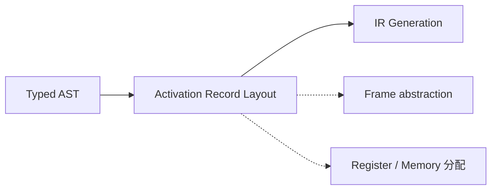

## What does Chapter 6 focus on?

Chapter 5 解决了"AST 是否语义合法"——我们现在有了 **typed AST + symbol tables**。Chapter 6 紧接着回答:

> **函数调用在机器上到底是怎么跑起来的?局部变量、参数、返回地址都放在哪?**

答案是 **Activation Record(活动记录)**,也叫 **Stack Frame(栈帧)**——它是编译器前端与机器层面真正接轨的第一个概念。



Chapter 6 的两大主题:

1. **Stack Frames(栈帧的通用概念)**——调用约定、frame pointer、static link、caller/callee-save、escape 分析等
2. **Frames in the Tiger Compiler**——Tiger 编译器中 `Frame` 模块的抽象接口和 `Translate` 层

---

## Storage Organization

从编译器作者的视角看,目标程序运行在自己的 **逻辑地址空间** 里,每个程序值都有一个位置。一个典型的运行时内存布局:

```
 Low  ┌──────────────┐
      │    Code      │  可执行目标代码
      ├──────────────┤
      │    Static    │  编译期大小已知:全局常量、编译器生成的数据
      ├──────────────┤
      │    Heap      │  程序控制的动态分配 (C: malloc/free) ↓
      ├──────────────┤
      │  Free Memory │
      ├──────────────┤
      │    Stack     │  函数调用期间生成的 activation records ↑
 High └──────────────┘
```

- **Code / Static**:大小在编译期就定下来
- **Heap / Stack**:都是 **dynamic**,但用法完全不一样
  - Heap 由程序显式控制
  - Stack 跟函数调用的 LIFO 结构一一对应

> 按习惯,stack 从高地址向低地址生长。

---

## 为什么函数调用要用 stack?

考虑 Tiger 代码:

```tiger
function f(x: int): int =
  let var y := x + x
  in if y < 10 then f(y) else y - 1
  end
```

- 一次 **invocation** 就叫一次 **activation**
- 每次调用 `f`,都会 **新建一个 x 的实例**(由 caller 初始化)
- 在很多语言(C / Pascal / Java)中,局部变量在函数返回时销毁
- 递归调用意味着很多个 `x` **同时存在**

函数调用天然是 **LIFO**(Last In, First Out,后进先出):最后调用的最先返回。所以用 **stack** 这个 LIFO 数据结构来放局部变量再自然不过。

```
main() 调 f() 调 g() 调 h()

调用顺序: main → f → g → h    (依次 push)
返回顺序: h → g → f → main    (依次 pop)
```

> 每个活着的 activation 在 control stack 上都有一个 **activation record**(也叫 **frame**)。

---

# Part 1: Stack Frames 的通用结构

## 为什么不能只用纯 push/pop?

理论上 stack 只要 push / pop 就够了,但实际上:

- 局部变量是 **成批** push/pop 的(进入函数一次性开,退出一次性收)
- 局部变量不一定创建后就立刻初始化
- 我们想访问 **stack 深处** 的变量,而不只是栈顶

所以实际实现是:**把 stack 当成一个大数组**,用 **Stack Pointer (SP)** 这个寄存器指向某个位置(栈向低地址生长,SP 指栈顶,也就是当前最低的已用地址):

- SP **上面**(更高地址):**已分配**(历史 frame)
- SP **下面**(更低地址):**garbage**(还没用到)

```
高地址 ↑
       ┌──────────────┐
       │   已分配     │
       │  (in use)    │
   SP →├──────────────┤   ← 栈顶
       │   garbage    │
       │  (free)      │
低地址 ↓
```

操作语义:

- **push**:`SP ← SP − size`(SP 往下走,新空间纳入"已分配")
- **pop** :`SP ← SP + size`(SP 往上走,腾出的空间变回 garbage)
- **访问深处变量**:`MEM[SP + offset]`(offset > 0,往上数)

---

## Stack Frame 的角色

> Stack 通常 **只在进入函数时增长**,一次增加足以容纳该函数所有局部变量的大小;**退出前再收缩回去**。

一个函数的 **activation record / stack frame** = stack 上分给这个函数的那一片区域,装着:

- 局部变量
- 参数
- 返回地址
- 临时值

> **核心问题:frame 怎么布局,才能让 caller 和 callee 正确通信?**

---

## 典型的 Stack Frame 布局

```
                    ┌─────────────────┐ ↑ 高地址
                    │   argument n    │ ↖
                    │      ...        │  │ incoming args
                    │   argument 2    │  │ (caller 压的,但属于
                    │   argument 1    │  │  current function 使用)
     frame pointer →│   static link   │ ↙
                    ├─────────────────┤ ← current frame 起点
                    │ local variables │ ↖
                    │                 │  │
                    │ return address  │  │
                    │   temporaries   │  │ current function 自用
                    │ saved registers │  │
                    │                 │  │
                    │   argument m    │  │ outgoing args
                    │      ...        │  │ (current 作为 caller,
                    │   argument 2    │  │  给下一层函数准备)
                    │   argument 1    │  │
     stack pointer →│   static link   │ ↙
                    ├─────────────────┤
                    │                 │   next frame 将在这里展开
                    │                 │
                    └─────────────────┘ ↓ 低地址
```

> ⚠️ **图里上方的 `argument 1..n` 其实是 current function 的 incoming args**——虽然物理上是 caller 压的(所以画在 previous frame 区),但它们正是"传给我"的参数。最下面那段 `argument 1..m` 才是 current function 作为 caller 要传给 **下一个** 函数的 outgoing args。

**为什么 argument 在高地址、local vars 在低地址?** 因为 stack 向下生长,**push 得越早,地址越高**:
> ① caller 先 push incoming args(最高) → ② call 指令 push return address → ③ current 进入后 SP 下移开 local(更低) → ④ current 要调下一层时 push outgoing args(最低)

从 FP 看出去天然对称:

- `MEM[FP + 正 offset]` → 访问 **incoming arguments**(上方)
- `MEM[FP − 正 offset]` → 访问 **local variables / saved regs**(下方)

各字段含义:

| 字段 | 谁放的 | 作用 |
|---|---|---|
| **incoming arguments** | caller 放,callee 看到 | 传进来的参数 |
| **local variables** | callee | 有些在 frame,有些在 reg |
| **return address** | `CALL` 指令自动 | 函数返回时跳回的地方 |
| **temporaries** | callee | 中间结果 |
| **saved registers** | callee 或 caller | 保护寄存器内容 |
| **outgoing arguments** | 当前函数作为 caller | 传给被叫函数 |
| **static link** | caller | 支持嵌套函数访问外层变量 |

---

## Frame Pointer

设 `g` 调用 `f(a1, ..., an)`,g 是 **caller**,f 是 **callee**:

**进入 f 时:**
1. SP 原先指向 g 传给 f 的第一个参数
2. 在 frame 里保存旧的 FP
3. `FP ← SP`
4. `SP ← SP − framesize`

**f 退出时:**
1. `SP ← FP`
2. 从 frame 里恢复旧的 FP

```
Before call:            After call:
┌──────────┐            ┌──────────┐
│ frame of │← FP        │ frame of │← FP (old)
│    g     │            │    g     │
│          │← SP        ├──────────┤← FP (new)
└──────────┘            │ frame of │
                        │    f     │
                        │          │← SP
                        └──────────┘
```

> 当 frame size 可变或 frame 不连续时,FP 才真正需要。如果 frame size 固定,**FP = SP + framesize**,FP 就是一个"虚构"的寄存器——编译器知道,不需要真寄存器保存。

---

## Registers: Caller-save vs Callee-save

访问 register 比访问 memory 快,但寄存器数量有限(一般 32 个),所有函数都要用。

**场景:** `f` 在 reg `r` 里存了局部变量,然后调用了 `g`,`g` 也要用 `r`——必须有人 **save / restore** `r`。

| 类型 | 谁来 save / restore | 何时用 |
|---|---|---|
| **caller-save** | 调用方 `f` | 跨 call 要用的值放这里 |
| **callee-save** | 被调方 `g` | 保存 frame pointer 等 |

由调用约定决定哪些寄存器是哪种。

---

## Parameter Passing:为什么要用寄存器?

**Tiger 用 pass-by-value**:传实参的值,修改形参不影响实参。

如果参数 **只放 stack**,每次函数调用都要写内存、读内存,开销很大。现代机器的调用约定通常:

> **前 k 个参数(k = 4 或 6)放寄存器 $r_p, ..., r_{p+k-1}$,剩下的放内存。**

### 但 register-passing 也不总是免费的

```c
void f(int a) {     // 假设 a 在 r1
  int z = ...;
  h(z);             // h 的第一个参数也要放 r1 → 先 save a
  int t = a + 2;    // 调用后还要 restore a
}
```

此时 f 不得不把 r1 save 到 frame 再 restore——省下的内存访问又吐出去了。

### 四种优化思路

1. **Liveness 分析**:如果 `a` 在 `h(z)` 之后已经 **dead**,f 直接覆盖 r1 即可,不用 save
2. **Leaf procedure**:不调用别人的函数,无需把入参写回 frame
3. **Inter-procedural register allocation**:全程序分析,给不同函数分配不同寄存器接收参数
4. **Register windows**:有些架构(SPARC)每次调用就分配一组新寄存器,硬件层面避免 spill

---

## Return Address

> 如果 `g` 中调用指令的地址是 `a`,那么 `f` 返回后应继续从 `a + 1` 执行——这就是 **return address**。

现代机器的 **call 指令** 一般把 return address 放到一个 **专用寄存器**(MIPS 的 `$ra`),而不是写入栈里:

- **Leaf procedure**:不再调用别人,`$ra` 不会被覆盖,**无需写 frame**
- **Non-leaf procedure**:在调用别人之前必须把 `$ra` 存到 frame(除非做了 inter-procedural 寄存器分配)

---

## Frame-Resident Variables

现代调用约定:参数、返回地址、返回值都在寄存器里,很多局部变量和中间值也放寄存器。

那**什么时候**一个值必须写到 frame?只有必要的时候:

- 变量将通过 **reference** 传递(需要真实地址)
- 变量被**嵌套内层函数**访问
- 值太大,单个 register 放不下
- 变量是 **数组**,需要地址算术
- 持有它的 register 要挪作他用(比如参数传递)
- 局部变量太多,register 不够——**spill** 到 frame

### Escape(逃逸)

> 一个变量 **escapes**,如果它 pass-by-reference、被取地址(`&`)、或被嵌套函数访问。

**Escape 的变量必须放 frame**(有地址),非 escape 才有资格进 register。

### 小结

| Registers | Stack Frame |
|---|---|
| 部分参数 | 按引用传递 / 取过地址的变量 |
| return address | 被嵌套函数访问的变量 |
| return value | 太大放不下 register 的值 |
| 部分局部变量与临时值 | 数组变量 |
| | spilled registers |

---

# Part 2: Static Links —— 如何支持嵌套函数

## 问题:嵌套函数访问外层变量

在允许嵌套函数声明的语言(Pascal、ML、Tiger)里,内层函数可以用外层函数的变量:

```tiger
function prettyprint(tree: tree) : string =
  let var output := ""
      function write(s: string) =
        output := concat(output, s)        (* 访问 prettyprint 的 output *)
      function show(n: int, t: tree) =
        let function indent(s: string) =
          ( for i := 1 to n do write(" ");   (* 访问 show 的 n、调 write *)
            output := concat(output, s) )     (* 访问 pp 的 output *)
        in ... end
  in show(0, tree); output end
```

通过 FP 能访问 **当前函数自己** 的局部变量(每个变量相对 FP 的 offset 编译期就定了)。

> **但嵌套函数怎么访问非本地变量?**

---

## 解决方案 1:Static Link

**每次调用 `f`,都把 "在程序文本中直接包围 `f` 的函数 `g` 的最近一次 activation record 的指针" 作为一个额外参数传进去。这个指针就是 static link。**

```c
int g(int x) {
  int f(int y) { ... }     // f 的 static link 指向 g 的 frame
  return f(x) + 1;
}
```

```
Frame of f:             ... → Frame of g
  static link ────────────────┘
  ...
```

### 嵌套访问示例

在 prettyprint 例子里:

```
pp's frame         show's frame        indent's frame
┌───────────┐      ┌───────────┐       ┌───────────┐
│static link│←─────│static link│←──────│static link│
│  output   │      │     n     │       │           │
└───────────┘      └───────────┘       └───────────┘
```

- `show` 调用时,传 `pp` 的 FP 作 static link(pp 是 show 的直接外层)
- `show` 递归调 `show`:传自己的 **static link**(不是自己的 FP!因为两个 show 同层,共同的外层是 pp——caller show 的 static link 本来就指向 pp,原样转发即可)

> **规则提炼**(设 callee 的文本外层为 `P`):
> - callee 嵌在 caller **内部**(caller = P)→ 传 caller **自己的 FP**
> - callee 和 caller **同层**(兄弟 / 递归)→ 传 caller **自己的 static link**
> - callee 在 caller **外层** → caller 沿 static link 向上走相应层数
- `indent` 里访问 `output`:先拿自己的 static link(指向 show),再拿 show 的 static link(指向 pp),再取 output

### 等价的 C 改写

```c
int f(link, int x, int y) {
  int m;
  int g(link, int z) {
    int h(link) {
      return link->prev->m + link->z;   // 沿 link 链上去
    }
    return 1;
  }
  return 0;
}
```

### Pros & Cons

- ✅ **参数传递额外开销小**(就多一个指针)
- ❌ 每访问一个非本地变量都要**沿链多次间接跳转**,跳转次数 = 嵌套深度差

---

## 解决方案 2:Display

全局数组 `d[]`,`d[i]` 指向 **当前最近进入的、嵌套深度为 `i`** 的函数的 frame。

```
nesting depths:           d[] array:
main      1               d[2] ────→ prettyprint's frame
  pp      2               d[3] ────→ show's frame
    write 3               d[4] ────→ indent's frame
    show  3
      indent 4
```

访问非本地变量时,直接 `d[depth]` 一步到位,不用沿链找。

### 同层函数交替进入时怎么办?

注意 `write` 和 `show` **都在深度 3**,是兄弟函数——pp 既可能调 write,也可能调 show。所以 `d[3]` 是 **动态变化** 的:

```
pp 调 write:  d[3] ← write.FP    (write 执行期间 d[3] 指向 write)
write 返回:   d[3] 恢复
pp 调 show:   d[3] ← show.FP    (show 执行期间 d[3] 指向 show)
```

**进入同深度函数时覆盖,返回时恢复**(所以函数 prologue 要 save old d[i],epilogue 要 restore)。

`d[i]` 的严谨语义:**当前调用栈上、最深的那个深度为 i 的函数的 frame**——永远反映此刻"可见的"那一层。indent 运行时 d[3] 一定指向 show(它的直接外层),绝不会是 write,因为 write 根本不在当前调用栈上。

### Pros & Cons

- ✅ 访问非本地变量 **O(1)**,不管嵌套多深
- ❌ 每次函数进入/退出都要 save + update `d[]`(多两次内存操作)
- **Tiger 没用这个**,用的是 static link

---

## 解决方案 3:Lambda Lifting

**重写程序**:把每个非本地变量改写成显式参数。

```c
// 原始                          // Lambda-lifted
int f(int x, int y) {            int f(int x, int y) {
  int m;                           int m;
  int g(int z) {                   int g(int &m, int z) {
    int h() {                        int h(int &m, int &z) {
      return m + z;                    return m + z;
    }                                }
    return 1;                        return 1;
  }                                }
  return 0;                        return 0;
}                                }
```

从最内层开始往外变换,把每层用到的外层变量都加成引用参数。

---

## Higher-Order Functions —— 栈用不完了

```ml
fun f(x) = 
  let fun g(y) = x + y 
    in g 
  end
val h = f(3)
val z = h(5)              (* 这里 f 已经返回,但 g 还引用 f 的 x! *)
```

- 如果 `g` 被 **返回出去**,`f` 的 frame 不能随着 `f` 的返回而销毁——x 还活着
- **栈方式不再适用**,局部变量的生命周期超过了所在函数

### 为什么栈不够用?

栈式分配依赖一个前提:**局部变量的生命周期 = 函数调用的生命周期(LIFO)**。函数返回时 frame 销毁,里面的变量一起收回。

但这里 `g` 带着 `x` 逃出了 `f`:

```
调 f(3):          f 返回后:         调 h(5):
┌─────────┐       ┌─────────┐       ┌─────────┐
│ x = 3   │       │garbage  │       │garbage  │ ← g 想读 x,读到垃圾!
└─────────┘       └─────────┘       └─────────┘
```

### 解决:Closure + Heap

把 `g` 打包成一个 **closure 对象**放在堆上,里面包含:
- 代码指针
- 捕获的自由变量(这里是 `x = 3`)

```
堆上:                   h ──→  ┌─────────────┐
                              │ code: g     │
                              │ x: 3        │  ← 由 GC 管理
                              └─────────────┘
```

堆对象的生命周期由 **GC** 决定——只要还有人引用就不回收,与函数调用无关。

> **标题"栈用不完了"的含义**:Tiger/Pascal 里栈上变量"用完就收"(LIFO),而支持 higher-order function 的语言,变量可能"带出去",栈上收不回——必须挪到堆上。

| 语言 | 嵌套函数 | 函数作为返回值 | 能全用 stack? |
|---|---|---|---|
| Pascal | ✅ | ❌ | ✅ |
| C | ❌ | ✅ | ✅ |
| ML / Scheme | ✅ | ✅ | ❌ (需要 heap-allocated closures) |

**higher-order function** = nested functions + functions as returnable values。这类语言 **不能用栈保存所有局部变量**,必须有 closure + heap。

---

# Part 3: Frames in The Tiger Compiler

## 为什么要抽象?

不同机器的调用约定不同(参数位置、寄存器编号、对齐方式……)。Tiger 把机器细节封装在 **Frame 模块**里,前端(Semant / Translate)根本不需要知道是 MIPS 还是 Pentium。

```
┌────────────────────────────┐
│         semant.c           │
├────────────────────────────┤
│        translate.h         │
│        translate.c         │   (管嵌套 scope / static link)
├─────────────┬──────────────┤
│   frame.h   │    temp.h    │   (机器独立接口)
├─────────────┼──────────────┤
│ mipsframe.c │   temp.c     │   (机器相关实现)
└─────────────┴──────────────┘
```

两层抽象:

- **frame + temp**:机器无关的"变量放在哪"视图
- **translate**:处理嵌套作用域(static link),是 Semant 看到的接口

### 各分层的职责

| 层 | 文件 | 职责 | 机器相关？ |
|---|---|---|---|
| 语义分析 | `semant.c` | 类型检查 + 符号表（Chapter 5） | 否 |
| 翻译层 | `translate.h/c` | AST → IR，管嵌套 scope / static link | 否 |
| 抽象接口 | `frame.h` / `temp.h` | 栈帧和临时量的**机器无关接口** | 否 |
| 具体实现 | `mipsframe.c` / `temp.c` | 某架构（如 MIPS）的具体栈帧布局、寄存器约定 | 是 |

**各层负责什么：**

- **`semant.c`**：只关心"程序语义对不对"，不知道目标机器
- **`translate.c`**：把 AST 翻译成 IR，处理 Tiger 的嵌套函数（static link），仍然机器无关
- **`frame.h`**：声明"一个函数的栈帧长什么样"的抽象接口——参数、局部变量、返回地址在哪里
- **`temp.h`**：声明抽象的"寄存器"（`Temp_temp`，数量无限）和"代码标签"（`Temp_label`）
- **`mipsframe.c`**：MIPS 架构的具体实现——参数前 4 个放 `$a0-$a3`，其余放栈；按 MIPS 约定对齐等

### 为什么分层？

**核心思想**：接口与实现分离。

```
translate.c 调用 frame.h 的接口（机器无关）
           ↓
frame.h 定义抽象接口
           ↓
mipsframe.c 提供具体实现（机器相关）
```

**好处：**

1. **可移植性**：支持新机器只需替换最下层。想支持 ARM？写一个 `armframe.c`，上层代码完全不改
2. **前端解耦**：`semant.c` 和 `translate.c` 完全不碰机器细节
3. **清晰的编译器分层**：前端（语言相关）/ 中端（IR）/ 后端（机器相关）互不污染

**类比**：就像操作系统的驱动模型——应用程序（semant）不关心硬件细节，通过系统调用（translate + frame.h）访问，具体硬件差异藏在驱动里（mipsframe/x86frame）。

---

## `frame.h`:Frame 抽象接口

```c
/* frame.h */
typedef struct F_frame_  *F_frame;
typedef struct F_access_ *F_access;
typedef struct F_accessList_ *F_accessList;

F_frame      F_newFrame(Temp_label name, U_boolList formals);
Temp_label   F_name(F_frame f);
F_accessList F_formals(F_frame f);
F_access     F_allocLocal(F_frame f, bool escape);
```

- `F_frame`:保存该函数所有 formal / local 信息
- `F_access`:描述一个变量 **在 frame 里** 还是 **在 register 里**(是抽象数据类型)
- `F_newFrame(name, l)`:新建 frame,`l` 是 k 个 bool——每个 formal 是否 escape
- `F_allocLocal(f, escape)`:为新局部变量分配位置

### `F_access` 的具体实现(对 Frame 内部可见)

```c
/* mipsframe.c */
struct F_access_ {
  enum {inFrame, inReg} kind;
  union {
    int offset;          /* InFrame */
    Temp_temp reg;       /* InReg */
  } u;
};
```

比如 `InFrame(8)` 表示 frame pointer + 8 处;`InReg(t84)` 表示抽象寄存器 t84。

---

## "Shift of View":caller 看到的 vs callee 看到的

同一个参数,caller 和 callee 看到的位置 **不一样**:

| 传递方式 | caller 看到 | callee 看到 |
|---|---|---|
| stack | offset from SP | offset from FP |
| register | 例如 r6 | 例如 r13 |

> `F_formals` 返回的是 **callee 视角** 的 access list。

`F_newFrame` 为每个 formal parameter 要算两样东西:

1. 它在函数内部怎么看(register / frame)
2. 实现这个 "view shift" 所需的指令

### 例子:`g` 有 3 个参数,第一个 escape

| | Pentium | MIPS | Sparc |
|---|---|---|---|
| Formal 1 | InFrame(8) | InFrame(0) | InFrame(68) |
| Formal 2 | InFrame(12) | InReg(t₁₅₇) | InReg(t₁₅₇) |
| Formal 3 | InFrame(16) | InReg(t₁₅₈) | InReg(t₁₅₈) |
| View Shift | M[sp+0]←fp; fp←sp; sp←sp−K | sp←sp−K; M[sp+K+0]←r2; t₁₅₇←r4; t₁₅₈←r5 | save; M[fp+68]←i0; t₁₅₇←i1; t₁₅₈←i2 |

MIPS 版本里,为什么要把 `r4 / r5` move 到 `t157 / t158` 而不是直接用?

```tiger
function m(x: int, y: int) = (h(y,y); h(x,x))
```

m 内部调用 h 两次,调用 h 时要把参数放到 r4 / r5,会 **覆盖** m 的入参。所以先把入参搬到临时寄存器,**register allocator 最后再决定** t157 / t158 真正落在哪个机器寄存器。

---

## Local Variables:何时调 `F_allocLocal`?

> 每次遇到 **variable declaration**,就调 `F_allocLocal` 分一个位置(temp or frame slot);遇到 `end` / `}` 时 **忘掉名字绑定**,但空间仍然保留。

也就是:**整个函数内,每个变量声明都分配一个独立的位置**,即使名字复用。

```tiger
function f() =
  let var v := 6 in           (* v1 *)
    (print(v);
     let var v := 7            (* v2,独立于 v1 *)
     in print(v) end;
     print(v);                 (* 这里访问的是 v1,print 6 *)
     let var v := 8 in         (* v3 *)
       print(v)
     end;
     print(v))                 (* 仍然是 v1 *)
  end
(* 输出:6 7 6 8 6 *)
```

### 为什么不复用?

因为此时 Semant 还不知道 **liveness / scope 重叠** 信息。后续 **register allocator** 会发现 v2 / v3 同时活不起来,把它们塞同一个寄存器或 frame slot。职责分离。

---

## Calculating Escapes:`escape.c`

`F_allocLocal(f, escape)` 的第二个参数从哪来?需要一个 **pre-pass**:

```c
/* escape.h */
void Esc_findEscape(A_exp exp);
```

遍历整棵 AST,对每个变量声明记 "它是否 escape"。判断标准前面讲过(pass-by-ref / 取地址 / 嵌套函数访问)。

实现上用的是环境:

```c
static void traverseExp(S_table env, int depth, A_exp  e);
static void traverseDec(S_table env, int depth, A_dec  d);
static void traverseVar(S_table env, int depth, A_var  v);
```

若某变量在比它声明 **深** 的函数里被用到,就标记 escape。

---

## Temporaries and Labels:抽象"寄存器"和"地址"

语义分析阶段要给参数/局部变量分配寄存器,要给函数体选地址——但此刻 **太早了**,我们还不知道真实的机器寄存器编号和代码地址。

**解决办法:抽象**

- **Temp**:一个"临时寄存器",相当于无限多个虚拟寄存器
- **Label**:一个"机器地址",最终地址还不确定

```c
/* temp.h */
typedef struct Temp_temp_ *Temp_temp;
Temp_temp  Temp_newtemp(void);             // 无限分发临时寄存器

typedef S_symbol Temp_label;
Temp_label Temp_newlabel(void);            // 无限分发 label
Temp_label Temp_namedlabel(string name);   // 指定汇编名
string     Temp_labelstring(Temp_label s);
```

> `Temp_namedlabel` 要小心——不同 scope 里可能有同名函数,直接用名字可能撞。

---

## Translate 层:在 Frame 之上管嵌套

为什么不把 static link 塞进 Frame 模块?

> 因为很多源语言(C、Java)没有嵌套函数。**Frame 模块应当独立于源语言**。

Static link 的做法:**当作一个隐藏的参数**——Translate 对每个函数的 formals 列表偷偷加一个 static link 参数。

### `translate.h`

```c
typedef struct Tr_access_ *Tr_access;
typedef ... Tr_accessList ...

Tr_level     Tr_outermost(void);
Tr_level     Tr_newLevel(Tr_level parent, Temp_label name,
                         U_boolList formals);
Tr_accessList Tr_formals(Tr_level level);
Tr_access    Tr_allocLocal(Tr_level level, bool escape);
```

- **`Tr_level`**:每个函数一个 level,记录其静态嵌套层次与父 level
- `Tr_outermost()`:最外层,Tiger main 所在;所有库函数在这层,**没有 frame**
- `Tr_newLevel`:进入新函数时调,由 `transDec` 调用
- `Tr_allocLocal(lev, esc)`:Semant 处理局部变量声明时调用
- `Tr_formals(level)`:拿到形参的 access 列表(已经剥掉 static link 的那种)

### `Tr_access` = level + F_access

```c
/* 在 translate.c 内部 */
struct Tr_access_ { Tr_level level; F_access access; };
```

为什么要带 level?因为访问一个变量时,要比较"当前函数的 level"和"变量所在 level",决定要沿多少层 static link 爬上去。

### 环境中的新条目

```c
struct E_enventry_ {
  enum {E_varEntry, E_funEntry} kind;
  union {
    struct { Tr_access  access; Ty_ty ty; } var;
    struct { Tr_level   level;  Temp_label label;
             Ty_tyList  formals; Ty_ty result; } fun;
  } u;
};
```

每个 variable / function 除了类型,还多了 level / access / label——后续 IR 生成才能真正产出访问代码。

---

## 一个访问链的例子

```tiger
function f(x: int) =
  let
    function g() = print_int(x)   (* g 的 level.parent = f 的 level *)
  in g() end
```

Semant 处理 `print_int(x)` 时:
1. `x` 的 `E_VarEntry` 里记了 `Tr_access = { level=f, access=InReg/InFrame(...) }`
2. 当前代码位于 `g` 的 level
3. g.level ≠ f.level → 需要沿 static link 爬 `g.depth - f.depth` 层
4. Translate 产出类似 `MEM(FP + x_offset)`,其中 FP 是经过若干次 `MEM(staticLink)` 解引用后得到的 f 的 frame pointer

> 这正是 Chapter 7 IR 生成要做的事——Chapter 6 只是 **把接口摆好**。

---

## Summary:Chapter 6 的核心思路

### 1. 为什么需要 activation records?

因为语言允许 **递归 / 嵌套 / 动态调用**,局部变量的生命周期跟 **函数调用** 绑定。Stack 是天然的 LIFO,每次调用对应一个 frame。

### 2. Frame 的布局是 caller-callee 协议

**参数、返回地址、saved registers、local、temporary、outgoing args、static link** 在 frame 里各有其位——这些布局由调用约定决定,是 caller 和 callee 之间的通信契约。

### 3. 寄存器优先,必要才 spill

现代调用约定的核心思想:**能用寄存器就用寄存器**——参数、返回地址、返回值、局部变量都先考虑 register,只在 escape / 溢出 / 冲突时才落 frame。

### 4. Static link vs Display vs Lambda lifting

三种方法实现嵌套作用域。Tiger 采用 **static link**——简单,对 register 压力小,代价是访问非本地变量要沿链多跳。

### 5. Higher-order function 打破栈

嵌套函数 + 函数作为返回值 = 栈存不下所有局部变量。这类语言必须用 closure + heap。Tiger 不支持 first-class functions,因此可以全用 stack。

### 6. Frame / Temp 是机器无关抽象

`F_access` 把"变量在 frame 里还是在 reg 里"抽象掉;`Temp` 把"具体哪个机器寄存器"抽象掉;`Label` 把"具体什么地址"抽象掉。**前端完全不碰机器细节**。

### 7. Translate 层管嵌套

`Tr_level / Tr_access` 在 Frame 之上加一层,处理 static link——**让 Frame 保持源语言无关**。

### 8. Escape 分析是一个 pre-pass

在 Semant 真正 `F_allocLocal` 之前,要先扫一遍 AST 标记哪些变量 escape。escape → 必须 InFrame;非 escape → 可 InReg。

### 9. Shift of view

Caller 和 callee 对参数位置的 "看法" 不同——`F_newFrame` 要同时产出 callee 视角的 access list 和实现 view-shift 的指令。

### 10. 分配动作和复用决策分离

Semant 阶段对每个声明都分配新位置;register allocator 阶段才决定物理上能否复用同一寄存器/slot。**职责分离,各做一层**。

---

## 一个总的理解框架

| Chapter | 问 | 答 |
|---|---|---|
| 3 | How do we parse? | LR / LL + grammar |
| 4 | What should parser produce? | AST |
| 5 | How to check AST's static correctness? | Symbol table + type checking |
| **6** | **How do we model runtime layout for calls?** | **Activation record + Frame / Temp abstraction** |
| 7 | How to translate typed AST to IR? | IR trees + Translate |

到这里,编译器视角下的 **执行模型** 初具雏形:

```
source → tokens → CST → AST → typed AST → typed AST + frame info
```

下一章 Chapter 7 会接着把 typed AST **真正翻译成 IR**——那时候所有前几章铺好的 `Tr_exp / Tr_access / F_access` 才开始产出真正的代码。
