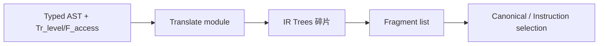

## What does Chapter 7 focus on?

Chapter 6 把**运行时的样子**抽象好了——`F_access` 告诉你"变量在 frame 还是 reg",`Tr_level` 帮你管嵌套 scope。但 typed AST 到这里**还没有变成可执行的东西**。Chapter 7 接着问:

> **怎么把 typed AST 真正翻译成机器无关的 IR?**

答案是 **IR Tree + Translate 模块**——把每个 Tiger 语法结构(变量、数组、条件、循环、函数调用)映射成一棵小小的 Tree。



Chapter 7 的三个主题:

1. **Three-Address Code / IR Tree**:两种常见 IR,Tiger 用树
2. **Translation into IR Trees**:各种 Tiger 构造怎么翻译
3. **Translation of Declarations**:变量 / 函数声明如何产生 frame 和 fragment

---

## 为什么需要 Intermediate Representation?

直接把 AST 翻成目标机器代码行不行?行,但**糟糕**:

- N 种源语言 × M 种目标机器 = **N × M** 个编译器
- 有了 IR:N 个前端 + M 个后端 = **N + M**

```
┌────────┐   ┌────────┐   ┌────────┐      ┌─────┐   ┌─────┐   ┌─────┐
│Tiger AST│   │ C AST  │   │ Java AST│      │Tiger│   │ C   │   │Java │
└───┬────┘   └───┬────┘   └───┬────┘      └──┬──┘   └──┬──┘   └──┬──┘
    ↓ × M 种机器 ↓            ↓                 ↘       ↓       ↙
  N×M 个编译器                                        IR        ← 前端都落到这里
                                                    ↙ ↓ ↘
                                                MIPS x86 ARM   ← 后端各自翻译
```

IR 的两个核心特性:

- **机器无关**:不绑定具体指令集
- **源语言无关**:不绑定具体语法

> **一个好的 IR:前端好产出、后端好翻译、每个构件语义极简**——这样优化变换写起来才干净。

---

# Part 1: Three-Address Code

最基本的指令形式:

```
x = y op z
```

一条指令四个字段:**一个操作符 + 三个地址**(源 1、源 2、目的)。

地址可以是:

- **source name**:源程序里的名字(如 `a`, `x`)
- **constant**:常量(如 `3`)
- **compiler-generated temporary**:编译期生成的临时量(如 `t1`)

> **约束**:==右侧最多一个运算符==。复杂表达式要用临时量一步步拆开。

### 例子:`2*a + (b-3)`

```
t1 = 2 * a
t2 = b - 3
t3 = t1 + t2
```

### 完整例子

```
read x                     read x
if 0 < x then              t1 = x > 0
  fact := 1;               if_false t1 goto L1
  repeat                   fact = 1
     fact := fact * x;     label L2
     x := x − 1            t2 = fact * x
  until x = 0;             fact = t2
  write fact               t3 = x − 1
end                        x  = t3
                           t4 = x == 0
                           if_false t4 goto L2
                           write fact
                           label L1
                           halt
```

### 实现

- 整个指令序列存为**数组**或**链表**
- 最常见实现:**quadruple**(四元组)——(op, arg1, arg2, result)
- 字段用不满时填 `_`:`fact = 1` → `(asn, 1, fact, _)`
- 其他变体:**triple**、**indirect triple**

> Three-address code 没有标准形式,不同语言可能要扩展(SSA 是其中著名变体)。

---

# Part 2: IR Tree(Tiger 用的 IR)

Tiger 用的不是三地址码,而是**表达式树**。

### 为什么用树?

- 抽象语法里一个节点(比如数组下标)可能**很重**
- 真实机器的一条指令也可能**很重**
- 两者的"重"点**不一定对齐**
- 所以 IR 要**拆到极简**:一次 fetch、一次 store、一次 add、一次 move、一次 jump

> 每条 IR 只描述一件极简的事。上层复杂的语法结构 → 一组 IR;一组 IR → 一条或多条真实机器指令。

### `T_exp`:有返回值的表达式

| 节点 | 含义 |
|---|---|
| `CONST(i)` | 整型常量 i |
| `NAME(n)` | 符号常量 n(汇编 label) |
| `TEMP(t)` | 临时量 t(虚拟寄存器) |
| `BINOP(o, e1, e2)` | 二元运算(PLUS/MINUS/MUL/DIV/AND/OR/XOR/LSHIFT/RSHIFT/ARSHIFT) |
| `MEM(e)` | 从地址 e 处取 wordSize 字节;作为 MOVE 左孩子时表示 **store**,其他地方表示 **fetch** |
| `CALL(f, l)` | 函数调用,参数从左到右求值 |
| `ESEQ(s, e)` | 先执行语句 s(副作用),再把 e 的值作为结果 |

### `T_stm`:只做副作用、没返回值的语句

| 节点 | 含义 |
|---|---|
| `MOVE(TEMP t, e)` | 把 e 的值搬到寄存器 t |
| `MOVE(MEM(e1), e2)` | 把 e2 的值存到地址 e1 |
| `EXP(e)` | 求值 e 丢弃结果(只要副作用) |
| `JUMP(e, labs)` | 跳到 e;可以是 `NAME(lab)` 也可以是算出来的地址 |
| `CJUMP(o, e1, e2, t, f)` | 比较 e1 op e2,真跳 t,假跳 f |
| `SEQ(s1, s2)` | 先 s1 再 s2 |
| `LABEL(n)` | 定义当前地址为 n |

> **`NAME(n)` vs `LABEL(n)`**:NAME 是**使用**一个符号,LABEL 是**定义**一个符号。

---

# Part 3: Translation into IR Trees

## 三种 Expression 的"味道"

一个 Tiger 表达式翻译出来可能长三种样子,Translate 层用 `Tr_exp` 统一表达:

| 味道 | 意思 | 载体 |
|---|---|---|
| **Ex** | "有返回值的表达式" | `T_exp` |
| **Nx** | "没有返回值,只有副作用" | `T_stm`(procedure、while) |
| **Cx** | "条件"——能跳 true-label / false-label | `T_stm` + 两条 patch list |

```c
struct Cx { patchList trues; patchList falses; T_stm stm; };
struct Tr_exp_ {
  enum { Tr_ex, Tr_nx, Tr_cx } kind;
  union {
    T_exp ex;
    T_stm nx;
    struct Cx cx;
  } u;
};
```

> `Tr_*` 是 Translate 模块的包装,`T_*` 是底层 Tree 模块的 IR 节点。

### Backpatching(回填)

翻译 `a > b | c < d` 时,还不知道 true / false 要跳到哪里——**那是外层 `if` / `while` 才会告诉你的**。所以:

- 先把 CJUMP 里的 true/false 字段填 NULL
- 把"需要以后填 t"的地址收进 **trues patchList**,"需要填 f"的收进 **falses patchList**
- 等外层上下文确定后,`doPatch(list, label)` 一次性回填

```c
void doPatch(patchList tList, Temp_label label) {
  for ( ; tList; tList = tList->tail)
    *(tList->head) = label;
}
```

### 三个 unwrap 函数

在不同上下文需要把 Tr_exp 转成指定形式:

```c
static T_exp    unEx(Tr_exp e);   // 要一个值
static T_stm    unNx(Tr_exp e);   // 要一个语句
static struct Cx unCx(Tr_exp e);  // 要一个条件
```

**`unEx` 最重要** ——Cx 转 Ex 的标准展开:

```
MOVE(TEMP r, 1)       // 预置 r = 1
<Cx.stm>              // 跑条件,true → t, false → f
LABEL(f)
MOVE(TEMP r, 0)       // false 分支改成 0
LABEL(t)
TEMP(r)               // 最后值
```

对应代码:

```c
Temp_temp r = Temp_newtemp();
Temp_label t = Temp_newlabel(), f = Temp_newlabel();
doPatch(e->u.cx.trues, t);
doPatch(e->u.cx.falses, f);
return T_Eseq(T_Move(T_Temp(r), T_Const(1)),
         T_Eseq(e->u.cx.stm,
           T_Eseq(T_Label(f),
             T_Eseq(T_Move(T_Temp(r), T_Const(0)),
               T_Eseq(T_Label(t), T_Temp(r))))));
```

---

## Simple Variables

一个在当前 frame 的局部变量 `v`,在 offset k 处:

```
MEM(+(TEMP fp, CONST k))
```

```
        MEM
         │
         +
        ╱ ╲
   TEMP fp  CONST k
```

- `TEMP fp`:frame pointer 寄存器
- `k`:v 在 frame 里的偏移
- Tiger 所有变量大小 = 机器字长

### Semant 和 Translate 的接口

Semant **不能直接碰** Tree 或 Frame 模块,要通过 Translate:

```c
Tr_exp Tr_simpleVar(Tr_access, Tr_level);
```

Semant 递给 Translate:变量的 `Tr_access` + 当前使用点所在的 `Tr_level`。

### Frame 模块需要暴露的东西

```c
/* frame.h */
Temp_temp F_FP(void);
extern const int F_wordSize;
T_exp F_Exp(F_access acc, T_exp framePtr);
```

`F_Exp` 把 `F_access` 翻成访问树:

- `InFrame(k)` → `MEM(+(TEMP FP, CONST k))`
- `InReg(t832)` → `TEMP t832`

### 嵌套函数访问外层变量

如果变量在外层 frame,要沿 **static link** 往上爬。爬 n 层:把 `TEMP FP` 换成 `MEM(+(TEMP FP, CONST slOff))` 嵌套 n 次。

---

## Array / Record Variables

不同语言对数组变量语义不同:

| 语言 | `a = b`(数组) | 说明 |
|---|---|---|
| Pascal | **复制整个数组** | array 变量就代表内容 |
| C | 非法 | 数组名是常量指针 |
| Tiger / Java / ML | **指针赋值** | 只改指向,不拷贝元素 |

Tiger 的数组和 record 都是**指向堆对象的指针**(scalar):

```tiger
let type intArray = array of int
    var a := intArray[12] of 0
    var b := intArray[12] of 7
in a := b end
(* a 和 b 指向同一个"12 个 7",原来的"12 个 0"被扔了 *)
```

---

## Structured L-Values

**L-value** = 能出现在赋值左边的表达式(有位置,可写入):`x`, `y.p`, `a[i+2]`。
**R-value** = 只能出现在赋值右边:`a + 3`, `f(x)`。

- Tiger 里所有变量都是 **scalar**(数组/记录是指针,也是 scalar)
- C / Pascal 有 **structured l-value**(C 的 struct、Pascal 的 array 直接值)

为了支持结构体赋值,`T_Mem` 多一个 size 参数:

```c
T_exp T_Mem(T_exp, int size);
```

`Mem(+(TEMP fp, CONST k), S)`——S 是这个对象的字节数。

### 为什么需要 size 参数?

Tiger 里数组和记录都是指针(一个字长,比如 4 字节),`MEM(e)` 默认取 wordSize 就够了。但 Pascal 里数组变量**就是数组本身**:

```pascal
var a, b: array[1..100] of integer;
a := b;   (* 要把 100 个整数全部拷过去,搬 400 字节! *)
```

普通的 `MEM(e)` 只取一个字,不够用。所以给 MEM 加 size,让 IR 知道要搬多少字节。

> **Tiger 基本用不到这个扩展**——所有变量都是 scalar,size 永远等于 wordSize。这个设计是为 Pascal/C 这类有 structured l-value 的语言准备的。

---

## Subscripting and Field Selection

### 地址算法

数组:
```
address(a[i]) = (i − l) × s + a
```
- `a` = 数组首址
- `l` = 下界(Tiger 是 0)
- `s` = 元素大小

记录:
```
address(a.f) = a + offset(f)
```

### L-value 应该翻成**地址**而不是"已解引用的 MEM"

否则 `a[i]` 就得不到 a 的地址去做算术。正确做法:

> 把 l-value 翻成**表示其地址的 Tree**,只有当它出现在需要 r-value 的上下文时,才外加一个 `MEM`。

**为什么?** 假设数组 `a` 在 frame 偏移 k 处,你要翻译 `a[i]`:

如果一上来就翻成 `MEM(+(TEMP fp, CONST k))`——这已经是**取出来的值**了,你没法在一个值上做地址运算(算 `a + i × W`)。

正确做法是先只保留地址 `+(TEMP fp, CONST k)`,自由地做算术算出 `a[i]` 的地址,等到最后确定上下文再决定:

- 赋值**右边**(要值)→ 外套 MEM,读出来
- 赋值**左边**(要写入)→ 外套 MEM 放在 MOVE 左孩子,表示写入

> 比喻:地址 = 门牌号("长安街 10 号"),MEM = 进门取东西。你要算"第 10 号往后第 3 家",得先有门牌号才能 +3。一上来就进门取了包裹,就没法在门牌号上做算术了。

### Tiger 数组下标 `a[i]` 的 IR Tree

因为 Tiger 的 a **本身是指针**(放在 frame 里),要先 MEM 把它取出来:

```
MEM
 │
 +
├── MEM(e)              ← e 是 a 的地址,MEM(e) 取出指针
└── BINOP
    ├── MUL
    ├── i
    └── CONST W         ← W 是 word size
```

```
MEM(+(MEM(e), BINOP(MUL, i, CONST W)))
```

> Tiger 里 MEM 既代表 fetch 又代表 store:看它是不是 MOVE 的左孩子。所以 l-value 可以先带着 MEM,等到上下文确定再解释。

---

## Arithmetic

Tiger 每个整型算术运算都直接对应一个 Tree 节点。**没有一元运算符**:

- `-n` → `0 - n`(减法)
- `not n` → `n xor -1`(XOR 全 1)
- **没有浮点**——因为浮点的 `-0.0` 没法用减法表示(`0 - (-0.0) = +0.0`,不对)

> 结论:Tree 语言对一元运算不友好,但 Tiger 也用不上。

---

## Conditionals

### 比较运算

`x < 5` 翻成 **Cx**:

```
stm    = CJUMP(LT, x, CONST 5, NULLt, NULLf)
trues  = {t}     ← 指向 NULLt 的指针,待回填
falses = {f}     ← 指向 NULLf 的指针,待回填
```

### `a > b | c < d`(短路或)

```
SEQ
├── CJUMP(GT, a, b, NULLt, z)     ← a > b 真 → 跳 NULLt(外层填),假 → 跳 z
└── SEQ
    ├── LABEL z
    └── CJUMP(LT, c, d, NULLt, NULLf)
```

**patch lists**:

```
trues  = [&cjump1.true, &cjump2.true]     ← 外层两个 true 目的地都要回填
falses = [&cjump2.false]
```

### `if e1 then e2 else e3`

最直接的翻法:

```
unCx(e1)
LABEL t
  r ← unEx(e2)
  JUMP join
LABEL f
  r ← unEx(e3)
  JUMP join
LABEL join
TEMP r
```

**优化:**

- 若 e2、e3 都是 **Nx**(如 if 语句),不需要 r
- 若 e2 或 e3 是 **Cx**(如 `if x<5 then a>b else 0`)——直接用 `unEx` 会产生一堆 jump/label 缠起来,要特判

### 例子:`if x < 5 then a > b else 0`

等价于 `if x<5 & a>b then 1 else 0`:

```
SEQ(
  s1(z, f),           ← x<5:真跳 z,假跳 f
  SEQ(LABEL z,
      s2(t, f)))      ← a>b:真跳 t,假跳 f
```

---

## While Loops

通用模板:

```
test:
  if not(condition) goto done
  body
  goto test
done:
```

### break

在 body 里的 break(不嵌在更内层 while 里)翻成 `JUMP done`——问题是**怎么知道 done 的 label**?

> 给 `transExp` 加一个形参 `break`,传入"最近一层外层循环的 done label"。嵌套时内层 while 覆盖这个参数,退出后恢复。

---

## For Loops

朴素想法:重写成 let/while:

```tiger
for i := lo to hi do body
≡
let var i := lo
    var limit := hi
in while i <= limit do (body; i := i + 1) end
```

**bug**:当 `limit = maxint` 时,`i + 1` 溢出。

**修正模板**:先判空,再把自增放到比较**前**(更准确:比较用 `>=` 提前检测,然后才加):

```
if lo > hi goto done
i := lo
limit := hi
test:
  body
  if i >= limit goto done
  i := i + 1
  goto test
done:
```

---

## Function Call

```
f(a1, ..., an)   →   CALL(NAME lf, [sl, e1, e2, ..., en])
```

- `lf`:f 的 label
- `sl`:**static link**——作为隐式第一参传入,支撑嵌套作用域

> static link 的值 = 按 Chapter 6 规则算出来的 caller 传给 callee 的 frame 指针。

---

# Part 4: Translation of Declarations

`transDec` 是 **side-effect**:它不返回 IR(或只返回 no-op),但会**修改 frame 数据结构**和**产出 fragment**。

## Variable Declaration

- 在当前 frame 里为变量分配新空间(调用 `Tr_allocLocal`)
- 初始化:翻译成一个赋值 IR,把它**插入 let 的 body 之前**

```tiger
let var x := 5 in body end
```

等价于:在 body 前加一条 `MOVE(x_access, 5)` 的 IR。

- **type declaration / function declaration** 对 IR 本身无贡献,`transDec` 返回 `EXP(CONST 0)`(no-op)

## Function Declaration

一个 Tiger 函数 → 一段"汇编语言片段",三部分:

```
          _global name
name:    ...                      ← prologue
         assembly code for body   ← body(translated expression)
         ...                      ← epilogue
```

### Prologue(5 条)

1. 汇编伪指令:标记函数开始
2. 函数名的 label 定义
3. 调整 SP:为新 frame 分配空间
4. 把 **escaping arguments**(含 static link)搬进 frame;把 **non-escaping arguments** 搬进新 temp reg
5. 保存函数内要用的 **callee-save registers**(包括 return address)

### Body(1 条)

6. 翻译出来的函数体 IR

### Epilogue(5 条)

7. 把返回值搬进返回值寄存器
8. 恢复 callee-save registers
9. 重置 SP:释放 frame
10. `return` 指令:跳回 return address
11. 汇编伪指令:标记函数结束

## Fragment:Translate 阶段的最终产物

每个函数产出一个 **fragment**(`F_frag`),两种类型:

```c
struct F_frag_ {
  enum { F_stringFrag, F_procFrag } kind;
  union {
    struct { Temp_label label; string str; } stringg;
    struct { T_stm body; F_frame frame; }    proc;
  } u;
};
```

- **stringFrag**:字符串字面量(放数据段)
- **procFrag**:函数体 IR + 对应 frame 描述

### Translate 层接口

```c
void        Tr_procEntryExit(Tr_level level, Tr_exp body,
                             Tr_accessList formals);
F_fragList  Tr_getResult(void);     // 拿到所有 fragment
```

每翻译完一个函数就调 `Tr_procEntryExit` 入队,全部翻完后 `Tr_getResult` 取列表传给下游。

---

## Summary:Chapter 7 的核心思路

### 1. 为什么要 IR?
N+M 而不是 N×M;优化写一次就能惠及所有前端/后端。

### 2. Tiger 用 IR Tree 而不是 three-address code
Tree 表达更自然,每个节点只描述**极简**的一件事——fetch / store / add / jump。

### 3. Ex / Nx / Cx 三味统一 Tr_exp
不同上下文要的"形状"不一样,`unEx / unNx / unCx` 按需转换;Cx 用 **patchList + backpatching** 延迟绑定 true/false label。

### 4. L-value = 地址,不是 MEM 包好的值
把 l-value 翻成地址表达式,等上下文要 r-value 时再外加 MEM。Tiger 里 MEM 双用(fetch/store)靠位置区分。

### 5. 嵌套函数 = CALL 多一个 static link 实参
Translate 层根据 caller / callee 层次关系算出 static link 值,作为隐式第一参传进去。

### 6. 控制结构都有模板
if / while / for / break 都能套标准的 label + CJUMP + JUMP 模式;for 要小心溢出。

### 7. Declaration 产出 fragment
每个函数 → 一个 procFrag(frame + IR body);字符串常量 → stringFrag。Translate 阶段最终交付给下游的就是这个 fragment list。

### 8. Prologue / Body / Epilogue 三段式
frame 的"进入"和"退出"动作并不在函数体 IR 里——由后续阶段根据 frame 信息合成,这里只是搭好框架。

---

## 一个总的理解框架

| Chapter | 问 | 答 |
|---|---|---|
| 5 | AST 语义对吗? | Symbol table + type checking |
| 6 | 运行时变量放哪? | Activation record + Frame / Temp 抽象 |
| **7** | **typed AST → IR 怎么翻?** | **IR Tree + Translate (Ex/Nx/Cx)** |
| 8 | IR 怎么整理? | Canonicalization (basic blocks, traces) |
| 9 | IR → 目标机器? | Instruction selection |

到这里,前端算是真正**落地**了:

```
source → tokens → CST → AST → typed AST
→ typed AST + frame info → IR fragments  ← 你在这里
→ canonical IR → machine code
```

下一章 Chapter 8 要把这些 IR tree 规整成 **basic block + trace** 的形式,为指令选择做准备。

---

# 学习路线建议

按以下顺序推进,效率最高:

### Step 1:把前置概念串起来(0.5h)
- 回顾 Lec6 的 `F_access`、`Tr_level`、static link——Ch7 整个前半部分就是拿这些接口**实际产 IR**
- 明确"Semant 不碰 Tree/Frame"这条铁律:Semant 只通过 Translate 层间接操作

### Step 2:吃透两种 IR(1h)
- **Three-address code**:看懂 quadruple 例子,理解为什么"右边最多一个运算符"
- **IR Tree**:把 `T_exp` 和 `T_stm` 的表格背下来——特别是 `MEM` 的双重含义、`ESEQ`、`CJUMP` 这三个
- 手画一遍 `a > b | c < d` 的树

### Step 3:Ex / Nx / Cx 三味 + backpatching(1.5h)⭐ **重点难点**
- 理解为什么需要三种"味道"——表达式在不同上下文会被要求不同形状
- 手写 `unEx` 的展开(MOVE 1; Cx; LABEL f; MOVE 0; LABEL t; TEMP r)
- 弄懂 patchList 怎么记"以后要填的地址",`doPatch` 和 `joinPatch` 两个操作
- 这是全章**最难**的概念,不过后面 if / while / & / | 全靠这套

### Step 4:各语法构造的翻译模板(2h)——照着课件手画 IR
按简单到复杂:
1. **Simple variable**:`MEM(+(TEMP fp, CONST k))`
2. **Array / record**:是指针(scalar),赋值只改指向
3. **Array subscript** `a[i]`:两层 MEM——取指针 + 下标偏移
4. **L-value 策略**:翻成地址,上下文决定加不加 MEM
5. **Conditional** `if-then-else`:三 label 模板,特判 e2/e3 是 Nx 或 Cx
6. **While**:4 行模板 + break 靠传递 done label
7. **For**:注意溢出修正(判空 + 比较在加之前)
8. **Function call**:多一个 static link 实参

### Step 5:Declaration 和 Fragment(0.5h)
- `transDec` 是 side-effect,不产值
- 变量初始化 IR 要拼到 let body 之前
- 函数 → procFrag:prologue/body/epilogue 三段各做什么,要能背

### Step 6:做作业 7.2 + 手写一个小 Tiger 程序的完整 IR(1h)
挑一个含嵌套函数 + if + while + 数组下标的 Tiger 片段,从 AST 翻到 IR Tree——能手画出来,这章就真掌握了。

### 常见陷阱提醒
- **MEM 双重角色**:看是不是 MOVE 左孩子
- **l-value**:带地址不带 MEM
- **Cx 不能当 Ex 直接用**:要走 unEx
- **for 的溢出**:不是 `i<=limit then i+=1`,而是先 body 再判再加
- **CALL 的第一个实参是 static link**,不是源程序的第一个参数

### 和后续章节的衔接
- Ch8:把这章产的 IR Tree 拆成 basic block,再串成 trace
- Ch9:每个 canonical IR → 机器指令(maximal munch)
- **Ch7 是前端的终点,也是后端的起点**——这一章通了,整个编译器的骨架就闭环了
