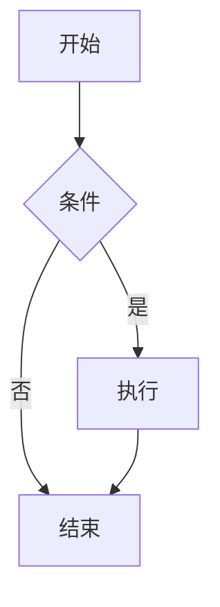

[toc]

## 行内扩展语法

这一段测试 ==高亮文本==、H~2~O 下标、E=mc^2^ 上标，以及 emoji :smile: :rocket: :100:。

混合：水的化学式是 H~2~O，光速是 c=3×10^8^ m/s，==这是高亮==。

## Typora style 图片

下面这段图片用了 Typora 的 zoom 写法，应该被改写成 width：

## CS 风格的尖括号文本

`<segment-number, offset>` 这种元组写法不应该破坏 MDX 解析，count `<>0` 也应该可以。
裸文本里的 a < b 和 <segment, offset> 也应该正常显示。

## Mermaid 流程图

## 数学公式

行内：$E = mc^2$，块级：

$$
\int_{-\infty}^{\infty} e^{-x^2}\,dx = \sqrt{\pi}
$$

## 任务列表

- [x] 已完成项
- [ ] 未完成项
- [ ] 还有一项

## 表格

| 语法 | 效果 |
|---|---|
| `==text==` | 高亮 |
| `~text~` | 下标 |
| `^text^` | 上标 |
| `:smile:` | 😄 |
