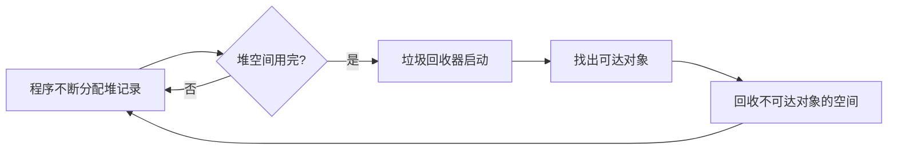

## 第 13 章关注什么？

前面几章我们把源代码一路编译到了机器码。但程序运行时还要管理 **堆内存**：
不断 `new` / `malloc` 出新对象，又不断不再使用它们。

第 13 章问的问题是：

> **谁来回收那些“分配了但不再使用”的内存？怎么自动回收？**

答案是 **垃圾回收（garbage collection, GC）**：由 **运行时系统（runtime）** 自动找出
不再被使用的记录（record），把它们的空间回收再利用，程序员不需要手动 `free`。



本章的核心内容：

1. **可达性近似**：用“能否从根被指针链到达”来近似“是不是垃圾”。
2. **Mark-and-Sweep（标记-清扫）**：DFS 标记可达节点，线性扫描回收其余。
3. **Reference Counting（引用计数）**：给每个记录记录被指向的次数。
4. **Copying Collection（复制式回收）**：把可达对象复制到另一半内存。
5. **与编译器的接口**：快速分配、数据布局描述、指针映射、派生指针。

---

## 我们在哪里？

```text
源代码
    |
    | 词法 / 语法 / 语义分析
    v
IR -> 规范 IR -> 抽象汇编 -> 活跃性分析 -> 寄存器分配 -> 机器码
                                                            |
                                                            | 运行时（runtime）
                                                            v
                                                  +-------------------+
                                                  |   垃圾回收器 GC    |  <- 第 13 章
                                                  +-------------------+
```

注意一个重要事实：

> **垃圾回收不是编译器做的，而是运行时系统做的**（链接进可执行程序的支持库）。

但是编译器要 **配合** GC：生成分配代码、告诉 GC 哪里有根、描述记录布局等。
所以本章既讲 GC 算法，也讲 **编译器与 GC 的接口**。

---

# 第 1 部分：内存组织与手动管理

## 1.1 存储组织

一个典型程序的内存被划分成几块（地址从低到高）：

```text
低地址
+-----------+
|  Code     |  可执行的目标代码
+-----------+
|  Static   |  编译期就知道大小的数据：全局常量、编译器生成的数据
+-----------+
|  Heap     |  程序控制下分配/释放的数据   ↓ 向下增长
+-----------+
| Free Mem  |
+-----------+
|  Stack    |  过程调用产生的活动记录   ↑ 向上增长
+-----------+
高地址
```

- **Heap（堆）**：`malloc`/`free`（C）、`new`（Java）分配的数据，本章主角。
- Heap 和 Stack 相向增长，中间是空闲内存。

## 1.2 手动内存管理

- **手动方法**：C、C++ 用 `malloc` 和 `free` 手动分配和释放指针。
- **手动管理的问题**：
  - 内存泄漏（memory leak）
  - 重复释放（double free）
  - 释放后使用（use-after-free）
  - 类型安全问题（type-safe problems）
- **存储 bug 很难找**：一个 bug 的可见效果可能在时间上、代码位置上离 bug 源头很远。

## 1.3 自动内存管理与“垃圾”

- **自动内存管理**：内存的回收是自动进行的。
- **垃圾（Garbage）**：已分配但 **不再被使用** 的存储。

例子：

```java
class node { int value; node next; }
node p, q;

p = new node();   // (a) p、q 各指向一个新记录
q = new node();
q = p;            // (b) q 改指向 p 的记录
delete p;         // (c) p 置空，原来 q 指的记录变成无人引用的“?”
```

`q = p` 之后，`q` 原来指向的那个记录就没人引用了 —— 它成了垃圾。

---

# 第 2 部分：垃圾回收的基本思想

## 2.1 什么是垃圾回收

> **垃圾回收**：在没有显式调用 `free` 的情况下，回收“已分配但不再使用”的存储。

- GC 由 **运行时系统** 执行，不是编译器。

## 2.2 用可达性近似“是不是垃圾”

理想情况下：

> 任何 **动态上不再活跃**（将来的计算中不会再用到）的记录，都是垃圾。

但是：

> **判断一个对象是不是垃圾是不可判定的（undecidable）。**

所以必须依赖一个 **保守近似（conservative approximation）**：

> **思想：用可达性（reachability）来近似。**
> 从程序变量出发，沿指针链 **不可达** 的堆记录，就是垃圾。

这个近似的方向很重要：

```text
不可达  ->  一定是垃圾      （安全，可以回收）
垃圾    ->  可能仍然可达    （保守，可能漏回收一些真正的垃圾）
```

也就是说，GC 可能会 **保留** 一些其实已经没用、但仍然可达的对象，
但 **绝不会回收** 还可能被用到的对象。这就是“保守”的含义。

可达性的递归定义：

> 对象 `x` 是 **可达的**，当且仅当：
> 1. 某个寄存器中存有指向 `x` 的指针，**或者**
> 2. 另一个可达对象 `y` 中存有指向 `x` 的指针。

## 2.3 有向图模型

把程序变量和堆记录看成一张 **有向图**：

| 图概念 | 含义 |
|---|---|
| 节点（node） | 程序变量、堆中的记录 |
| 边（edge） | 指向关系（pointing relationship） |
| 根（root） | 程序变量：寄存器、栈上的局部变量/形参、全局变量 |

可达性：

```text
节点 n 是可达的
  <=>  存在一条有向边的路径 r -> ... -> n
       其中 r 是某个根
```

GC 的任务，就是把 **从根可达的** 节点都保留，其余回收。

---

# 第 3 部分：Mark-and-Sweep（标记-清扫）

四种主要算法的第一种。分两个阶段：**Mark（标记）** + **Sweep（清扫）**。

## 3.1 Mark：标记可达节点

- 从根（程序变量）出发搜索整张图。
- 把访问到的节点 **标记（mark）**。
- 用 **深度优先搜索（DFS）** 就能标记所有可达节点。

递归版 DFS：

```text
function DFS(x)
  if x is a pointer into the heap
    if record x is not marked
      mark record x
      for each field fi of record x
        DFS(x.fi)
```

标记完成后：

> **任何没被标记的记录一定是垃圾，应该被回收。**

## 3.2 Sweep：清扫并回收

- 对整个堆做一次 **线性扫描（linear scan）**。
- 把没标记的节点串成一个 **空闲链表（freelist）**。
- 把标记过的节点 **取消标记（unmark）**，为下一次 GC 做准备。

## 3.3 完整算法（ALGORITHM 13.3）

```text
Mark phase:                  Sweep phase:
  for each root v              p <- first address in heap
    DFS(v)                     while p < last address in heap
                                 if record p is marked
                                   unmark p
                                 else
                                   let f1 be the first field in p
                                   p.f1 <- freelist
                                   freelist <- p
                                 p <- p + (size of record p)
```

- GC 结束后，程序恢复执行。
- 程序想分配新记录时，就从 **freelist** 取一个。
- 当 freelist 为空时，再做一次 GC。

## 3.4 代价分析

设：

- `H` = 堆大小（heap size）
- `R` = 可达数据量（reachable data）

一次 GC 的时间：

| 阶段 | 时间 |
|---|---|
| Mark（DFS） | 正比于 `R` |
| Sweep（线性扫描） | 正比于 `H` |
| 总时间 | `c1·R + c2·H` |

一次 GC 给 freelist 补充了 `H − R` 个字（words）的空间，所以 **分摊代价（amortized cost）**：

```text
                c1·R + c2·H
分摊代价  =  -----------------
                  H − R
```

> 如果 `R` 接近 `H`（可达数据几乎占满堆），分摊代价会 **非常高**：
> 每次 GC 累得要死，却只腾出一点点空间。

---

# 第 4 部分：DFS 的栈空间问题

Mark 阶段用 DFS，但朴素 DFS 有个隐患。

## 4.1 递归 DFS 的问题

- DFS 是 **递归** 的。
- 极端情况：堆里 `H` 个记录串成一条 `H` 元素的链表。
- 递归的活动记录栈深度会达到 `H`，**比整个堆还大**。

GC 本来就是因为内存紧张才启动，结果它自己又要一个超大的栈，显然不行。

## 4.2 用显式栈

- **方案**：用一个 **显式栈（explicit stack）** 代替递归。

```text
function DFS(x)
  if x is a pointer and record x is not marked
    mark record x
    t <- 1
    stack[t] <- x                 // push DFS 起点
    while t > 0
      x <- stack[t]; t <- t - 1   // pop 一个元素
      for each field fi of record x
        if x.fi is a pointer and record x.fi is not marked
          mark x.fi
          t <- t + 1; stack[t] <- x.fi
```

- `t`：栈顶下标；`stack`：worklist（工作表）。
- **好处**：需要 `H` 个 **字**，而不是 `H` 个 **活动记录**。
- **但仍然不行**：要求一个和被回收的堆一样大的辅助栈，依然不可接受。

## 4.3 指针反转（Pointer Reversal）

最巧妙的解法：**把 DFS 的栈存进有向图自身**。

核心洞见：

> 当 `x.fi` 被压入栈后，算法再也不会去看 `x.fi` 原来的位置了，
> 所以 **`x.fi` 这个字本身可以拿来存一个栈元素**。
> 等到出栈时，再把 `x.fi` 的原值恢复。

做法（当搜索遇到新记录 `x` 时）：

- 标记 `x`。
- 在 `DFS(x.fi)` 之前，把 `x.fi` **改成指回 `x` 的 DFS 父记录**（这就是“指针反转”）。
- 无法再深入时返回，沿着这些 **反向链** 回溯，并 **恢复** 这些链。

带 `done[]` 的完整算法：

```text
function DFS(x)
  if x is a pointer and record x is not marked
    t <- nil                         // t: 栈顶（用反转指针串起来）
    mark x; done[x] <- 0             // done[x]: x 已处理了几个字段
    while true
      i <- done[x]
      if i < # of fields in record x
        y <- x.fi
        if y is a pointer and record y is not marked
          x.fi <- t; t <- x; x <- y  // x.fi 指向旧栈顶(父); 压栈; 下探 y
          mark x; done[x] <- 0
        else
          done[x] <- i + 1           // 这个字段处理完，看下一个
      else                           // x 的字段都处理完了，回溯
        y <- x; x <- t               // 弹出栈顶到 x
        if x = nil then return       // 回到根，结束
        i <- done[x]
        t <- x.fi; x.fi <- y         // 恢复正确的链
        done[x] <- i + 1             // 继续处理父记录的下一个字段
```

- `done[x]`：记录每个记录已经处理了多少个字段。
- `t`：栈顶（通过反转的指针隐式串成栈，不需要额外数组）。
- 课件用一个三节点例子（x0、x1、x2）一步步演示了压栈、反转、恢复的全过程。

这样就 **不需要任何额外栈空间** 了，代价是常数因子变大（每条边要走两次：下探一次、回溯恢复一次）。

---

# 第 5 部分：Mark-and-Sweep 小结与碎片

## 5.1 优缺点

| | 内容 |
|---|---|
| **优点 Pros** | 回收过程中对象 **不移动**；能处理 **循环引用（cyclic references）** |
| **缺点 Cons** | 正常执行必须 **暂停（stop-the-world）**；会造成堆 **碎片（fragmentation）**（缓存不命中、分配更复杂） |

## 5.2 碎片：外部 vs 内部

- **外部碎片（External fragmentation）**：
  程序想分配大小为 `n` 的记录，存在很多比 `n` 小的空闲记录，但 **没有一个刚好够大**。

  ```text
  fragmented:    [f][a][f][a][f][a]    <- 空闲块 f 被分散，凑不出一块大的
  not fragmented:[   a   ][   f   ]    <- 同样的空闲总量，但连成一块就够用
  ```

  两个堆空闲内存总量相同，但第一个有外部碎片：有些请求第二个能满足、第一个不能。

- **内部碎片（Internal fragmentation）**：
  程序用了一个 **过大** 的记录却不切分它，浪费的内存在记录 **内部**。

  ```text
  |<-------- allocated size -------->|
  |<----- requested size ----->|     |
  [        memory block        ][浪费]
  ```

  内存管理器有时会分配比请求更多的内存（例如满足 **对齐约束**），导致小块浪费散落在堆里。

---

# 第 6 部分：Reference Counting（引用计数）

第二种算法。思路与 Mark-and-Sweep 完全不同。

## 6.1 基本思想

> **思想**：不要等到内存耗尽，而是 **一旦某个记录没有任何指针指向它（不可达），就立刻回收**。

- 给每个记录记录 **有多少个指针指向它**，这就是该记录的 **引用计数（reference count）**。
- 引用计数 **和记录存在一起**。
- 每当建立一个指向该记录的新引用，引用计数 **加一**。
- 当引用计数 **降到 0**，该记录就是不可达垃圾，可以回收。

## 6.2 如何维护引用计数

> 编译器为 **每个赋值操作** 生成额外指令来维护引用计数。

当执行 `x.fi <- p`（把 `p` 存进 `x.fi`）时：

- `p` 的引用计数 **加一**；
- `x.fi` **原来指向** 的那个记录的引用计数 **减一**。

如果某个记录 `r` 的引用计数 **降到 0**：

- 把 `r` 放到 **freelist**；
- `r` 指向的所有其他记录的引用计数 **各减一**（可能引发连锁回收）。

`x.fi <- p` 实际被翻译成的指令序列：

```text
z       <- x.fi          // 取出 x.fi 原来指向的记录 z
c       <- z.count
c       <- c - 1         // z 的引用计数减一
z.count <- c
if c = 0 call putOnFreelist   // z 没人引用了 -> 回收

x.fi    <- p             // 真正的赋值
c       <- p.count
c       <- c + 1         // p 的引用计数加一
p.count <- c
```

可以看到：原本 **一条** 机器指令 `x.fi <- p`，现在要执行 **一大串**。

## 6.3 优化：从 freelist 移除时才递归减少

> 与其在记录 `r` **被放上 freelist 时** 立刻递归减少 `r.fi` 指向记录的计数，
> 不如等到 `r` **从 freelist 被取出复用时** 再做这个“递归减少”。

两个理由：

1. 把“递归减少”的工作 **拆成小块**，程序运行更平滑（对交互式/实时程序很重要）。
   - 例如 `r.fi -> p`，`p.fi -> q` 这样的长链不会一次性全部回收。
2. 递归减少只在 **一个地方**（分配器 allocator 里）做。

## 6.4 两个主要问题

引用计数看起来简单又吸引人，但有两个大问题：

### 问题 1：循环引用（Reference Cycle）

- **引用环** 是一组互相循环引用的对象。
  - 例如存 7 的记录和存 9 的记录互相指。
- 引用计数追踪的是 **引用数**，而不是 **可达引用数**。
- 一个环里的对象即使整体已经从根不可达，环内部互相指使得各自计数 ≠ 0，**永远不会被回收**。
- 这是使用引用计数的语言/系统的大问题，例如 **Perl、Firefox 2**。

### 问题 2：代价（Cost）

- 维护引用计数 **非常昂贵**：一条 `x.fi <- p` 膨胀成上面那 9 条指令。
- **数据流分析** 可以消除一部分增减操作，但仍会剩下很多。

## 6.5 优缺点分析

| | 内容 |
|---|---|
| **优点** | 实现简单；**即时回收**（对象变垃圾到被回收的间隔短）；**增量回收**（与程序执行交织，没有 stop-and-collect 的停顿） |
| **缺点** | **无法回收所有不可达对象**（环）；如果触发一次大回收会很慢；**明显拖慢赋值操作** |

---

# 第 7 部分：Copying Collection（复制式回收）

第三种算法。用空间换简单和速度。

## 7.1 基本思想

> 把内存分成 **两半**，通过 **复制** 来回收。

- **from-space**：程序当前正在使用的那一半。
- **to-space**：GC 之前一直空着的那一半。

复制式回收流程：

1. 当 from-space 用完时，遍历由 **程序变量 + from-space** 构成的图，
   把所有 **可达记录复制到 to-space**。
2. 复制完成后，让 **根指向 to-space 中的副本**；
   此时整个 from-space 都不可达了。
3. **交换 from-space 和 to-space 的角色**。

## 7.2 优点：to-space 副本是紧凑的

- to-space 中的副本 **占据连续内存，没有碎片（compact）**。
- 因此 **分配新记录极其简单**：

  ```text
  p = next;          // next 指向连续空闲区的开头
  next = next + n;   // 往后挪 n
  ```

- 没有碎片问题。

```text
   from-space  roots          from-space  roots  to-space
   [可达]<--+                              +---->[副本]
   [垃圾]   |        ===GC===>             |     [副本]
   [可达]<--+                              +---->[副本] <- next
   [垃圾]                                              （连续，可分配）
  没空间分配了                              到这里可以继续分配
```

---

# 第 8 部分：Pointer Forwarding（指针转发）

实现复制式回收的关键技术。

## 8.1 为什么需要

实现复制式回收时：

- 需要像 Mark-and-Sweep 一样遍历所有可达记录。
- 每找到一个可达记录，就把它复制到 to-space。

**关键难点**：复制后必须 **保持指向关系（points-to-relations）** —— 要 **更新所有指向该记录的指针**。

> 假设 `B.fi -> A`，当运行时做图遍历、把 `A` 复制到 to-space 后，
> 怎么把 `B.fi` 更新成指向 `A` 的新副本？

## 8.2 洞见：转发指针（Forwarding Pointer）

> 当我们复制记录 `A` 时，在它 **在 from-space 的旧副本里** 存一个 **转发指针（forwarding pointer）**，指向它的新副本。

```text
   From-Space            To-Space
   A [ •]------------------>[A    ]
        转发指针 (forwarding pointer)
```

- 之后再次到达这个带转发指针的记录时，就 **知道它已经被复制过**，以及 **新副本在哪**。

```text
   From-Space   当之后再到达这条记录    To-Space
   A [ •]---+                          [A   ]
            +----（顺着转发指针找到新副本所在）---->
```

## 8.3 Forward 函数

`next` 初始化指向 to-space 的开头。

`Forward(p)`：给定一个指向 from-space 的指针 `p`，让它指向 to-space。

```text
function Forward(p)
  if p points to from-space
    then if p.f1 points to to-space          // 情况1：已经被复制过
           then return p.f1                  //   p.f1 是转发指针，直接返回新址
         else for each field fi of p          // 情况2：还没被复制
                next.fi <- p.fi              //   复制每个字段到 next 处
              p.f1 <- next                   //   在旧副本留下转发指针
              next <- next + size of record p
              return p.f1
    else return p                            // 情况3：不是指针，或指向 from-space 之外
```

三种情况：

| 情况 | 条件 | 处理 |
|---|---|---|
| 1. 已复制 | `p.f1` 指向 to-space | `p.f1` 就是转发指针，返回它 |
| 2. 未复制 | 指向 from-space 且未复制 | 复制到 to-space，留转发指针 |
| 3. 无需处理 | 不是指针 / 指向 from-space 之外 | 原样返回 `p` |

---

# 第 9 部分：Cheney 算法

用 **广度优先（BFS）** 实现复制式回收，且 **不需要额外的栈或队列空间**。

## 9.1 BFS + scan / next 双指针

- **Cheney 算法**：用 **广度优先搜索（BFS）** 遍历可达数据。
- 问题：BFS 的 worklist（队列）放哪？
- 巧妙之处：引入指针 `scan`，用 `scan` 和 `next` 把 to-space 分成 **三段连续区域**：

```text
 start            scan              next
   |                |                 |
   +----------------+-----------------+-----------------+
   | Copied&Scanned |  Worklist(BFS)  |      Empty       |
   +----------------+-----------------+-----------------+
   |<----------- Copied -------------->|
```

| 区域 | 含义 |
|---|---|
| **Copied & Scanned**（`start..scan`） | 已复制，且内部指针都已处理完 |
| **Worklist for BFS**（`scan..next`） | 已复制，但还没看记录内部的指针 |
| **Empty**（`next..`） | 空 |

`scan..next` 这段就充当了 BFS 的 **队列**，完全复用 to-space 自身，不需要额外内存。

## 9.2 算法（ALGORITHM 13.9）

```text
scan <- next <- beginning of to-space
for each root r
    r <- Forward(r)              // 复制根直接可达的记录；next 增大，scan 不动
while scan < next
    for each field fi of record at scan
        scan.fi <- Forward(scan.fi)
    scan <- scan + size of record at scan
```

- 先把所有根 `Forward` 一遍（相当于 BFS 第一层入队）。
- 然后 `scan` 不断向前推进：处理 `scan` 处记录的每个字段，把它指向的记录也 `Forward`（入队，`next` 往后长）。
- 当 `scan` 追上 `next`，队列空，复制完成。

课件用 p/q/r + 12/15/7/37/59/9/20 的例子画了三步：
(a) 复制前 → (b) 根被 forward → (c) 扫描一个记录后。

## 9.3 局限性：局部性差（Locality of Reference）

- 在有 **虚拟内存** 或 **缓存** 的系统里，**好的引用局部性** 很重要：
  - 程序访问地址 `a` 后，内存子系统期望接下来访问 `a` 附近的地址。
- **BFS 复制出来的指针数据结构局部性很差**：
  - 如果地址 `a` 的记录指向地址 `b` 的记录，`a` 和 `b` 很可能 **离得很远**。
- **深度优先复制** 局部性更好，
  - 但深度优先复制需要 **指针反转**，不方便又慢。

## 9.4 混合算法（Hybrid）

> 部分深度优先、部分广度优先，可以提供 **可接受的局部性**。

基本思想：用广度优先复制，但 **每复制一个对象时，看看能不能把它的某个子节点也复制到它旁边**。

```text
function Forward(p)               function Chase(p)
  if p points to from-space         repeat
  then if p.f1 points to to-space     q <- next
       then return p.f1               next <- next + size of record p
       else Chase(p); return p.f1     r <- nil
  else return p                       for each field fi of record p
                                        q.fi <- p.fi
                                        if q.fi points to from-space and
                                           q.fi.f1 does not point to to-space
                                        then r <- q.fi
                                      p.f1 <- q
                                      p <- r
                                    until p = nil
```

## 9.5 优缺点

| | 内容 |
|---|---|
| **优点** | 简单：不需要栈或指针反转；运行时间正比于 **可达对象数**（与堆大小无关）；空闲空间连续（**自动整理消除碎片**） |
| **缺点** | **浪费一半内存**；局部性差（至少 Cheney 算法是）；需要 **精确的类型信息**（判断每个字是不是指针） |

---

# 第 10 部分：与编译器的接口

GC 虽属于运行时，但编译器必须配合它。课件还提到 **分代回收（Generational）** 和
**增量回收（Incremental）** 两种进阶方法（本章略讲）。

## 10.1 编译器要为 GC 做什么

虽然 GC 是“运行时”的一部分，编译器要通过以下方式与 GC 交互：

- 生成 **分配记录** 的代码；
- 为每次 GC **描述根的位置**；
- 描述堆上 **数据记录的布局**；
- 生成实现 **读屏障 / 写屏障（read/write barrier）** 的指令（某些增量回收需要）；
- ……

## 10.2 快速分配（Fast Allocation）

- 分配很关键：经验数据，**每 7 条指令就有 1 条是 store**，即每条指令最多 1/7 字的分配。
- 创建堆记录有相当的代价。
- 应该用 **复制式回收**（因为它分配快）：分配空间是连续空闲区，`next` 是下一个空闲位置，`limit` 是区域末尾。

分配一个大小为 `N` 的记录的步骤：

```text
1. Call the allocate function                       <- 内联展开可消除
2. Test next + N < limit ?  (失败则 call GC)         <- 不可消除，但可共享
3. Move next to result                              <- 可与步骤 A 合并消除
4. Clear M[next], M[next+1], ..., M[next+N-1]        <- 可被步骤 B 替代消除
5. next <- next + N                                 <- 不可消除，但可共享
6. Return from the allocate function                <- 内联展开可消除
---（以下不算分配开销）---
A. Move result into some computationally useful place
B. Store useful values into the record
```

逐步优化：

| 步骤 | 优化 |
|---|---|
| 1、6 | **内联展开** allocate 函数即可消除 |
| 3 | 常常可与步骤 A **合并** 而消除 |
| 4 | 可由步骤 B（反正要往记录里存值）**替代** 而消除 |
| 2、5 | **不能消除**，但可在 **多次分配间共享** |

> 把 `next` 和 `limit` 放在 **寄存器** 里，步骤 2 和 5 共需 **3 条指令**。
> 综合这些技术，分配一个记录（外加最终回收它）的代价可降到 **约 4 条指令**。

## 10.3 描述数据布局（Describing Data Layouts）

- 回收器必须能处理程序声明的 **任意类型** 的记录：
  - 必须能确定每个记录的 **字段数**，以及 **每个字段是不是指针**。
  - （Cheney 算法里 `Forward(scan.fi)` 和 `size of record at scan` 都需要这个信息。）

- **怎么得到这些信息？** 对静态类型语言（Tiger、Pascal）或面向对象语言（Java）：
  - 让 **每个对象的第一个字** 指向一个特殊的 **类型描述符 / 类描述符（type-/class-descriptor）** 记录。
  - 描述符里记录：对象的 **总大小**、**每个指针字段的位置**。
  - 描述符由编译器从静态类型信息生成 —— 在 **语义分析** 阶段。

- 开销：
  - 静态类型语言：每个记录 **1 个字** 的开销。
  - 面向对象语言：**没有额外开销**，因为它们本来就需要这个描述符指针来实现 **动态方法查找（dynamic method lookup）**。

## 10.4 指针映射（Pointer Map）

要实现 GC，编译器必须告诉回收器：

- 每个 **含指针的** 临时变量和局部变量；
- 它在 **寄存器** 里还是在 **活动记录** 里。

> **Tiger 的方案：构建指针映射（pointer map）。**
> 所有映射都由编译器生成（编译器在编译期就知道哪个 temp 是指针）。

关键问题与设计：

- 活跃临时变量集合 **在每条指令处都可能变化**。
- 指针映射在程序每一点都不同，所以 **只在“可能开始一次新 GC”的点** 描述指针映射就够了。
- **哪里可能开始 GC？**
  - 调用 `alloc` 函数处；
  - **任何函数调用** 处（因为被调函数内部可能再调 `alloc`）。

- 指针映射 **以返回地址（return address）为键** 最合适：
  - 因为返回地址正是回收器在“下一个活动记录”里看到的东西。
  - 找根时，回收器从 **栈顶开始向下扫描**；每个返回地址索引到描述 **下一帧** 的指针映射项；
    在每一帧里，回收器从该帧的指针出发标记（或转发，如果是复制式回收）。
- **被调用者保存寄存器（callee-save）需要特殊处理**：
  - 设 `f` 调用 `g`，`g` 又调用 `h`。
  - `g` 的指针映射必须说明：在调用 `h` 时，它的哪些 callee-save 寄存器含指针，哪些是从 `f` “继承”来的。

## 10.5 派生指针（Derived Pointers）

有时编译后的程序里有指针 **指向堆记录的中间**，或指向记录 **之前/之后**。

例子：`a[i-2000]` 内部算成 `M[a-2000+i]`：

```text
t1 <- a - 2000      // t1 指向数组 a 的“前面”2000 个元素处，不指向任何真正对象
t2 <- t1 + i
t3 <- M[t2]
```

- 如果 `a[i-2000]` 在 **循环** 内，编译器可能把 `t1 <- a - 2000` **提到循环外**（避免每次重算）。
- 若循环里还有 `alloc`，且 GC 发生时 `t1` 还活跃：
  `t1` 不指向任何对象开头，甚至（更糟）指向一个不相关的对象。

处理办法：

- 称 `t1` 是从 **基指针（base pointer）** `a` **派生（derived）** 出来的。
- 回收器会被 `t1` 搞糊涂，所以：
  - **指针映射必须标出每个派生指针，并指明它的基指针。**
  - 当回收器把 `a` 重定位到地址 `a'` 时，必须把 `t1` 调整为 `t1 + a' − a`。
  - **只要 `t1` 还活跃，`a` 就必须保持活跃。**

```text
let var a := int array[100] of 0      r1 <- 100
in                                    r2 <- 0
  for i := 1930 to 1990               call alloc
    do f(a[i-2000])                   a  <- r1
end                                   t1 <- a - 2000     // 派生指针
                                      i  <- 1930
                                  L1: r1 <- M[t1 + i]
                                      call f
                                  L2: i  <- i + 1
                                      if i <= 1990 goto L1
```

- 表面上 `a` 在赋值给 `t1` 之后就“死了”。
- 但这样的话，返回地址 `L2` 关联的指针映射就 **无法解释 `t1`**。
- 因此：**一个派生指针隐式地让它的基指针保持活跃。**

---

# 总结

第 13 章一句话：

> **垃圾回收用“从根可达”近似“还在用”，自动回收不可达的堆记录；
> 它属于运行时，但编译器必须为它提供分配代码、数据布局描述和指针映射。**

三种核心算法对比：

| 算法 | 核心思想 | 优点 | 缺点 |
|---|---|---|---|
| **Mark-and-Sweep** | DFS 标记可达，线性扫描回收 | 对象不移动；能处理环 | 要暂停；产生碎片；DFS 栈空间问题（用指针反转解决） |
| **Reference Counting** | 给每个记录数引用数，归零即回收 | 简单；即时、增量回收 | **回收不了环**；赋值代价大 |
| **Copying Collection** | 把可达对象复制到另一半内存 | 分配快；自动整理无碎片；时间正比可达对象 | **浪费一半内存**；局部性差；需精确类型信息 |

关键概念：

| 概念 | 含义 |
|---|---|
| 可达性（reachability） | 用“从根经指针链可达”近似“非垃圾”；不可达 ⇒ 垃圾（保守） |
| 根（roots） | 寄存器、栈上局部变量/形参、全局变量 |
| Mark / Sweep | DFS 标记可达；线性扫描把未标记的串入 freelist |
| 指针反转（pointer reversal） | 把 DFS 栈存进图自身，省去额外栈空间 |
| 引用计数（reference count） | 记录被指向的次数，归零回收；无法处理引用环 |
| from-space / to-space | 复制式回收的两半内存，GC 后交换角色 |
| 转发指针（forwarding pointer） | 复制对象后在旧副本留下指向新副本的指针 |
| Cheney 算法 | 用 scan/next 双指针在 to-space 内实现无额外空间的 BFS 复制 |
| 类型/类描述符 | 对象首字指向它，描述大小和指针字段位置 |
| 指针映射（pointer map） | 编译器生成，以返回地址为键，告诉 GC 各帧里哪些是指针 |
| 派生指针（derived pointer） | 指向对象中间/外部的指针，需记录基指针并随基指针重定位而调整 |

最重要的直觉：

- 判断垃圾是不可判定的，所以用 **可达性** 做 **保守近似**：宁可漏收，绝不错收。
- Mark-Sweep **不移动对象**但有 **碎片**；Copying **整理对象**但 **浪费一半内存**；两者各有取舍。
- 引用计数最简单也最即时，但 **环** 和 **代价** 两个硬伤让它很少单独使用。
- 编译器和 GC 不是各干各的：**快速分配、指针映射、派生指针** 都需要编译器在编译期就准备好信息。

---

> 课后作业：**13.2**
