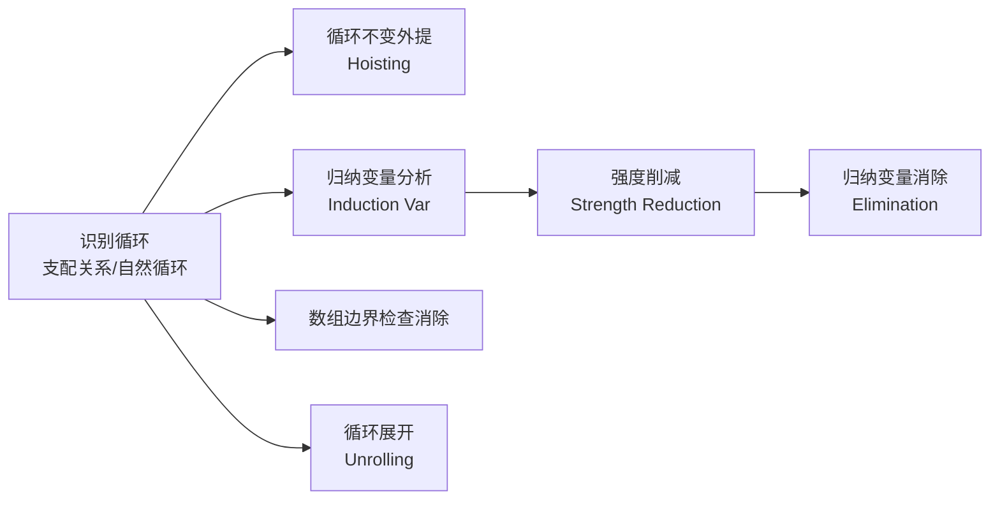

## 第 18 章关注什么？

程序的执行时间，绝大部分都耗在 **循环（loop）** 里。一个跑得慢的程序，瓶颈几乎一定在某个循环上。

第 18 章问的问题是：

> **怎么在编译期识别出循环，并把循环里"白做的功"省掉、把"贵的运算"换成便宜的？**

本章不再像前面那样讲"如何把源代码变成机器码"，而是讲 **优化（optimization）**：在已经有了流图（control-flow graph）之后，做一系列变换让循环跑得更快。



本章五大主题（课件 Outline）：

1. **支配关系（Dominators）**：怎么在流图里把循环找出来。
2. **循环不变计算（Loop-Invariant Computations）**：把每次循环都算同样结果的语句提到循环外。
3. **归纳变量（Induction Variables）**：识别像 `i`、`i*4` 这样随循环线性增长的量，做强度削减与消除。
4. **数组边界检查（Array-Bounds Checks）**：证明某些下标检查是冗余的，删掉它。
5. **循环展开（Loop Unrolling）**：把循环体复制几份，摊薄循环控制开销。

---

## 我们在哪里？

```text
源代码
    |
    | 词法 / 语法 / 语义分析
    v
IR -> 规范 IR -> 抽象汇编
                    |
                    |  <- 第 18 章：在流图上做循环优化
                    v
            +------------------------+
            |  循环优化（本章）        |
            |  支配/不变外提/归纳变量   |
            +------------------------+
                    |
                    | 活跃性分析 -> 寄存器分配
                    v
                 机器码
```

注意两点：

> **循环优化是在"流图 / 中间表示"这一层做的**，不依赖具体目标机器，属于 **机器无关优化（machine-independent optimization）**。
>
> 它要反复用到前面学过的 **数据流分析**：到达定值（reaching definitions）、活跃变量（liveness）。本章可以看成是数据流分析的"应用场"。

---

# 第 1 部分：循环是什么

## 1.1 为什么要优化循环

- **Why**：循环在程序里无处不在（pervasive），一个典型程序 **绝大比例的执行时间** 都花在某个循环里。
- 所以：**优化循环，性价比最高。**

字典里的循环定义：

> **Loop**：一串指令，被反复执行，直到满足某个终止条件。

## 1.2 流图意义上的循环（精确定义）

光说"反复执行"不够精确。在 **控制流图** 里，一个 **循环** 是一组节点 `S`，其中有一个 **头节点（header）`h`**，满足三条性质：

```text
   ① h -> S ：从 h 出发，有路径能到达 S 中任意节点
   ② S -> h ：从 S 中任意节点出发，有路径能回到 h
   ③ no other node -> S ：除了 h，没有任何从 S 外部直接进入 S 的边
```

| 性质 | 直觉 |
|---|---|
| ① 从 `h` 能到 `S` 里每个节点 | `h` 是"总入口"，循环体都在它"下游" |
| ② `S` 里每个节点能回到 `h` | 循环能"转圈"，每个节点都在环上 |
| ③ 外部只能从 `h` 进 `S` | **单入口（single entry）**：想进这个循环，必须先经过 `h` |

两个配套概念：

- **循环入口节点（loop entry）**：有一个 **前驱在循环外** 的节点。
- **循环出口节点（loop exit）**：有一个 **后继在循环外** 的节点。

> 关键结论：满足上面定义的循环 **只有一个入口（entry）**，但 **可以有多个出口（exit）**。

为什么这点重要？因为 **单入口** 意味着：每次循环迭代开始时，都能保证某些 **初始条件成立**，这正是后面所有优化的基础。如果一个"循环"能从两个不同地方跳进去，编译器就很难推理它的不变量了——所以本章后面只优化下面要定义的 **自然循环（natural loop）**。

---

# 第 2 部分：支配关系（Dominators）

要优化循环，先得 **找到** 循环。识别循环的关键工具就是 **支配（dominator）** 关系。

## 2.1 支配的定义

设 `s0` 是流图的 **起始节点（start node）**。

> **支配（dominate）**：节点 `d` **支配** 节点 `n`，当且仅当：从 `s0` 到 `n` 的 **每一条** 有向路径都 **必须经过 `d`**。

直觉：`d` 是去 `n` 的"必经关卡"，绕不过去。

两条基本事实：

- **每个节点都支配它自己**（`n` 总在去 `n` 的路径上）。
- **一个节点可以有多个支配节点**（去 `n` 路上有好几个必经关卡）。

## 2.2 求支配节点：不动点迭代

令 `D[n]` = 支配 `n` 的节点集合。支配关系满足下面这组方程：

```text
D[s0] = {s0}

D[n] = {n} ∪ ( ⋂   D[p] )      （n ≠ s0）
                p∈pred[n]
```

读法：**`n` 的支配者 = `n` 自己，加上"`n` 的所有前驱的支配者的交集"。**

> 为什么是 **交集**？因为要"支配 `n`"，必须支配 **通往 `n` 的每一条路径**。`n` 的前驱有好几个，只有 **同时支配所有前驱** 的节点，才挡得住所有进入 `n` 的路。

求解用 **不动点迭代（fixed point）**：

```text
1. D[s0] <- {s0}
2. 对每个 n ≠ s0，初始化 D[n] <- 全部节点（最大集合）
3. 反复用上面的方程更新 D[n]，直到所有 D[n] 都不再变化（到达不动点）
```

> 注意初始化方向：`D[n]` 从"全集"开始，一轮轮 **缩小**。这是因为方程里有 **交集**，求的是 **最大不动点**；初始太小会算错。

### 具体例子：跟着迭代走一遍

看这个小流图（`s0 = 1`），`4 -> 2` 是一条回边：

```text
   1
   |
   v
   2 <---+
   |     |
   v     |
   3     |
   |     |
   v     |
   4 ----+
   |
   v
   5

   边：1->2, 2->3, 3->4, 4->2(回边), 4->5
   前驱：pred[2]={1,4}, pred[3]={2}, pred[4]={3}, pred[5]={4}
```

初始化（`U` = 全集 `{1,2,3,4,5}`）：

| 节点 | 初始 `D` |
|---|---|
| 1 | `{1}` |
| 2 | `{1,2,3,4,5}` |
| 3 | `{1,2,3,4,5}` |
| 4 | `{1,2,3,4,5}` |
| 5 | `{1,2,3,4,5}` |

**第 1 轮**（按 2,3,4,5 顺序更新）：

```text
D[2] = {2} ∪ (D[1] ∩ D[4]) = {2} ∪ ({1} ∩ {1,2,3,4,5}) = {2} ∪ {1}     = {1,2}
D[3] = {3} ∪  D[2]          = {3} ∪ {1,2}                              = {1,2,3}
D[4] = {4} ∪  D[3]          = {4} ∪ {1,2,3}                            = {1,2,3,4}
D[5] = {5} ∪  D[4]          = {5} ∪ {1,2,3,4}                          = {1,2,3,4,5}
```

**第 2 轮**（再算一遍，看是否还变）：

```text
D[2] = {2} ∪ (D[1] ∩ D[4]) = {2} ∪ ({1} ∩ {1,2,3,4}) = {1,2}   ← 没变
D[3], D[4], D[5] 也都没变
```

到达 **不动点**，结果：

| 节点 | 支配者 `D[n]` |
|---|---|
| 1 | `{1}` |
| 2 | `{1,2}` |
| 3 | `{1,2,3}` |
| 4 | `{1,2,3,4}` |
| 5 | `{1,2,3,4,5}` |

这张表后面 2.5 节会直接用来判定回边和自然循环。

## 2.3 直接支配节点（Immediate Dominator）

**定理**：在连通图里，若 `d` 支配 `n`、`e` 也支配 `n`，则 **要么 `d` 支配 `e`，要么 `e` 支配 `d`**（`n` 的支配者们排成一条链，不会"并列")。

由这条定理：

> 除 `s0` 外，每个节点 `n` 都有 **唯一** 一个 **直接支配节点 `idom(n)`**，满足：
> 1. `idom(n)` 不是 `n` 本身；
> 2. `idom(n)` 支配 `n`；
> 3. `idom(n)` 不支配 `n` 的任何 **其它** 支配者。

直觉：在 `n` 的那条"支配者链"上，**离 `n` 最近的那个**（除 `n` 自己）就是 `idom(n)`。

上面小例子里：`idom(2)=1, idom(3)=2, idom(4)=3, idom(5)=4`。

## 2.4 支配树（Dominator Tree）

把每个节点 `n` 和它的 `idom(n)` 连一条边（`idom(n) -> n`），得到的图 **一定是一棵树**——这就是 **支配树**。

为什么是树？因为每个节点（除根）恰有一个 `idom`，即恰有一个父亲 —— 这正是树的定义。

课件用了一个 12 节点的流图做例子：

```text
     控制流图 (CFG)                  支配树 (Dominator Tree)

        1                                  1
        |                                  |
        v                                  2
        2 <====(回边 3->2, 4->2)          / \
       / \                               3   4
      3   4                                 /|\ \
          |\                               5 6 7 12
          v v                              |     |
          5  6                             8     11
         /|   \                           |
        v v    v                          9
        8 7----+                          |
        | |                               10
        v v
        9 11
        |  \
        v   v
       10    12
        |   /
        +--+   (10->5 回边, 10->12, 11->12)
```

> 读支配树的方法：`5` 在树里是 `4` 的孩子，意思是 `idom(5)=4`，即"想到 `5`，必经 `4`"。注意 `7` 的父亲是 `4` 而不是 `5` 或 `6`——因为 `7` 既能从 `5` 来、又能从 `6` 来，所以 `5`、`6` 谁都不支配 `7`，它们的"公共必经点"是 `4`。

## 2.5 自然循环（Natural Loops）

我们特别关心 **单入口** 的循环，因为单入口才能保证"每次迭代开始时初始条件成立"，便于优化。这引出 **自然循环** 的定义，核心是 **回边**。

> **回边（Back Edge）**：一条流图边 `n -> h`，其中 **`h` 支配 `n`**，就叫回边。

直觉：回边就是"往回跳"的边——跳回到一个支配自己的、更靠上的节点。

> **回边 `n -> h` 的自然循环（Natural Loop）**：所有满足下面条件的节点 `x` 的集合：
> - `h` 支配 `x`；**且**
> - 存在一条 **不经过 `h`** 的、从 `x` 到 `n` 的路径。
>
> 这个循环的 **头节点就是 `h`**。

直觉：自然循环 = 回边的"两端" `h` 和 `n`，外加"夹在中间、能不经过 `h` 就溜到 `n`"的所有节点。

### 例子：在小流图上找回边和自然循环

回到 2.2 的结果表。看边 `4 -> 2`：`D[4]={1,2,3,4}` 里 **含 2**，即 **2 支配 4**，所以 `4 -> 2` 是 **回边**。它的自然循环 = `{2,3,4}`（2 支配它们，且 3、4 都能不经过 2 跳到 4）。✓

### 例子：一个头可以是多个自然循环的头

在 12 节点的大图里：

- 回边 `10 -> 5` 的自然循环 = `{5, 8, 9, 10}`，其中 **嵌套** 着循环 `{8, 9}`。
- 进入节点 `2` 的回边有 **两条**：
  - `3 -> 2`  ⇒  自然循环 `{3, 2}`
  - `4 -> 2`  ⇒  自然循环 `{4, 2}`

> **一个节点 `h` 可以同时是多个自然循环的头。** 处理时通常把"同一个头 `h` 的多个自然循环 **合并** 成一个循环 `loop[h]`"。

## 2.6 嵌套循环与循环嵌套树（Loop-Nest Tree）

> **嵌套循环（Nested Loop）**：若循环 `A` 和 `B` 头节点不同，且 `B` 的所有节点都在 `A` 里（`B ⊆ A`），就说 `B` **嵌套在** `A` 内，`B` 是 **内层循环（inner loop）**。

**循环嵌套树** 把一个程序里所有循环的嵌套关系组织成一棵树，构造步骤：

```text
1. 计算流图 G 的支配关系。
2. 构造支配树。
3. 找出所有自然循环，从而找出所有循环头节点。
4. 对每个循环头 h，把 h 的多个自然循环合并成一个 loop[h]。
5. 构造头节点（隐含循环）的树：若 h2 ∈ loop[h1]，则 h1 在树中位于 h2 之上。
```

对 12 节点的图，循环嵌套树为：

```text
        ┌─────────────┐
        │  1          │   ← 整个过程体看成"伪循环(pseudo-loop)"，坐在根上
        │  6,7,11,12  │     (不在任何真循环里的节点挂这里)
        └──────┬──────┘
          ┌────┴────┐
          v         v
      ┌───────┐  ┌──────┐
      │  2    │  │  5   │
      │  3,4  │  │  10  │
      └───────┘  └──┬───┘
                    v
                 ┌──────┐
                 │  8   │
                 │  9   │
                 └──────┘
```

> 我们可以把 **整个过程体** 看成一个坐在树根上的 **伪循环（pseudo-loop）**。优化时通常 **从内层循环往外层** 处理（内层执行次数最多，收益最大）。

## 2.7 循环前置头（Loop Preheader）

很多循环优化都要 **在循环执行前** 插入语句（最典型的就是把不变计算"提"到循环外）。问题：**插到哪？**

如果有多条边从循环外指向头 `h`，没有一个统一的"循环之前"的位置。解决办法：

> **插入一个新的、初始为空的前置头节点（preheader）`P`**：
> - 把所有 **从循环外节点 `y` 指向 `h`** 的边 `y -> h`，**改成指向 `P`**；
> - 循环内部指向 `h` 的回边 **保持不变**。

```text
   插入前                      插入后

   2   3                       2   3
    \ /                         \ /
     v                           v
     4 <--+                      P        ← 新前置头
    / \   |                      |
   v   v  |                      v
   5   ...|                      4 <--+
                                / \   |
                               v   v  |
                               5  ... |   (回边仍指向 4=h)
```

这样所有"循环之前要做的事"都有了 **唯一的落脚点 `P`**。后面外提、强度削减的初始化语句都放进 `P`。

---

# 第 3 部分：循环不变计算（Loop-Invariant Computations）

## 3.1 什么是循环不变

> 如果循环里有语句 `t ← a ⊕ b`，而 `a` 每次循环都是 **同样的值**、`b` 每次也是 **同样的值**，那么 `t` 每次也必然是 **同样的值**。

这种语句每轮都白算一遍同样的结果，我们想把它 **外提（hoist）** 到循环外只算一次。

怎么判断 `a` 每次都一样？用 **递归** 定义"循环不变"：

> 定义 `d : t ← a₁ ⊕ a₂` 在循环 `L` 内是 **循环不变（loop-invariant）** 的，如果对每个操作数 `aᵢ`：
> - `aᵢ` 是 **常数**；**或**
> - 所有到达 `d` 的 `aᵢ` 的 **定值（definition）** 都在 **循环外**；**或**
> - 只有一个 `aᵢ` 的定值到达 `d`，且那个定值本身 **也是循环不变** 的。

> 这是一个 **迭代算法（iterative algorithm）**：先标出常数和"定值全在循环外"的，然后反复传播——一个语句若其操作数都已被标为不变，它自己也标为不变，直到不再变化。它依赖 **到达定值** 数据流分析。

## 3.2 外提（Hoisting）：不是不变就能提

**关键陷阱**：`t ← a ⊕ b` 是循环不变，**不代表** 一定能安全外提！课件用四份代码对比：

```text
    (a) 正确                 (b) 错误            (c) 错误            (d) 错误
  L0  t ← 0              L0  t ← 0          L0  t ← 0          L0  t ← 0
  L1  i ← i+1           L1  if i≥N goto L2  L1  i ← i+1        L1  M[j] ← t
      t ← a⊕b               i ← i+1            t ← a⊕b            i ← i+1
      M[i] ← t              t ← a⊕b            M[i] ← t           t ← a⊕b
      if i<N goto L1        M[i] ← t           t ← 0              M[i] ← t
  L2  x ← t                 goto L1            M[j] ← t           if i<N goto L1
                        L2  x ← t              if i<N goto L1  L2  x ← t
                                            L2
   correct, faster     incorrect:          incorrect:         incorrect:
   （正确，更快）        不一定执行到 def      t 有多个定值        在 def 之前就用了 t
```

把这四种情况想清楚，就得到 **外提的三条判据**。

## 3.3 外提的三条判据

> 把 `d : t ← a ⊕ b` 提到 **循环前置头末尾** 是安全的，当且仅当：
>
> 1. **`d` 支配所有"`t` 在其上 live-out"的循环出口**；
>    （对应 (b)：若 `d` 不支配出口，可能根本没执行 `d` 就带着错误的 `t` 出循环了）
> 2. **循环里 `t` 只有这一个定值**；
>    （对应 (c)：`t` 有多个定值，提了一个会和另一个打架）
> 3. **`t` 在前置头处不是 live-out**（即外提不会覆盖掉循环前就要用的 `t`）。
>    （对应 (d)：def 之前就用了 `t`，提上去会改变那次使用读到的值）

> **隐式副作用（implicit side effects）**：如果 `t ← a ⊕ b` 可能 **抛出算术异常**（如除零）或有 **其它副作用**，上面的规则还要再加限制——因为外提相当于"无条件执行"，可能让一个本来不会触发的异常被触发。

## 3.4 把 while 改成 repeat-until

判据 1（"`d` 支配所有 `t` live-out 的出口"）有个副作用：它 **挡住了 while 循环里的很多外提**。

原因：while 循环的形状是"先判断、再执行循环体"，**判断节点（也是出口）在循环体之前**，所以循环体里的语句 **都不支配那个出口节点**——判据 1 不满足，提不了。

```text
   while 形状（提不动）                改成 repeat-until 形状（能提了）

   1: x ← i+3                         1:  x ← i+3
      if x<n goto 2 else 3                if x<n goto 2 else 3
        |                                   |
   2: y ← i+a    ← 这些语句都              2:  y ← i+a
      z ← M[y]      不支配出口节点 1            z ← M[y]
      w ← y+1                              w ← y+1
      M[w] ← z                             M[w] ← z
      goto 1                              1a: x ← i+3        ← 复制一份判断放到循环体末尾
        |                                     if x<n goto 2 else 3
   3:                                      |
                                          3:
```

做法：**复制一份循环条件判断**，一份留在循环入口（先判一次要不要进循环），一份放到循环体 **末尾**（变成"循环体—判断"的 repeat-until 结构）。这样循环体里的语句就能支配新的出口判断了，外提得以进行。代价是判断语句多了一份。

---

# 第 4 部分：归纳变量（Induction Variables）

这是本章 **最核心、最常考** 的部分。

## 4.1 什么是归纳变量

有些循环里有：

- 一个变量 `i`，每轮被 **递增或递减**（如 `i ← i + 1`）；
- 一个变量 `j = i·c + d`，其中 `c`、`d` 都是 **循环不变量**。

那么 `j` 也随循环线性变化。关键洞见：

> **我们可以不引用 `i` 就算出 `j`**：每当 `i` 增加 `a`，`j` 就增加 `a·c`（`j ← j + a·c`）。

把"每轮一次乘法 `j ← i·c`"换成"每轮一次加法 `j ← j + a·c`"——这就是后面 **强度削减** 的思想。

两类归纳变量：

| 类型 | 定义 | 记法 |
|---|---|---|
| **基本归纳变量（basic）** `i` | 循环内对 `i` 的定值 **只有** `i ← i + c` 或 `i ← i − c`（`c` 循环不变） | —— |
| **派生归纳变量（derived）** `j` | 由别的归纳变量线性导出 | 三元组 `(i, a, b)` 表示 `j = a + i·b` |

### 引导例子

```text
     s ← 0
     i ← 0
L1:  if i ≥ n goto L2
     j ← i · 4         ← j 是派生归纳变量
     k ← j + a         ← k 也是派生归纳变量（a 循环不变）
     x ← M[k]
     s ← s + x
     i ← i + 1         ← i 是基本归纳变量
     goto L1
L2:
```

分析每个变量的三元组 `(i, a, b)`，含义 `值 = a + i·b`：

```text
i：基本归纳变量
j = i·4 = 0 + i·4     →  三元组 (i, a_j=0, b_j=4)，记 (i, 0, 4)
k = j + a = i·4 + a   →  三元组 (i, a, 4)         （a 循环不变）
```

`j` 和 `k` 都在 **`i` 的家族（family of i）** 里。

## 4.2 线性归纳变量（Linear Induction Variable）

> **线性归纳变量**：在循环的 **每一次** 迭代里都按 **同一个**（常数或循环不变）增量变化的归纳变量。

不是所有归纳变量都线性。反例：

```text
     s ← 0
L1:  if s > 0 goto L2
     i ← i + b          ← i 在"这条路径"上加 b
     j ← i · 4
     x ← M[j]
     s ← s − x
     goto L1
L2:  i ← i + 1          ← i 在"另一条路径"上加 1
     s ← s + j
     if i < n goto L1
```

这里基本归纳变量 `i` 在 **不同迭代里加的量不同**（有时加 `b`、有时加 `1`），所以 **不是线性** 的。派生变量 `j = i·4` 有时跟得上、有时"暂时掉队"（`i` 增加了但 `j` 还没更新）。本章的优化主要针对 **线性** 归纳变量。

## 4.3 归纳变量优化的全景

对引导例子，整套优化是 **四步流水线**：

```text
   (a) Before                                          (b) After
     s ← 0                  ① 归纳变量分析             s ← 0
     i ← 0                     （找出 i & j）          k' ← a
L1:  if i ≥ n goto L2        ② 强度削减                b ← n · 4
     j ← i · 4                  （把 i*4 换成加法）     c ← a + b
     k ← j + a               ───────────────────►  L1: if k' ≥ c goto L2
     x ← M[k]                ③ 归纳变量消除              x ← M[k']
     s ← s + x                  （i≥n → k≥4n+a）        s ← s + x
     i ← i + 1               ④ 复制传播                  k' ← k' + 4
     goto L1                                            goto L1
L2:                                                  L2:
```

下面把 ②③④ 一步步拆开看。

## 4.4 检测归纳变量（Detection）

> **基本归纳变量**：变量 `i` 是循环 `L`（头 `h`）的基本归纳变量，若 `L` 内对 `i` 的 **唯一** 定值形如 `i ← i + c` 或 `i ← i − c`，`c` 循环不变。

> **派生归纳变量**：变量 `k` 是循环 `L` 的派生归纳变量，若：
> 1. `L` 内对 `k` 只有 **一个** 定值，形如 `k ← j · c` 或 `k ← j + d`，其中 `j` 是归纳变量、`c`/`d` 循环不变；**且**
> 2. 若 `j` 本身是 `i` 家族的派生归纳变量，则：
>    - 2.1 到达 `k` 的 `j` 的定值 **唯一**，就是循环里那个；**且**
>    - 2.2 在 `j` 的定值和 `k` 的定值之间的 **任何路径上，都没有对 `i` 的定值**。
>
> （条件 2 是为了能安全地把 `k` 转换成一个"挂在 `i` 上"的三元组。）

## 4.5 强度削减（Strength Reduction）

> **强度削减**：乘法比加法贵，把派生归纳变量的 **乘法定值 `j ← i·c`** 换成 **加法**。

对每个三元组为 `(i, a, b)` 的派生归纳变量 `j`（即 `j ← a + i·b`）：

```text
1. 造一个新变量 j'
2. 在每条 i ← i + c 之后，加一句 j' ← j' + c·b
   （c·b 是循环不变表达式，可在前置头算好；若 c、b 都是常数，乘法在编译期就能算掉）
3. 把对 j 的（唯一）定值改成 j ← j'
4. 在前置头末尾初始化 j' ← a + i·b
   （随后做死代码消除 dead-code elimination 清理）
```

### 强度削减完整走一遍（重点！）

**起点 Before**：

```text
     s ← 0
     i ← 0
L1:  if i ≥ n goto L2
     j ← i · 4
     k ← j + a
     x ← M[k]
     s ← s + x
     i ← i + 1
     goto L1
L2:
```

**第 ① 步：对 `j`（三元组 (i,0,4)，即 c=1, b=4）做强度削减**

- 造 `j'`；前置头里 `j' ← a + i·b = 0 + 0·4 = 0`；
- `i ← i+1` 后加 `j' ← j' + c·b = j' + 1·4 = j' + 4`；
- `j ← i·4` 改成 `j ← j'`。

```text
     s ← 0
     i ← 0
     j' ← 0              ← 初始化（前置头）
L1:  if i ≥ n goto L2
     j ← j'              ← 原来是 j ← i·4
     k ← j + a
     x ← M[k]
     s ← s + x
     i ← i + 1
     j' ← j' + 4         ← 加法替代乘法
     goto L1
L2:
```

**第 ② 步：对 `k`（三元组 (i,a,4)，c=1, b=4）做强度削减**

- 造 `k'`；前置头里 `k' ← a + i·b = a + 0·4 = a`；
- `i ← i+1` 后加 `k' ← k' + 4`；
- `k ← j + a` 改成 `k ← k'`。

```text
     s ← 0
     i ← 0
     j' ← 0
     k' ← a             ← 初始化
L1:  if i ≥ n goto L2
     j ← j'
     k ← k'             ← 原来是 k ← j + a
     x ← M[k]
     s ← s + x
     i ← i + 1
     j' ← j' + 4
     k' ← k' + 4        ← 加法替代
     goto L1
L2:
```

到这里，循环里 **再也没有乘法** 了，只剩加法 `j'←j'+4`、`k'←k'+4`。下面 4.6、4.7 继续清理。

### 用具体数字感受一下（n=3, a=100）

```text
迭代   i    k'（=a+i·4=100+4i）    访问 M[k']     说明
 0     0          100               M[100]        k' 初值 = a = 100
 1     1          104               M[104]        k' ← k'+4
 2     2          108               M[108]        k' ← k'+4
 3     3        （i≥n 退出）                         结束
```

`k'` 直接走 100 → 104 → 108，正好是 `M[k]` 要访问的地址，**全程只用加法，没有一次乘法**。这就是强度削减的收益。

## 4.6 归纳变量消除（Elimination）

强度削减之后：

- 有些归纳变量 **在循环里根本没被用到**（如上面的 `j`，被 `j ← j'` 替换后没人用了）；
- 有些 **只在和循环不变量的比较里用到**。

> 变量在循环 `L` 里是 **无用的（useless）**，若：
> - 它在 `L` 的 **所有出口都已 dead**；**且**
> - 它的 **唯一使用** 出现在 **它自己的定值** 里（即只剩"自己更新自己"）。
>
> 无用变量的 **所有定值都可以删除**。

对 4.5 第 ② 步的结果做消除：`j` 只被 `j ← j'` 定值、之后没人用 → `j` 无用，删 `j ← j'`；接着 `j'` 只剩 `j' ← j'+4` 和 `j' ← 0` 自我更新 → `j'` 也无用，删掉。

```text
     s ← 0
     i ← 0
     k' ← a
L1:  if i ≥ n goto L2
     k ← k'            （k 稍后会被复制传播掉）
     x ← M[k]
     s ← s + x
     i ← i + 1
     k' ← k' + 4
     goto L1
L2:
```

## 4.7 改写比较（Rewriting Comparisons）

现在 `i` 只剩两处：比较 `if i ≥ n` 和自增 `i ← i + 1`。这种变量叫 **几乎无用（almost useless）**：

> 变量 `k` 是 **几乎无用** 的，若：
> - 它 **只** 用在"与循环不变量比较"和"自己的定值"里；**且**
> - 同家族里 **存在另一个不是无用** 的归纳变量 `c`。
>
> 这时可以把那个比较 **改写成用 `c`**，从而把 `k` 变成 **真正无用**，进而删掉。

对 `i`：同家族的 `k'` 不是无用的。`i = (k' − a)/4`，所以：

```text
   i ≥ n   ⟺   k' ≥ a + 4·n
```

`a + 4·n` 是 **循环不变**，可在前置头算好（`b ← n·4`、`c ← a + b`）。把比较改成 `if k' ≥ c`，`i` 就彻底无用，删掉 `i ← 0` 和 `i ← i+1`：

```text
     s ← 0
     i ← 0          ← 现在 i 也无用了，删
     k' ← a
     b ← n · 4      ← 前置头预计算
     c ← a + b      ← c = a + 4n（循环不变）
L1:  if k' ≥ c goto L2     ← 比较改用 k'
     k ← k'
     x ← M[k]
     s ← s + x
     k' ← k' + 4
     goto L1
L2:
```

## 4.8 复制传播（Copy Propagation）收尾

循环里还剩 `k ← k'` 然后 `x ← M[k]`。`k` 只是 `k'` 的副本，**复制传播** 把 `M[k]` 直接改成 `M[k']`，删掉 `k ← k'`：

```text
     s ← 0
     k' ← a
     b ← n · 4
     c ← a + b
L1:  if k' ≥ c goto L2
     x ← M[k']            ← 由 k←k'; x←M[k] 复制传播而来
     s ← s + x
     k' ← k' + 4
     goto L1
L2:
```

这就是 4.3 里那张 **After** 图。回头看收益：

| | Before（每轮） | After（每轮） |
|---|---|---|
| 乘法 | `j ← i·4` 一次乘法 | **0 次乘法** |
| 加法/更新 | `i←i+1` | `k'←k'+4` |
| 多余变量 | `i, j, k` | 只剩 `k'` |
| 循环外 | —— | 多算 `b、c` 各一次（一次性） |

> 一句话：**归纳变量优化 = 用一连串廉价的加法，替换掉循环里反复出现的昂贵乘法和冗余变量。** 流程是"分析 → 强度削减 → 消除 → 改写比较 → 复制传播"。

---

# 第 5 部分：数组边界检查消除（Array-Bounds Checks）

## 5.1 问题

- 有些语言（如 Java、Tiger）在 **每次下标访问** 时自动插入 **边界检查**。
- 我们想让编译器 **删掉能证明是冗余的检查**。
- 但是：**删掉所有冗余边界检查是不可计算的（not computable）**——只能尽量删。

## 5.2 思路

- 很多下标形如 `a[i]`，其中 `i` 是 **归纳变量**——编译器往往能"看懂"它的变化范围，从而优化。
- 数组的边界一般是 `0 ≤ i ∧ i < N`。
- 如果能证明在整个循环里 `i` 始终落在 `[0, N)`，那循环内每次的边界检查就都是冗余的，可以提到循环外只查一次、甚至完全删掉。

> 从循环 `L` 里消除一个边界检查的 **完整判据相当复杂**，课件说"细节参见教材"。直觉上它和归纳变量分析、循环不变量、支配关系这些工具是同一套班底。

---

# 第 6 部分：循环展开（Loop Unrolling）

## 6.1 动机

有些循环 **体很小**，大部分时间都耗在"自增计数器 + 判断退出条件"这种 **循环控制开销** 上，真正干活的指令反而占比很低。

> **展开（Unrolling）**：把循环体 **复制两份或多份**，连在一起，从而摊薄每次有效计算所分担的控制开销。

## 6.2 朴素展开：先把图改对

给定循环 `L`，头 `h`，回边 `sᵢ → h`：

```text
1. 复制节点，造出循环 L'，头 h'，回边 sᵢ' → h'
2. 把 L 里的回边 sᵢ → h  改成  sᵢ → h'
3. 把 L' 里的回边 sᵢ' → h' 改成 sᵢ' → h
```

效果是两个循环体首尾相接、交替跳转。但 **光这么做没有任何收益**：

```text
   原循环                          朴素展开后

L1: x ← M[i]                  L1:  x ← M[i]
    s ← s + x                      s ← s + x
    i ← i + 4                      i ← i + 4
    if i<n goto L1 else L2         if i<n goto L1' else L2
L2:                           L1': x ← M[i]
                                   s ← s + x
                                   i ← i + 4
                                   if i<n goto L1 else L2
                              L2:
```

> 问题：**每个"原始"迭代仍然各自带着一次自增和一次条件跳转**——控制开销一点没省。必须把两份的自增和判断 **合并** 才有意义。

## 6.3 合并增量与判断：Fragile 版本

> 前提：需要一个归纳变量，使得 **每条 `i ← i + Δ` 都支配循环的每条回边**——这样才能安全合并。

把两份的自增/判断 **聚合（agglomerate）**：

```text
   展开后（未合并）                 Fragile（合并）

L1: x ← M[i]                  L1:  x ← M[i]
    s ← s + x                      s ← s + x
    i ← i + 4                      x ← M[i+4]      ← 第二份直接用 i+4，不再单独自增
    if i<n goto L1'                s ← s + x
L1':x ← M[i]                       i ← i + 8       ← 两次自增合并成一次 +8
    s ← s + x                      if i<n goto L1 else L2
    i ← i + 4                 L2:
    if i<n goto L1 else L2
L2:
```

> 为什么叫 **Fragile（脆弱）**？因为它把步长直接变成 `+8`、一次跨两个元素，**只能正确处理迭代次数为偶数的情况**。如果总次数是奇数，最后会多跑或少跑一次，出错。

## 6.4 Robust 版本：用尾声（epilogue）兜底奇数次

> 解决奇偶问题：让主循环按 `+8` 跑"成对"的迭代，把可能剩下的"奇数那一次"放到一个 **尾声（epilogue）** 里单独执行。

```text
   Fragile                             Robust

L1: x ← M[i]                          if i < n−8 goto L1 else L2
    s ← s + x                     L1:  x ← M[i]            ← 主循环：一次处理两个元素
    x ← M[i+4]                          s ← s + x
    s ← s + x                          x ← M[i+4]
    i ← i + 8                          s ← s + x
    if i<n goto L1 else L2             i ← i + 8
L2:                                    if i<n goto L1 else L3
                                  L2:  x ← M[i]            ← 尾声：剩下的零头，一次一个
                                       s ← s + x
                                       i ← i + 4
                                       if i<n goto L2 else L3
                                  L3:
```

| 版本 | 特点 |
|---|---|
| **Fragile（脆弱）** | 主循环步长 `+8`，只能处理偶数次迭代 |
| **Robust（健壮）** | 主循环成对处理 + 尾声处理零头，任意迭代次数都正确 |

> 直觉：把 `n` 个元素分成"`⌊n/2⌋` 对"用展开后的主循环高速跑，"最后剩下的 0 或 1 个"用尾声扫尾。展开 K 倍同理：主循环步长 `K`，尾声处理最后 `n mod K` 个。

---

# 总结

第 18 章一句话：

> **循环优化先用"支配关系"在流图里找出（自然）循环，再在循环上做两类核心变换——把"每轮算同样结果"的语句外提（loop-invariant hoisting）、把"随循环线性增长"的量做强度削减与消除（induction variables）——外加边界检查消除和循环展开。**

五大优化对比：

| 优化 | 解决什么浪费 | 关键前提/工具 | 收益 |
|---|---|---|---|
| **支配 / 自然循环** | （识别循环，是其它优化的基础） | 支配关系不动点迭代、回边 | 找出循环、嵌套结构 |
| **循环不变外提** | 每轮重复计算同样的值 | 三条外提判据、前置头 | 不变计算只算一次 |
| **强度削减** | 循环里反复做昂贵乘法 | 归纳变量三元组 `(i,a,b)` | 乘法 → 加法 |
| **归纳变量消除** | 冗余的归纳变量、比较 | useless / almost-useless 判定 | 删变量、改写比较 |
| **循环展开** | 循环控制开销占比过高 | 自增支配所有回边 | 摊薄自增/跳转开销 |

关键概念表：

| 概念 | 含义 |
|---|---|
| 支配（dominate） | 从 `s0` 到 `n` 的每条路径都过 `d` ⇒ `d` 支配 `n` |
| 求支配 | 不动点迭代 `D[n]={n}∪⋂ D[p]`，从全集开始缩小 |
| 直接支配 `idom(n)` | 支配者链上离 `n` 最近的那个；据此建支配树 |
| 回边（back edge） | `n→h` 且 `h` 支配 `n` |
| 自然循环 | 回边 `n→h` 对应的、`h` 支配且能不经 `h` 到 `n` 的节点集；单入口 |
| 循环嵌套树 | 按 `B⊆A` 组织循环嵌套；过程体是根上的伪循环 |
| 前置头（preheader） | 循环头前插入的统一落脚点，放外提/初始化语句 |
| 循环不变 | 操作数是常数、或定值全在循环外、或定值本身不变 |
| 外提三判据 | ①支配所有 live-out 出口 ②循环内唯一定值 ③前置头处非 live-out |
| 基本归纳变量 | 只被 `i←i±c` 定值（`c` 不变） |
| 派生归纳变量 | 三元组 `(i,a,b)` 表 `a+i·b` |
| 强度削减 | `j←i·c` 换成 `j'←j'+c·b`，乘法变加法 |
| useless / almost-useless | 无用变量删定值；几乎无用变量改写比较后删 |
| 循环展开 fragile/robust | 合并增量（偶数次）/ 加尾声兜底（任意次） |

最重要的直觉：

- **单入口** 是一切的前提：自然循环单入口，才能保证"每轮迭代初始条件成立"，编译器才敢推理不变量。
- **支配关系** 是识别循环的钥匙；**不动点 + 交集 + 从全集开始缩小** 是求它的套路（回扣前面数据流分析）。
- **外提不是"不变就能提"**：还要 `d` 支配出口、唯一定值、前置头非 live-out——三条缺一不可（四份反例代码就是来记这三条的）。
- **归纳变量优化的精髓是"用加法换乘法"**：`i·c` 每轮重算很贵，改成"上一轮结果 + 常量增量"；再顺手把没人用的归纳变量和比较一起清掉。
- **展开要小心奇偶**：fragile 版只对偶数次正确，robust 版靠 **尾声** 处理零头——这是"主体高速 + 尾巴兜底"的通用模式。

---

> 课件补充（来自原讲义，仅供复习参考）：考试中 **第 18 章只考第 1、2 两个小节**（支配关系 + 循环不变计算），且只出判断题、选择题。归纳变量、边界检查、循环展开作为理解性内容掌握即可。
